```{r}
#| label: load_refs
#| echo: false
#| cache: false
#| include: false

library(tidyverse)
library(RefManageR)
BibOptions(check.entries = FALSE, 
           bib.style = "numeric", 
           cite.style = 'authoryear', 
           style = "html",
           hyperlink = FALSE, 
           no.print.fields = c("isbn", "urldate"),
           dashed = FALSE)
bb <- ReadBib("./CV.bib", check = T)
```

# Outline

1.  [Introduction](#introduction) <!-- Hi, I'm susan and I do an odd assortment of things -->
2.  [Statistical Forensics?](#forensics-history) 
3.  [Shoes: Computer $\neq$ Human Vision](#shoes)
4.  [Feature Engineering and Human Perception](#bullets)
5.  [Wire Cuts and Probability](#wire-cuts) <!-- Error Rates and Scientific Foundations in Forensics -->
6.  [Conclusions](#conclusions)

# Introduction 👋️🌎 {#introduction}

::: notes

Thank you for inviting me to campus to speak today. 

Let me start by introducing myself, so you have a bit of background, and then I'll talk about statistical forensics, algorithms, artificial intelligence, and the importance of the work that I'm doing to society. 

That's not at all ambitious for an hour, right?

:::

## 🏫 My History 🕰️

::: nolines
+:--------:+:-------------------------------------------------------------------------------------------------------------------------------------------------------------------------------------------------------------------------------------------------+
| 2009     | BS, Psychology & Applied Math {style="position:absolute;right:10px;margin-top:0;margin-left:50px;margin-right:50px;max-width:150px;height:50px;" fig-alt="Texas state outline with ATM logo from Texas A&M university."}  |
+----------+--------------------------------------------------------------------------------------------------------------------------------------------------------------------------------------------------------------------------------------------------+
| 2011     | MS, Statistics {style="position:absolute;margin-top:20px;right:10px;max-width:150px;height:100px;" fig-alt="A red I overlaid with STATE, the Iowa State university logo."}                                                 |
+----------+--------------------------------------------------------------------------------------------------------------------------------------------------------------------------------------------------------------------------------------------------+
| 2015     | Ph.D., Statistics<br/>[Dissertation: [[Perception of Statistical Graphics](https://srvanderplas.github.io/Dissertation/SusanVanderplas-DissertationFinalVersion.pdf)]{.emph}]{.small}                                                            |
+----------+--------------------------------------------------------------------------------------------------------------------------------------------------------------------------------------------------------------------------------------------------+
| 2015-18  | Stat. Analyst, [NE Public Power District]{.small} {fig-alt="Nebraska Public Power District logo" style="position:absolute;margin-left:40px;margin-right:30px;right:10px;max-width:150px;height:50px"}                     |
+----------+--------------------------------------------------------------------------------------------------------------------------------------------------------------------------------------------------------------------------------------------------+
| 2018-19  | Research Asst. Professor {fig-alt="Center for Statistics and Applications in Forensic Evidence logo" style="position:absolute;right:10px;margin-top:-10px;max-width:250px;height:75px;"}                          |
+----------+--------------------------------------------------------------------------------------------------------------------------------------------------------------------------------------------------------------------------------------------------+
| 2020-24  | Assistant Professor {fig-alt="UNL logo" style="position:absolute;right:10px;max-width:150px;height:100px;"}                                                                                                                |
+----------+--------------------------------------------------------------------------------------------------------------------------------------------------------------------------------------------------------------------------------------------------+
| 2024-26  | Associate Professor                                                                                                                                                                                                                              |
+----------+--------------------------------------------------------------------------------------------------------------------------------------------------------------------------------------------------------------------------------------------------+
:::

::: notes

I started my academic journey in psychology and applied math, and got my PhD in statistics from Iowa State in 2015. I worked in industry for a couple of years before returning to academia, because there was some cool work going on at the Center for Statistics and Applications in Forensic Evidence (CSAFE). When the CSAFE funding came up for renewal, I transitioned to a tenure-track position at UNL and continued doing work with CSAFE remotely. In 2024, I applied for promotion and tenure early and was successful. And in 2025, UNL decided to eliminate their statistics department, and I started looking for universities that valued applied statistics and places where I could continue the cool research I've been doing.

:::

<!-- 
---

{fig-alt="A timeline of career moves, locations, and projects." width="95%" height="auto"} -->


## 📊 Recent Work

::: r-fit-text
```{r}
#| label: graphics-pubs
#| results: 'asis'
#| echo: false
#| cache: false
#| include: false

mypubs <- ReadBib("CV.bib") |> sort(sorting = "ydat")

newpubs <- as.data.frame(mypubs) |> 
  arrange(desc(date)) |> 
  filter(row_number() > 2) |>
  filter(!str_detect(keywords, "npr")) |>
  head(5) |>
  as.BibEntry()

NoCite(newpubs)
PrintBibliography(newpubs, .opts = list(sorting = "ydnt", no.print.fields = c("note", "file", "issn", "url-date", "url", "doi"), style="markdown"))
```

-   Can You See The Change? Visual Perception in Change Point Analysis (JCGS)\
    [Fudolig, Robinson, and Vanderplas. 2025]{.small}

-   Automated Residual Plot Assessment With the R Package autovi and the Shiny Application autovi.web (Aus & NZ Journal of Stats)\
    [Li, Cook, Tanaka, Vanderplas, and Ackermann. 2025]{.small}

-   Perception and Cognitive Implications of Logarithmic Scales for Exponentially Increasing Data: Perceptual Sensitivity Tested with Statistical Lineups (JCGS)\
    [Robinson, Howard, Vanderplas. 2025]{.small}

-   A Guide to Designing Experiments to Test Statistical Graphics (WIRE Computational Statistics)\
    [Robinson, Hofmann, Vanderplas. 2025]{.small}
:::

::: notes

Last year, I had several graphics papers: changepoint detection, using computer vision to evaluate residual plots, the use of log scales, and a how-to guide on testing graphics.

:::


## 🔬 Recent Work

::: r-fit-text
-   Methodological problems in every black-box study of forensic firearm comparisons (Law, Probability, and Risk)\
    [Cuellar, Vanderplas, Luby, Rosenblum. 2024]{.small}

-   Incorrect statistical reasoning in *Guyll et al.* leads to biased claims about strength of forensic evidence (PNAS)\
    [Rosenblum, Chin, Ogburn, Nishimura, Westreich, Datta, Vanderplas, Cuellar, Thompson. 2024]{.small}

-   Hidden Multiple Comparisons Increase Forensic Error Rates (PNAS)\
    [Vanderplas, Carriquiry, Hofmann. 2024]{.small}

-   Amicus Briefs and Written Testimony filed in cases in Oregon, Washington, Michigan, Colorado, California, Maryland, Illinois, Washington D.C., New Jersey, Federal (Northern District of Florida)

:::

::: notes

I've also been active in the forensics space, most recently, critiquing experimental design, examining the probability of false positive errors, and addressing some misconceptions. This year, I've submitted a bunch of written briefs in various cases -- some collaborative, some single-author.

:::

## Coming Soon! 🐣 

::: r-fit-text
Forensics:

-   `courtR` package for legal transcript studies
-   `highlightR` package for conserved text analysis
-   Juror Evaluation of Algorithms in Firearms and Toolmark Analysis
-   What Comes Next: A Constructive Vision for Forensic Firearms Analysis

Graphics:

-   Parallel Coordinate Plots with Mixed-Type Variables
-   `ggdibbler` - uncertainty visualization
-   Experiential Learning with Statistical Graphics: Writing, Reflection, and Suspense
-   Assessing Computer Vision models for Gestalt Perception
-   Visual Statistical Inference: Design, Experiment, and Analysis 

:::

::: notes

And, of course, I have a lot of projects that are in various stages of "not officially published" yet -- R packages that are on github but hopefully soon to be on CRAN, papers that are in progress, other papers that have been submitted, in both forensics and graphics. 

:::

## 💵 Funded Grants

::: r-fit-text
-   2025-2030, NSF CAREER, What Do You See? Perception, Decisions, and Statistical Graphics     
(\$550,000)

-   2020-2024, NIST, CSAFE Project lead: Footwear Class Characteristics and Human Factors     
(\$20 mil for CSAFE, \$456,930 sub-award)

-   2019/2021 - 2023, NIJ, Automatic Acquisition and Identification of Footwear Class Characteristics     
(\$380,650)

-   2020-2023, USDA-NRCS, Improving the Economic and Ecological Sustainability of US Crop Production through On-Farm Precision Experimentation     
(\$4 mil total, \$400,000 for 3 UNL PIs)

-   2019-2022, NSF, Overcoming the Rural Data Deficit to Improve Quality of Life and Community Services in Smart & Connected Small Communities     
(\$1.5 mil total, \$123,445 sub-award)
:::

::: notes

And, of course, I've had some success in getting funding to cover some of these research projects -- most recently, I got an NSF CAREER award that started in October, but I've also gotten funding from NIJ and worked on a USDA collaborative multistate grant for farmers who want to design field trials to optimize profitability.

So, with that overview out of the way, I want to talk today about statistical forensics. The graphics research is interesting and fun, but I had to choose, and the forensics work is more AI connected and is also very cool.

:::

# Statistical Forensics{#forensics-history .center background-image="../images/dna.jpg" background-opacity="50%" background-size="cover"}

------------------------------------------------------------------------

::: r-stack

{.fragment fig-alt="Screenshot of an article from The Guardian in 2004 titled 'Earprint landed innocent man in jail for murder'. Article url: https://www.theguardian.com/uk/2004/jan/23/ukcrime1"}

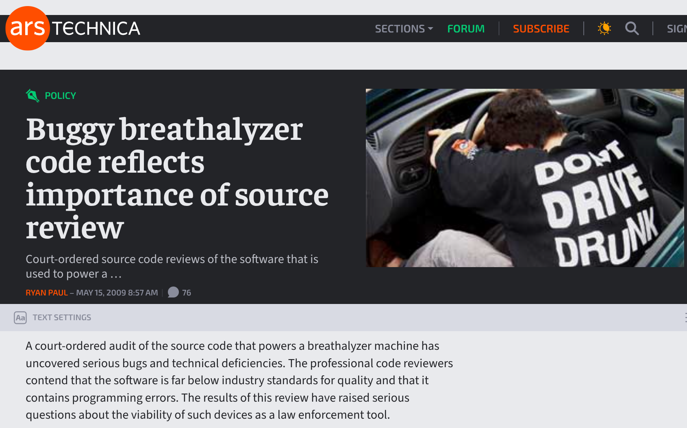{.fragment fig-alt="Screenshot of an Ars Technica article titled “Buggy breathalyzer code reflects importance of source review,” describing court‑ordered audits that found serious software flaws in breathalyzer machines. Article url: https://arstechnica.com/tech-policy/2009/05/buggy-breathalyzer-code-reflects-importance-of-source-review/"}

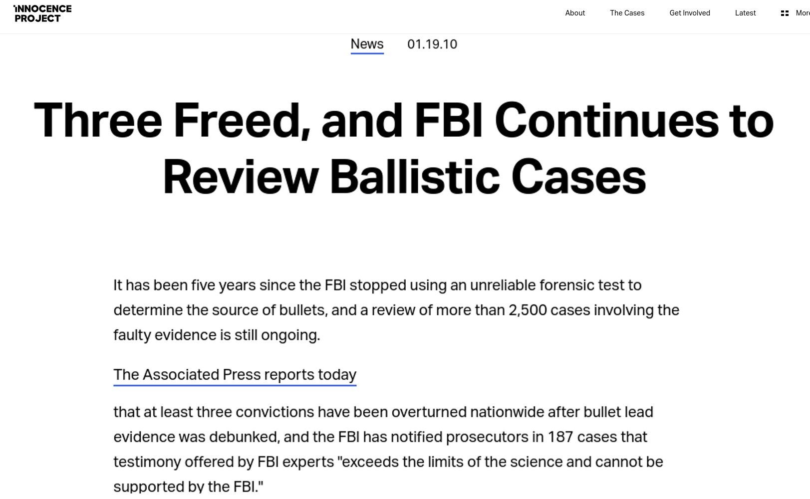{.fragment fig-alt="Screenshot of an Innocence Project article titled “Three Freed, and FBI Continues to Review Ballistic Cases,” discussing unreliable bullet‑matching forensic methods and related overturned convictions. Article url: https://innocenceproject.org/news/three-freed-and-fbi-continues-to-review-ballistic-cases/"}

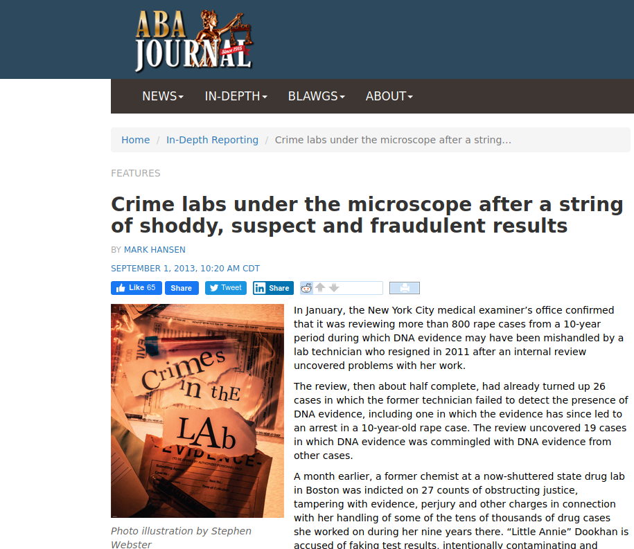{.fragment fig-alt="Screenshot of an ABA Journal article titled “Crime labs under the microscope after a string of shoddy, suspect and fraudulent results,” including a photo illustration labeled “Crimes in the Lab” on evidence bags. Article url: https://www.abajournal.com/magazine/article/crime_labs_under_the_microscope_after_a_string_of_shoddy_suspect_and_fraudu"}

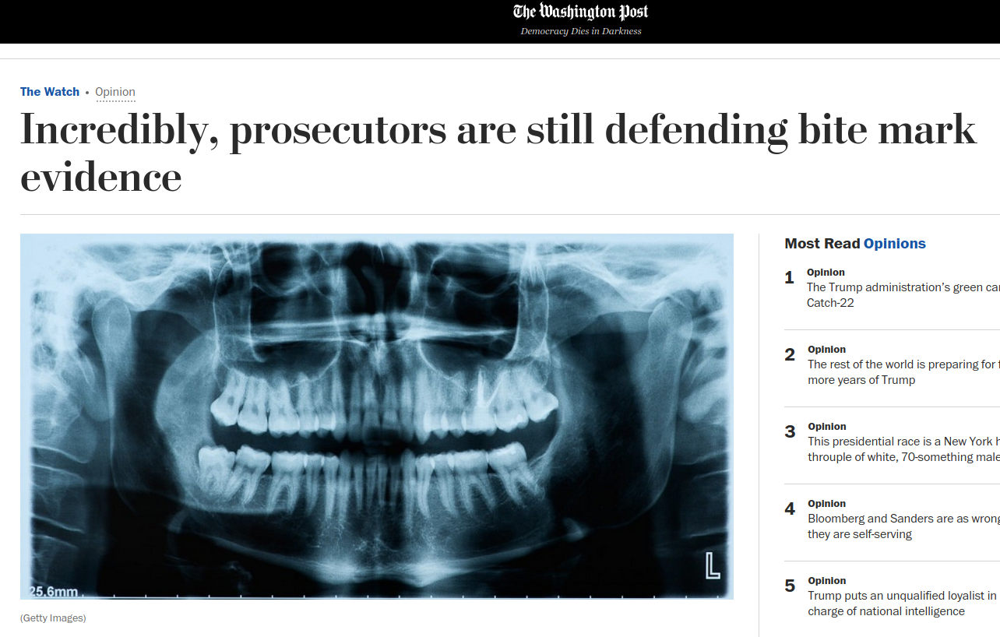{.fragment fig-alt="Screenshot of a Washington Post opinion piece titled “Incredibly, prosecutors are still defending bite mark evidence,” displaying a dental X‑ray image beneath the headline. Article url: https://www.washingtonpost.com/news/the-watch/wp/2017/01/30/incredibly-prosecutors-are-still-defending-bite-mark-evidence/"}

:::

::: notes
In the past 20 years, CSI-style forensic analysis has taken quite a beating.

DNA is the gold standard for forensic evidence - a specific combination of genes is supposed to be unique to the individual, matches can be objectively determined with error rates that are quantifiable, and it could be used to reexamine evidence from old cases.

As organizations like the Innocence Project used DNA to revisit old cases, it became clear that there were *major* problems with the evidence used in criminal cases -- eyewitness testimony, false confessions, and shoddy forensics.

There were a number of very embarrassing cases where forensic evidence was shown to be faulty. As these cases happened, scientists started asking how this all went so wrong? Wasn't forensics ultimately based in science? Weren't there studies out there showing that forensic techniques had low error rates?

:::


## Forensics under Fire {.smaller}

::: columns
::: {.column width="20%"}
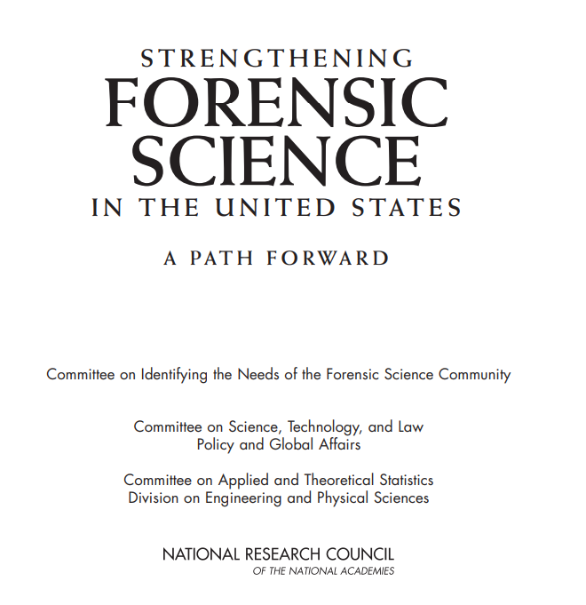{fig-alt="Cover of the 2009 NAS report. PDF at https://www.ojp.gov/pdffiles1/nij/grants/228091.pdf"}

{fig-alt="Screenshot of cover page of PCAST report; pdf available at https://obamawhitehouse.archives.gov/sites/default/files/microsites/ostp/PCAST/pcast_forensic_science_report_final.pdf"}
:::
::: {.column width="10%"}
:::
::: {.column .incremental width="60%"}

- Scientific underpinnings

- Empirical error rates   
  - Well designed studies
  - Representative of casework
  - Accuracy, Repeatability, Reproducibility
  
- Subjective methods -- special concerns
  - Testing issues
  - Potential for bias

:::
:::

## [Current Status of Forensic Disciplines]{.smaller}

::::: columns
::: {.column .small width="80%" margin="auto"}
+----------+-------------+-----------+----------+----------+
|          | Discipline  | Method    | Validity | Evidence |
+==========+=============+===========+==========+==========+
| 🧬       | DNA         | 🧪        | ✅       | 📚       |
+----------+-------------+-----------+----------+----------+
| 🧬       | DNA mixture | 🧪+🔎     | ❓       | 📖📖     |
+----------+-------------+-----------+----------+----------+
| 🫆       | Fingerprint | 🔎 💻     | ✅[^1]   | 📚       |
+----------+-------------+-----------+----------+----------+
| 🔫       | Firearms    | 🔎 💻[^2] | ❓       | 📖       |
+----------+-------------+-----------+----------+----------+
| 👟       | Footwear    | 🔎        | ❓       |          |
+----------+-------------+-----------+----------+----------+
| 🦱       | Hair        | 🔎        | 🚩🚩     | 📚       |
+----------+-------------+-----------+----------+----------+
| 😁       | Bitemark    | 🔎        | 🚩🚩     | 📚       |
+----------+-------------+-----------+----------+----------+
:::

::: {.column .small width="20%"}
+--------------+---------------+
|              | Meaning       |
+==============+===============+
| 🧪           | Lab           |
+--------------+---------------+
| 🔎           | Subjective    |
+--------------+---------------+
| 💻           | Algorithm     |
+--------------+---------------+
| ✅           | Valid         |
+--------------+---------------+
| ❓           | Unknown       |
+--------------+---------------+
| 🚩           | Invalid       |
+--------------+---------------+

:::
:::::

[^1]: high error rate

[^2]: Algorithms not used in practice


## Hard Problems

::: smaller

> Far better an approximate answer to the right question, which is often vague, than an exact answer to the wrong question, which can always be made precise.
> ― John Tukey

:::

::: incremental

- The math is (usually) not the hard part
    
    - Approaching the problem in a way that is tractable

    - Getting the (right) data
    
    - Encouraging adoption of statistical solutions

- Practical data science and useful/ethical AI:    
[focus on the human element]{.emph .cerulean .fragment}

:::


# Shoes and Shape Identification<br/>[Computer $\neq$ Human Vision]{.fragment .emph .blue} {#shoes}

::: notes

I'm going to start with the first project I worked on in forensics -- one I still haven't completed.

The reason I'm including this story is to both demonstrate that I'm working in "AI" and also that it's really important to understand the fundamentals of how these algorithms work so that when they unexpectedly don't do anything you want them to do, you can at least hopefully figure out why.

:::

## Shoe Problems

::: columns

::: {.column width="25%"}
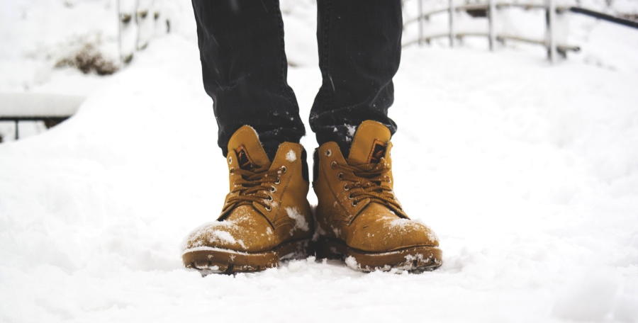{fig-alt="A picture of snow boots in the snow"}
:::

::: {.column width="5%"}
:::

::: {.column width="30%"  .fragment}
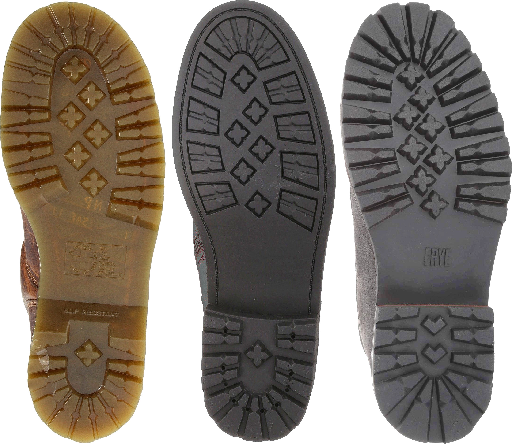{fig-alt="The bottom of 3 different brands of shoes, showing that each has a similar shoe sole"}


:::

::: {.column width="5%"}
:::

::: {.column width="30%"  .fragment}
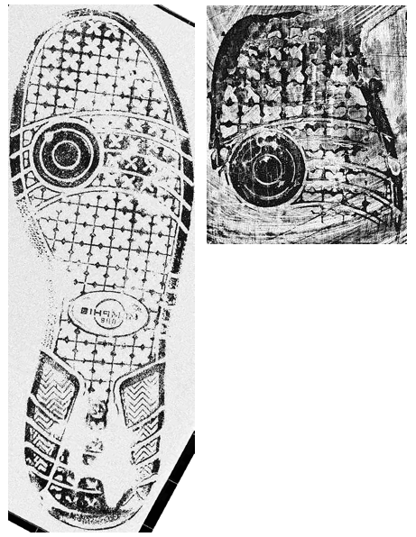{fig-alt="A picture of a shoe print and a partial print that is much messier next to it"}
:::

:::


::: notes


So let me set the stage: shoe prints aren't used in the US much in part because they are hard to work with and require collection training. They're more commonly used in the UK and Israel. 

And shoes vary a lot geographically - y'all have boots for winter, Floridians have sneakers. 

In addition, there's not a database of shoes, and lots of different shoes have similar patterns. 

So when there is something found at a crime scene, even if you can find a "match" for that evidence, you then are faced with "what does it mean?" -- if it's a rare shoe, then it might be important, but if it's a print from Uggs in the winter in a college town, maybe not. 

:::

## Local Shoe Features

::: columns
::: column

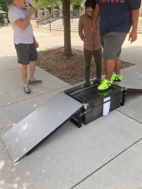{fig-alt="An image of a person walking across a shoe scanner prototype."}
:::
::: column

1. Identify relevant features within the scans

2. Define a similarity metric for shoe images based on shapes and locations

3. Assess the frequency of similar shoes in the sampled data

:::
:::

::: notes

So, we decided to attack this problem by collecting data -- first, I worked with some engineers to design a shoe scanner that could be embedded in the sidewalk, but Iowa State wasn't keen on us digging up sidewalks to test it, so we made ramps. 

The goal was to take pictures of people's shoe soles (just the bit in contact with the surface) and then parse that data using computer vision models. 
:::

## 2018: Computer Vision is Awesome!

::: columns

::: {.column width="30%"}
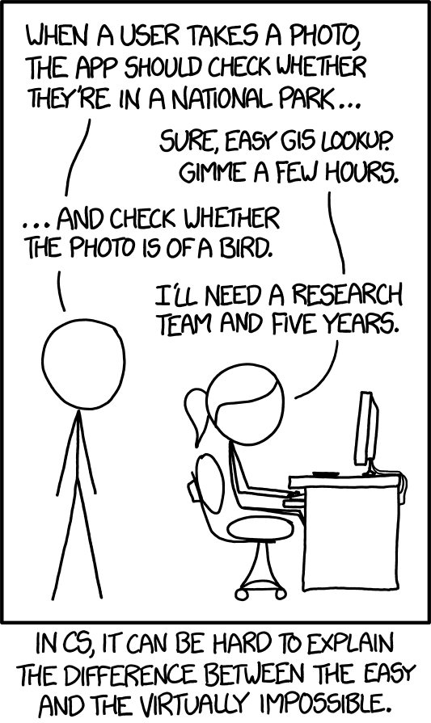{fig-alt="[Ponytail sitting at a computer with Cueball standing behind her.] Cueball: When a user takes a photo, the app should check whether they're in a national park... Ponytail: Sure, easy GIS lookup. Gimme a few hours. Cueball: ...and check whether the photo is of a bird. Ponytail: I'll need a research team and five years. [Caption below the panel:] In CS, it can be hard to explain the difference between the easy and the virtually impossible."}

:::

::: {.column .smaller width="60%"}

- 2010s - Computer Vision models start actually solving problems!

- ~2018 - Birds, plant species are all ID-able using apps!

::: {layout-ncol=2}
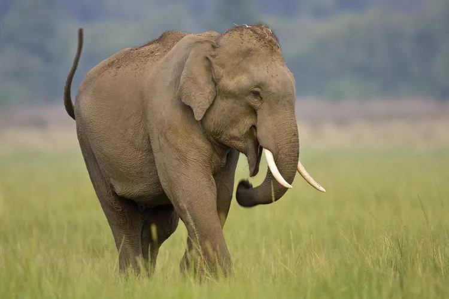


:::

[Computer vision models can identify shapes, right?]{.fragment .emph .cerulean}

:::
:::

## Complication: Different CV Models

We can reasonably pose this problem in 3 different ways:

::: {layout-ncol=3}
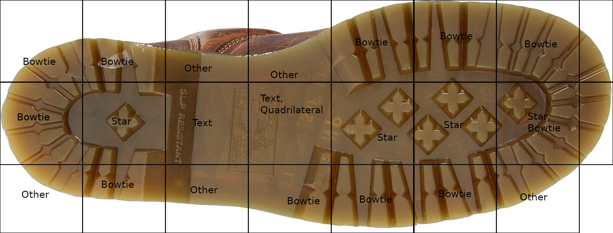{fig-alt="A shoe sole overlaid with a grid, with each square labeled with a relevant category."}

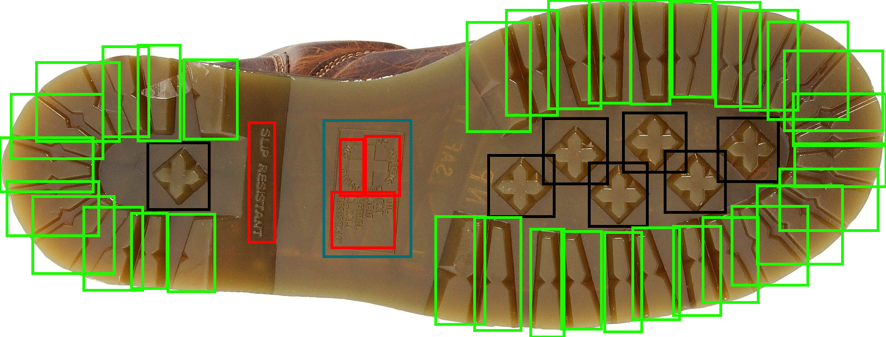{fig-alt="An object detection labeling system with each shape labeled with its own rectangular bounding box"}

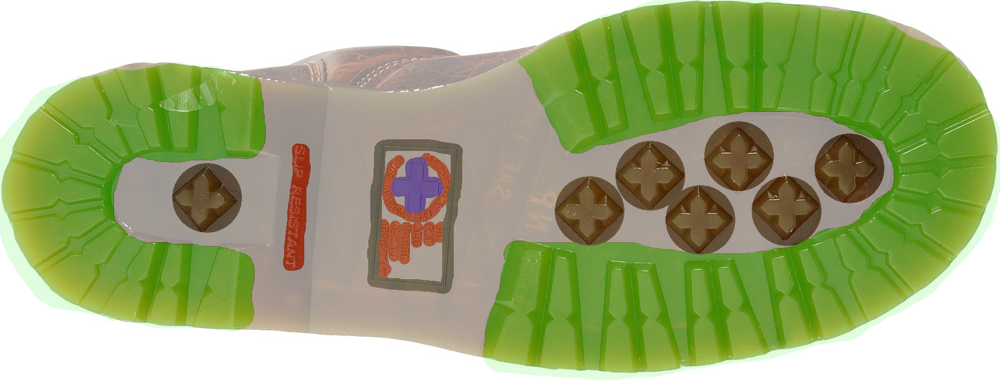{fig-alt="An image segmentation version of a shoe, with each feature painted."}
:::


::: incremental

- Each method requires a different labeling schema, annotation method, and data format.
- Switching between them is annoying.

:::

## Attempt #1: VGG16


<table class="smaller">
<thead><tr><th style = "width:30%"> Bowtie </th><th style = "width:30%"> Chevron </th><th style = "width:30%"> Circle </th></tr></thead>
<tr><td>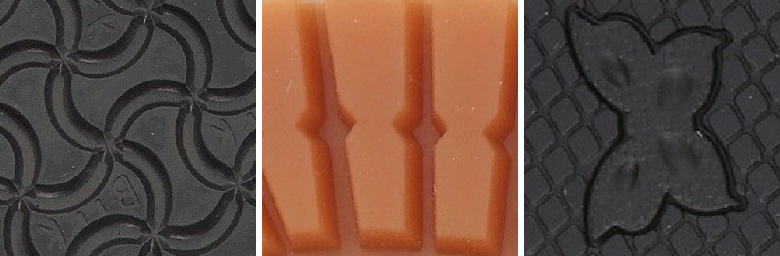</td><td>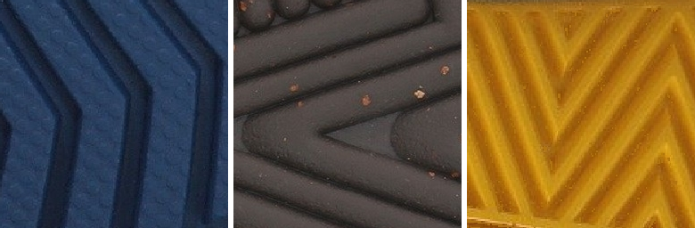</td><td>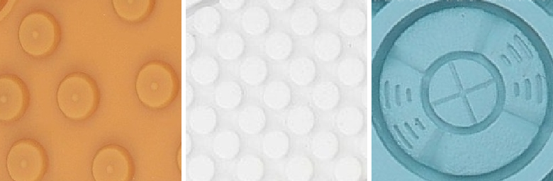</td></tr>
<tr><th> Line </th><th> Polygon </th><th> Quadrilateral </th></tr>
<tr><td>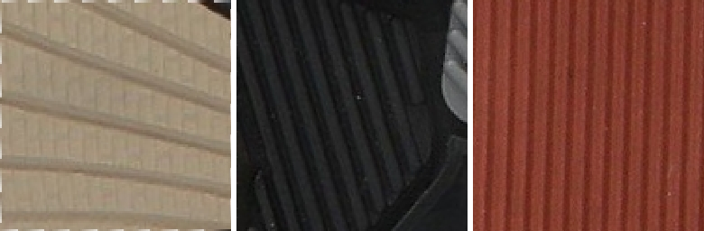</td><td>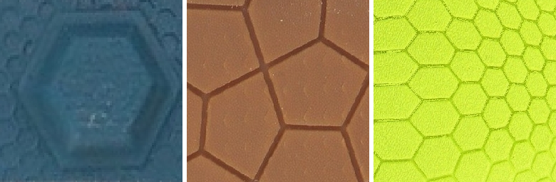</td><td>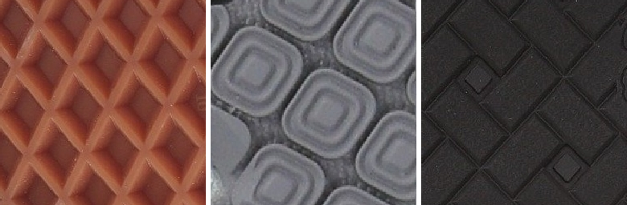</td></tr>
<tr><th> Star </th><th> Text </th><th> Triangle </th></tr>
<tr><td>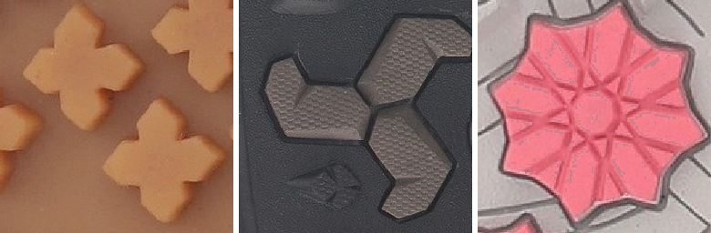</td><td>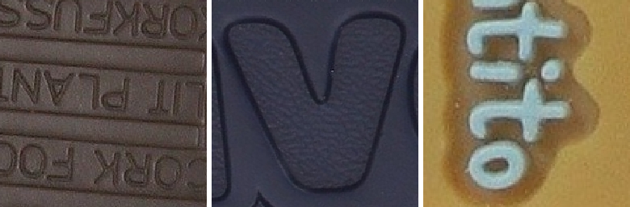</td><td>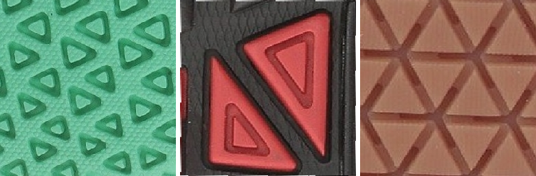</td></tr>
</table>


## Attempt #1: VGG16

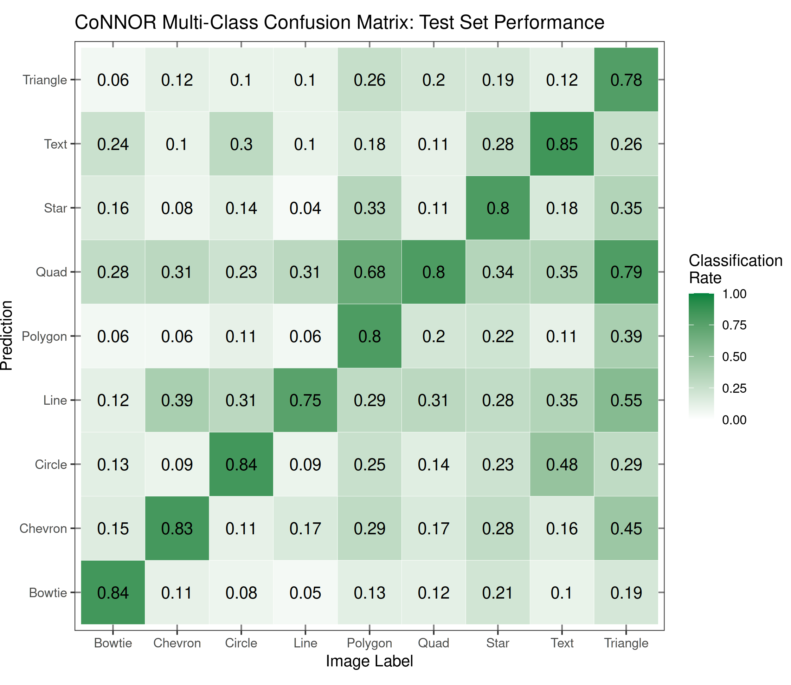{fig-alt="A confusion matrix for the Multi-class shape recognition model" width="60%"}

## Attempt #1: VGG16

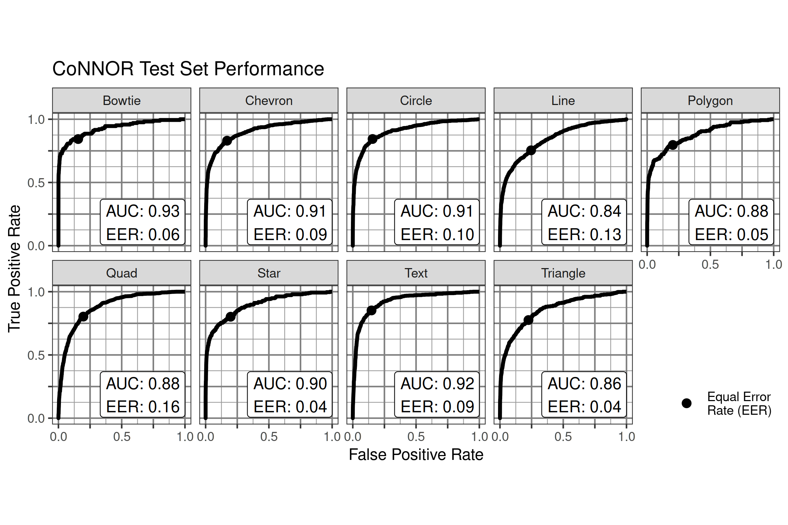{fig-alt="ROC curves for class models"}

## Attempt #2: Synthetic Data

Can CNNs even distinguish between different shapes?

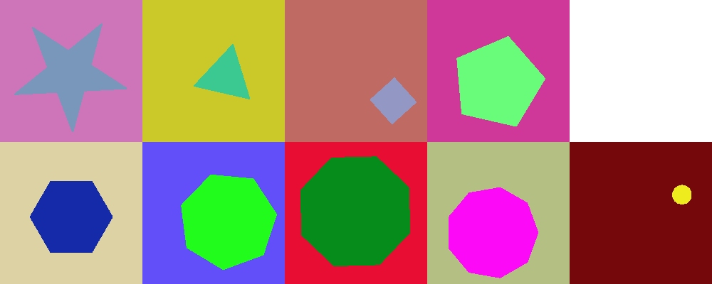{width="auto" fig-align="center" fig-alt="Synthetically generated class examples of stars and 3- to 9- gons, plus circles"}

## Attempt #2: Synthetic Data

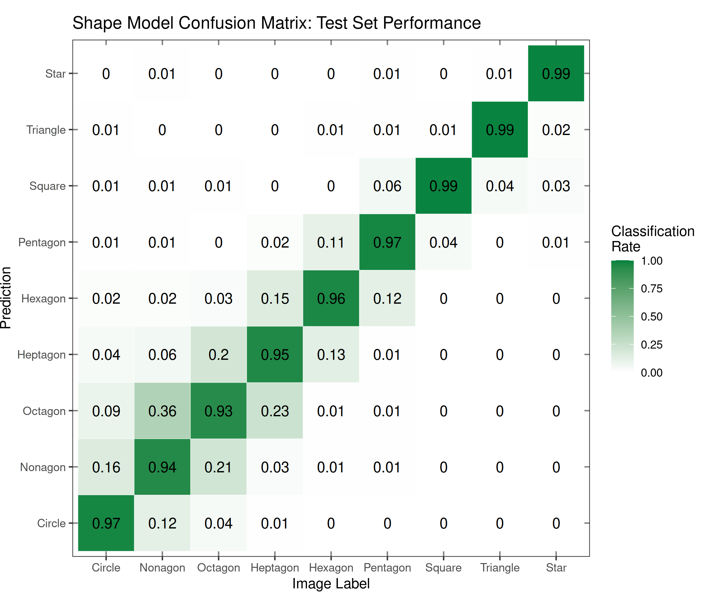{width="50%" fig-align="center"}

## Attempt #2: Synthetic Data

| Image                                                   | Circle | 3   | 4   | 5   | 6   | 7   | 8   | 9   | Star |
|--------|--------|--------|--------|--------|--------|--------|--------|--------|--------|
| {width="80%" fig-align="center"}  | .9999  | 0   | 0   | 0   | 0   | 0   | 0   | 0   | 0    |
| {width="80%" fig-align="center"} | .9999  | 0   | 0   | 0   | 0   | 0   | 0   | 0   | 0    |

::: fragment
-   Shoe data is complicated to label

-   Predictions made on ambiguous data don't work as well as we'd like
:::

## Why Doesn't This Work?

- Moravec's Paradox: 

> It is comparatively easy to make computers exhibit adult level performance on intelligence tests or playing checkers, and difficult or impossible to give them the skills of a one-year-old when it comes to perception and mobility. 

## Why Doesn't This Work?

::: incremental

- Computer vision models don't have Gestalt perception

- Shapes are a great feature set for humans    
[maybe not a great feature base for computer vision models?]{.emph .fragment .darkgreen}

- It's important to understand the model's limitations

:::

# Firearms & Toolmarks<br/>[Feature Engineering &]{.emph .darkred}<br/>[Human Perception]{.emph .darkred} {#bullets background-image="../images/bulletxtrctr-cmcr-hex.png" background-position="right" background-size="30%"}

## {.r-fit-text}

[Joint work with [**Heike Hofmann**]{.darkorange} and [**Joe Zemmels**, **Kiegan Rice**, **Ganesh Krishnan**, **Will Ju**, **Nate Garton**, **Eric Hare**]{.darkgreen}]{.emph} 

:::::: {.columns .v-center-container}
::: {.column .vcenter width="30%"}


`bulletxtrctr` package
:::

::: {.column .vcenter .r-fit-text width="10%"}
:::

::: {.column .vcenter .tiny width="60%"}
This work was partially funded by the Center for Statistics and Applications in Forensic Evidence (CSAFE) through Cooperative Agreements 70NANB15H176 and 70NANB20H019 between NIST and Iowa State University, which includes activities carried out at Carnegie Mellon University, Duke University, University of California Irvine, University of Virginia, West Virginia University, University of Pennsylvania, Swarthmore College and University of Nebraska, Lincoln.
:::
::::::


## Firearms & Toolmark Examination 

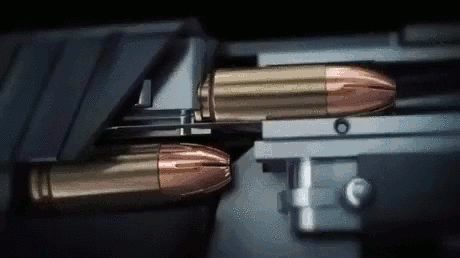{fig-alt="A gif of a bullet being fired from a gun. The firing pin hits the back of the cartridge case primer. The gif pivots to a cross section through the cartridge to see the powder ignition. The copper bullet then separates from the cartridge due to gas expansion and spins through the rifling before being ejected." width="100%"}

## Firearms & Toolmark Examination 

::: {layout-ncol=2}
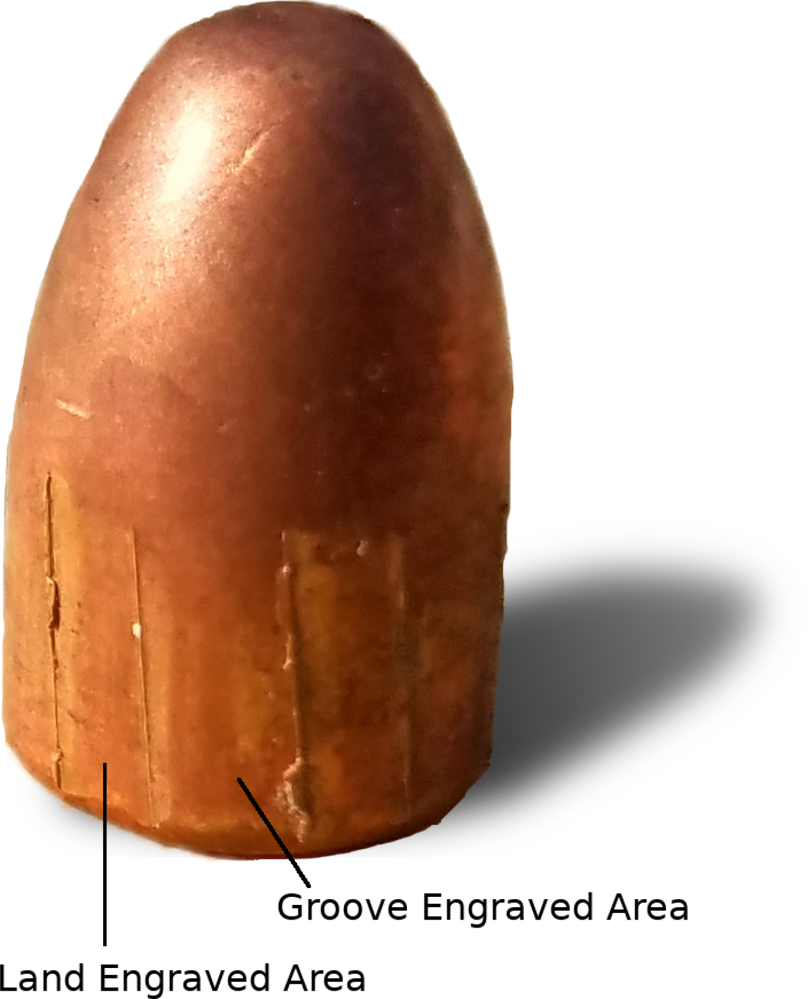{fig-alt="A fired bullet with lands and grooves due to the rifling." width="40%"}


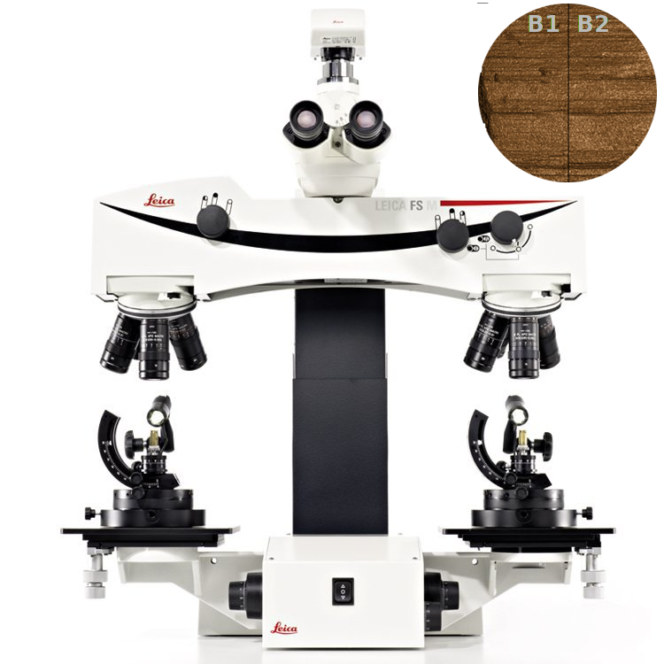{fig-alt="A comparison microscope with a close-up of the split viewfinder showing two aligned bullet segments." width="40%"}

:::


```{r}
#| label: bullet-package-setup
#| include: false
#| cache: false
library(tibble)
library(dplyr)
library(tidyr)
library(purrr)
library(ggplot2)
library(bulletxtrctr)
library(x3ptools)
```

```{r}
#| cache: false
#| label: bullet-setup

if (!file.exists("../data/Houston-3AQ/calcs.Rdata")) {
  
  b1 <- read_bullet("../data/Houston-3AQ/Bullet 1")
  b2 <- read_bullet("../data/Houston-3AQ/Bullet 2")
  b3 <- read_bullet("../data/Houston-3AQ/Bullet 3")
  b4 <- read_bullet("../data/Houston-3DN/Bullet 1")
  bullet_demo <- bind_rows(b1, b2, b3, b4) |>
    mutate(set = "Houston3", 
           barrel=rep(c("Q", "N"), c(18, 6)), 
           bullet = rep(c(1:3, 1), each=6), 
           land = rep(1:6, times = 4)) |>
    mutate(crosscut = map_dbl(x3p, x3p_crosscut_optimize)) |>
    mutate(ccdata = map2(x3p, crosscut, x3p_crosscut)) |>
    mutate(grooves =  map(ccdata, cc_locate_grooves, method = "middle", adjust = 30, return_plot = F)) |>
    mutate(sigs = map2(ccdata, grooves, cc_get_signature))
  
  bullet_demo <- bullet_demo |> select(-x3p) |>
    mutate(id = paste(barrel, bullet, sep = "-"))
  
  keep_comparisons <- tibble(
    b1_barrel = c("Q", "Q", "Q", "N", "N", "N"), 
    b2_barrel = c("Q", "Q", "Q", "Q", "Q", "Q"),
    b1_bullet = c(1, 1, 2, 1, 1, 1), 
    b2_bullet = c(2, 3, 3, 1, 2, 3))
  
  comparisons <- crossing(
    b1 = select(bullet_demo, id, barrel, bullet, land, sigs), 
    b2 = select(bullet_demo, id, barrel, bullet, land, sigs)) |>
    unnest(c(b1, b2), names_sep="_") |>
    inner_join(keep_comparisons) |>
    mutate(aligned = map2(b1_sigs, b2_sigs, ~sig_align(.x$sig, .y$sig))) 
  
  features <- comparisons |>
    mutate(striae = map(aligned, sig_cms_max)) |>
    mutate(features = map2(aligned, striae, extract_features_all, resolution = .645))
  
  save(bullet_demo, comparisons, features, file = "../data/Houston-3AQ/calcs.Rdata")
  
} else {
  load("../data/Houston-3AQ/calcs.Rdata")
}


crosscuts <- bullet_demo |> 
  dplyr::select(-source) |> 
  tidyr::unnest(ccdata) 

grooves <- bullet_demo |> 
  unnest(grooves) |>
  unnest(grooves)

signatures <- bullet_demo |> 
  select(bullet:land, id, sigs) |> 
  unnest(sigs)

featuredf <- features |> unnest(features) |>
  select(-matches("sigs"), -aligned, -striae)

```

## Building a Data Pipeline

1. Wrangle scans with `x3ptools`
    - usually 6 land engraved area scans per bullet
    - orientation - (0,0) top or bottom left?
    - scale - work in microns, not meters. 
    - nested `tibble`s to keep data organized

```{r}
#| eval: false
#| echo: false
#| include: false
x3p_image(b1$x3p[[2]]) 
x3p_snapshot(file = "../images/houston3AQ-bullet1-land2.png")

x3p_image(x3p_add_hline(bullet_demo$x3p[[2]], yintercept=bullet_demo$crosscut[2], size = 20)) 
x3p_snapshot(file = "../images/houston3AQ-bullet1-land2-crosscut.png")

x3p_image(x3p_add_hline(bullet_demo$x3p[[11]], yintercept=bullet_demo$crosscut[11], size = 20))
x3p_snapshot(file = "../images/houston3AQ-bullet2-land5-crosscut.png")
```


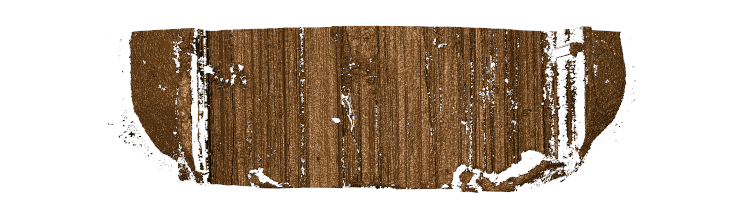{fig-alt="A screenshot of a rendered bullet land engraved area." .fragment}


## Building a Data Processing Pipeline

1. Wrangle scans with `x3ptools`
2. Find a good "crosscut" [-> reduce to 1 dimensional data]{.emph .darkgreen .fragment}

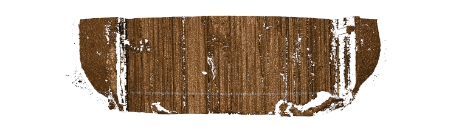{fig-alt="A screenshot of a rendered bullet land engraved area with the crosscut marked across the bottom in silver." .fragment}

## Building a Data Processing Pipeline

1. Wrangle scans with `x3ptools`
2. Find a good "crosscut" [-> reduce to 1 dimensional data]{.emph .darkgreen}

```{r}
#| echo: false
#| label: crosscut-facet
#| fig-width: 6.25
#| fig-height: 2
#| fig-dpi: 600

crosscuts |>
  filter(id %in% c("N-1", "Q-1")) |>
ggplot(aes(x = x, y = value)) + 
  geom_line() + 
  facet_grid(id~land, labeller="label_both") +
  theme_bw() + 
  theme(axis.title=element_blank(), axis.text = element_blank())
```

## Building a Data Processing Pipeline

1. Wrangle scans with `x3ptools`
2. Find a good "crosscut"
3. Keep only the land area -- cut off grooves    
[This was surprisingly hard!]{.emph .blue .fragment}

```{r}
#| echo: false
#| label: crosscut-facet-grooves
#| fig-width: 6.25
#| fig-height: 2
#| fig-dpi: 600

crosscuts |>
  filter(id %in% c("N-1", "Q-1")) |>
ggplot(aes(x = x, y = value)) + 
  geom_line() + 
  geom_vline(data = filter(grooves, id %in% c("N-1", "Q-1")), aes(xintercept = grooves), color = "blue") + 
  facet_grid(id~land, labeller="label_both") +
  theme_bw() + 
  theme(axis.title=element_blank(), axis.text = element_blank()) 

```


## Building a Data Processing Pipeline

1. Wrangle scans with `x3ptools`
2. Find a good "crosscut"
3. Keep only the land area -- cut off grooves
4. Remove surface curvature

```{r}
#| echo: false
#| label: signature
#| fig-width: 6.25
#| fig-height: 2
#| fig-dpi: 600


signatures |>
  filter(id %in% c("N-1", "Q-1")) |>
  filter(!is.na(sig),!is.na(raw_sig)) |>
  ggplot(aes(x = x)) + 
  # geom_line(aes(y = raw_sig), colour = "grey70") +
  geom_line(aes(y = sig), colour = "grey30") +
  facet_grid(id~land, labeller="label_both") +
  ylim(c(-10,10)) +
  theme_bw()
```


## Building a Data Processing Pipeline

1. Wrangle scans with `x3ptools`
2. Find a good "crosscut"
3. Keep only the land area -- cut off grooves
4. Remove surface curvature
5. Align signatures

```{r}
#| echo: false
#| label: alignment
#| fig-width: 6.25
#| fig-height: 1.75
#| fig-dpi: 600

filter(comparisons, b1_id == "Q-1", b2_id=="Q-2", b1_land == 1, b2_land==6)$aligned[[1]]$lands |>
  tidyr::pivot_longer(-x) |>
ggplot(aes(x = x, y = value, color = name)) + 
  geom_line() + theme_bw()

```

## Building a Data Processing Pipeline

1. Wrangle scans with `x3ptools`
2. Find a good "crosscut"
3. Keep only the land area -- cut off grooves
4. Remove surface curvature
5. Align signatures
6. Extract features


```{r}
#| label: bullet-features
#| output-location: fragment
#| echo: false
#| layout-ncol: 6
#| fig-width: 4
#| fig-height: 4
featuredf |>
  ggplot(aes(x = b1_land, y = b2_land, fill = ccf)) + 
  geom_tile() + 
  facet_grid(b1_id ~ b2_id) + scale_fill_gradient2(low = "white", high = "#d7570e", midpoint = 0.5) + 
  theme_bw() + 
  coord_fixed() + 
  ggtitle("Cross-Correlation") + 
  guides(fill = "none")

featuredf |>
  ggplot(aes(x = b1_land, y = b2_land, fill = D)) + 
  geom_tile() + 
  facet_grid(b1_id ~ b2_id) + scale_fill_gradient(low = "#006de6", high = "white") + 
  theme_bw() + 
  coord_fixed() + 
  ggtitle("Euclidean Distance") + 
  guides(fill = "none")


featuredf |>
  ggplot(aes(x = b1_land, y = b2_land, fill = cms2_per_mm)) + 
  geom_tile() + 
  facet_grid(b1_id ~ b2_id) + scale_fill_gradient(low = "white", high = "#047b40") + 
  theme_bw() + 
  coord_fixed() + 
  ggtitle("CMS per mm") + 
  guides(fill = "none")

featuredf |>
  ggplot(aes(x = b1_land, y = b2_land, fill = non_cms_per_mm)) + 
  geom_tile() + 
  facet_grid(b1_id ~ b2_id) + scale_fill_gradient(low = "#a41ffa", high = "white") + 
  theme_bw() + 
  coord_fixed() + 
  ggtitle("Non-CMS Per mm") + 
  guides(fill = "none")

featuredf |>
  ggplot(aes(x = b1_land, y = b2_land, fill = rough_cor)) + 
  geom_tile() + 
  facet_grid(b1_id ~ b2_id) + scale_fill_gradient(low = "white", high = "#db0ac5") + 
  theme_bw() + 
  coord_fixed() + 
  ggtitle("Rough Correlation") + 
  guides(fill = "none")

featuredf |>
  ggplot(aes(x = b1_land, y = b2_land, fill = mismatches_per_mm)) + 
  geom_tile() + 
  facet_grid(b1_id ~ b2_id) + scale_fill_gradient(low = "#13859f", high = "white") + 
  theme_bw() + 
  coord_fixed() + 
  ggtitle("Mismatches per mm") + 
  guides(fill = "none")
```


## Building a Data Processing Pipeline

::: columns
::: {.column width="60%"}
1. Wrangle scans with `x3ptools`
2. Find a good "crosscut"
3. Keep only the land area
4. Remove surface curvature
5. Align signatures
6. Extract features
7. Compute similarity score

:::
::: {.column width="40%"}
```{r}
#| out-width: 100%
#| fig-width: 6
#| fig-height: 6
require(randomForest)
# use the scaled features, but the unscaled names ...
featuredf <- featuredf %>% mutate(
  cms = cms_per_mm,
  matches = matches_per_mm,
  mismatches = mismatches_per_mm,
  non_cms = non_cms_per_mm
  )
featuredf$rfscore <- predict(rtrees, newdata = featuredf, type = "prob")[,2]
featuredf |>
  ggplot(aes(x = b1_land, y = b2_land, fill = rfscore)) + 
  geom_tile() + 
  facet_grid(b1_id ~ b2_id) + scale_fill_gradient2(low = "grey80", high = "#d7570e", midpoint = 0.4) + 
  theme_bw() + 
  coord_fixed() + 
  ggtitle("Random Forest Score") + 
  guides(fill = "none")

```
:::
:::

## Important Features

::: incremental

- Every part of the processing pipeline has diagnostics
  - Design for human-in-the-loop processing
  - Explainability matters!

- Need smart defaults + ability to override

- Most features engineered to correspond to visual signals used by examiners
  - Boosts signal in random forest
  - Cross-correlation is usually "good enough"

:::

# Wire Cuts and Multiple Comparisons {#wire-cuts}

## Hidden Multiple Comparisons Increase Forensic Error Rates {.smaller}

Proceedings of the National Academy of Sciences, 2024

[Joint work with [**Heike Hofmann**]{.darkorange} and [**Alicia Carriquiry**]{.darkpurple}]{.emph}

:::::: columns
::: {.column .vcenter width="30%"}


PNAS Paper Link
:::

::: {.column .vcenter width="10%"}
:::

::: {.column .vcenter .smaller width="60%"}
This work was partially funded by the Center for Statistics and Applications in Forensic Evidence (CSAFE) through Cooperative Agreements 70NANB15H176 and 70NANB20H019 between NIST and Iowa State University, which includes activities carried out at Carnegie Mellon University, Duke University, University of California Irvine, University of Virginia, West Virginia University, University of Pennsylvania, Swarthmore College and University of Nebraska, Lincoln.
:::
::::::

## Toolmark Examination Primer

::: {layout="[[60,-10, 30],[100]]" layout-valign="bottom"}


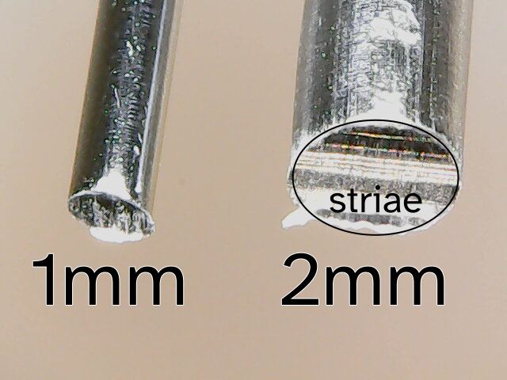


:::

::: fragment
[How do we know wire comparison is valid?]{.emph .meddarkblue .large}
:::

## A Specific Case -- Jimmy Genrich

:::: {layout-ncol="2"}
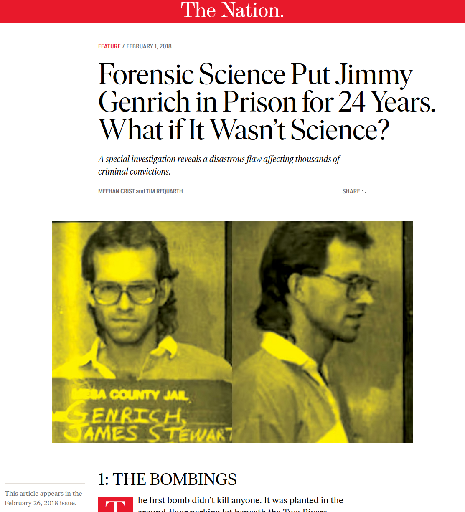{fig-alt="A screenshot of an article by Meehan Crist and Tim Requarth from The Nation (Feb 26, 2018 issue). The title reads 'Forensic Science Put Jimmy Genrich in Prison for 24 Years. What if It Wasn’t Science?'. A mugshot is shown below the article title. Article url: https://www.thenation.com/article/archive/the-crisis-of-american-forensics/" height="750"}

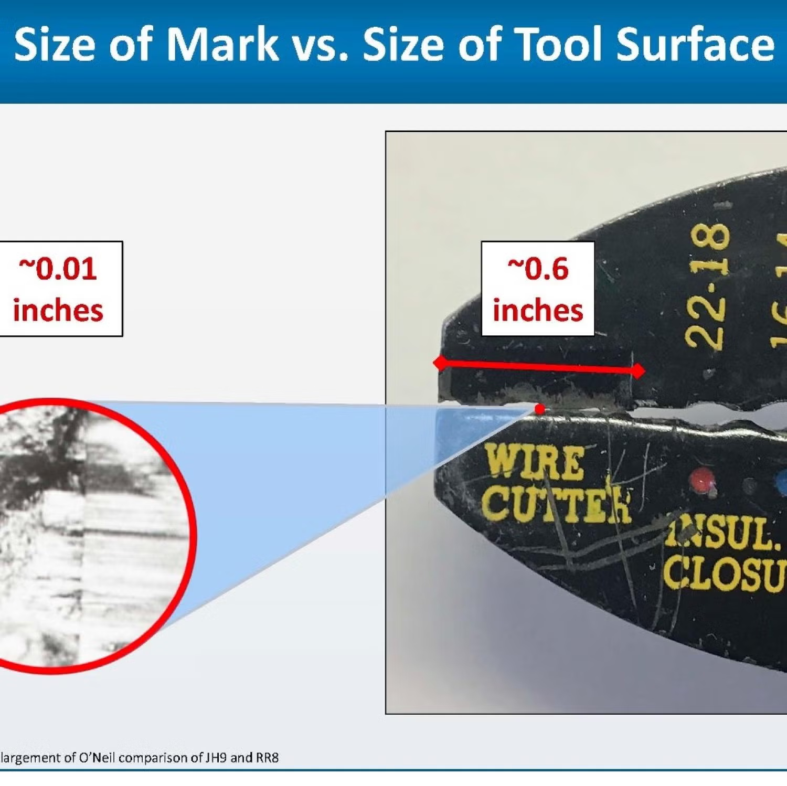{fig-alt="The picture shows the edge of a pair of wire cutters along with a microscopically enhanced picture of striations on a cut wire. At trial, the prosecution and its expert witnesses claimed that Mr. Genrich’s generic wire cutters were the only wire cutters in the world that could have made a tiny mark – just 1/100th of an inch long – found on a piece of wire from one of the bombs. The wire cutter surface compared was .6 inches long -- more than 60 times the length of the wire fragment. Image from https://www.colorado.edu/outreach/korey-wise-innocence-project/2021/08/09/jimmy-genrichs-conviction-overturned." height="750px"}

::::

## Motivation

::: smaller
> At trial, O’Neil testified that tools like the wire cutters found in Genrich’s residence were the only tools that could have been used to make the pipe bombs. “Agent O’Neil opined that the three of Mr. Genrich’s tools were the **only tools in the world that could have made certain marks found on pieces from the four bombs**,” Judge Gurley wrote in Monday's opinion.

> O’Neil was asked specifically at trial what he meant by the phrase “to the exclusion of any other tool.” “That the individual jaw, the location within that jaw on that particular side, was identified as having cut the wire in question to a degree of certainty to exclude any other tool,” he said, according to court transcripts referenced in Gurley’s decision. O’Neil said this was **true of needle-nosed pliers used on the bomb, slip-joint pliers, as well as the wire cutter**.
:::

[Source](https://www.cpr.org/2023/07/10/judge-orders-new-trial-for-grand-junction-man-convicted-in-90s-pipe-bombings/) (emphasis added)

## Personal Motivation

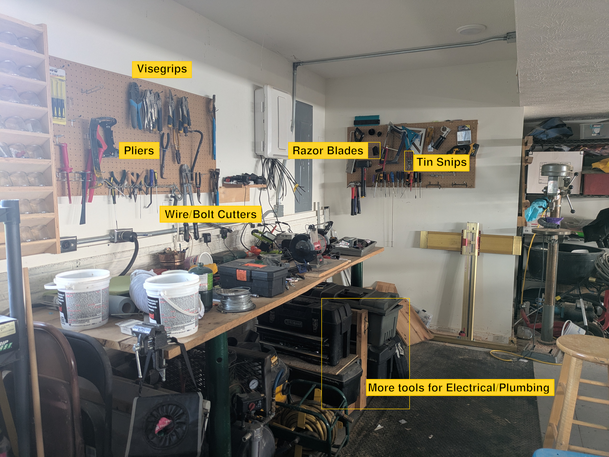{fig-alt="An annotated picture of a messy garage, showing all of the tools which could conceivably make striated toolmarks, including visegrips, pliers, bolt cutters, pry bars, electrical tools, razor blades, hammers, tin snips, saws, and more." width="60%"}

## Constructive Scientific Proof<br>[from first principles]{.emph .meddarkblue .smaller}

::::: columns
::: {.column .r-fit-text width="70%"}
-   Understand
    -   how tools make marks
    -   tool wear over time
    -   tool manufacturing processes
    -   tool/material interaction
    -   mark type/frequency distribution
-   Track
    -   Frequency of tools in a local population
:::

::: {.column width="30%"}
[😓]{.extrabig .fragment}
:::
:::::

::: notes
Scientifically, we might boil this down to a series of engineering and materials science problems - understanding the types of marks which can occur on different types of tool materials through manufacture, wear, etc., and then understanding in turn how those tools transfer marks to other surfaces and how force, angle, and material hardness impact those marks.

Unfortunately, though, the number of different characteristics gets very quickly out of control and you end up with an exponential number of interactions very quickly.

Establishing the discipline from first principles is ... difficult, to say the least. You could probably do it with a combination of time, stubbornness, and statistical inference, but there is always a chance that a new manufacturing method will be developed that will produce new types/classes of markings.

But, there are other ways to handle this problem.
:::

## 📐 A Different Angle on the Problem

-   $e^{(1)}$: error rate for a single comparison

-   $e^{(N)}$: overall error rate, $N$ comparisons

-   Calculate $N$: \# comparisons between tool and evidence

-   [Ultimate question]{.emph .darkpurple}:\
    What does $e^{(1)}$ need to be for $e^{(N)}$ to be low[^4]?

[^4]: Low enough will be determined by courts⚖️, not statisticians... 🫣


## Structural Parameters

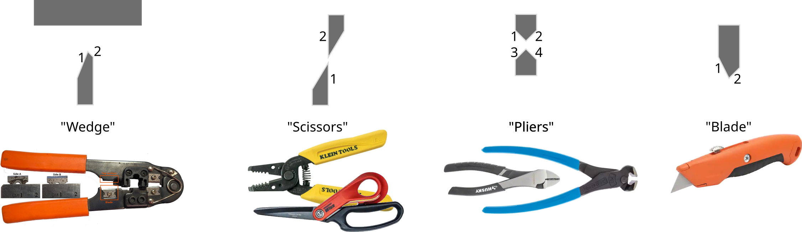{fig-alt="A profile image of the blades of each of four types of tools - wedge-type cuts (guillotine/wire cutters), scissors, pliers, and blades. All but pliers have two cutting surfaces, but the angles of each surface differ. Pliers have 4 cutting surfaces." width="80%" style="margin-left:auto;margin-right:auto;"}

-   Bladed Surfaces: $s \in \{2, 4\}, 1 \leq i \leq s$

-   Cut Surfaces (on one wire): $w \in \{1, 2\}, 1\leq j\leq w$

## Visual Examination {.smaller}

::: columns
::: {.column width="80%"}
-   Test cuts made along the blade(s) of the tool

-   At least $N_{ij} = b_i/d_j$ comparisons for each blade surface $i$ and cut wire surface $j$

-   Manual alignment: estimate the minimum comparisons


{width="100%" fig-alt="A diagram showing a blade cut (long, thin) with striations compared to a wire cut (semi-circle shape, short) aligned with the blade cut. There are multiple non-overlapping positions along the blade cut where the wire cut could fit, and each is shown with an empty hemisphere."}

:::

::: {.column width="20%"}

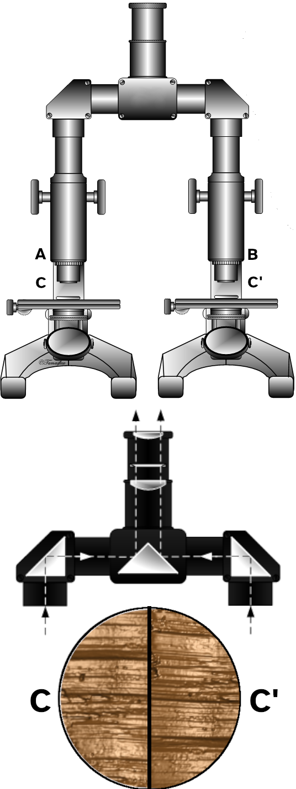{fig-alt="An image of a comparison microscope, which allows viewing two samples simultaneously in order to align them."}
:::
:::


## Visual Examination

{width="100%" fig-alt="A diagram showing a blade cut (long, thin) with striations compared to a wire cut (semi-circle shape, short) aligned with the blade cut. There are multiple non-overlapping positions along the blade cut where the wire cut could fit, and each is shown with an empty hemisphere."}

Adj. comparisons are non-overlapping $\Rightarrow$ "independent"[^5]

[^5]: There are peak-valley dependence structures in profile data, but conditioning on tool/material/manufacturing, we would **expect** statistical independence between adjacent comparisons

## Algorithmic Comparison

Scans -\> Cross Section -\> "Signature"\
(remove gross topology)

{fig-alt="An animated gif of a wire cross-section sliding along a composite cross section generated from a blade cut."}

## Number of Comparisons {.smaller}

```{r}
nc <- floor(15000/0.645 - 2000/0.645 + 1)
Ncomp1 <- format(nc, big.mark=",")
Ncomp2 <- format(nc*2, big.mark=",")
```

|                  | Minimum (Manual) | Maximum (Algorithm)       |
|------------------|------------------|---------------------------|
| blade size       | $b=15 \text{mm}$ | $b=15000 \mu \text{m}$    |
| cutting surfaces | $s=2$/blade      | $s=2$/blade               |
| wire size        | $d=2 \text{mm}$  | $d=2000 \mu \text{m}$     |
| wire surface     | $w=1$            | $w=1$                     |
| resolution       |                  | $r=0.645 \mu \text{m/px}$ |
| \# per side      | 7.5              | `{r} Ncomp1`              |
| \# total         | 15               | `{r} Ncomp2`              |

This assumes a single wire and a single possible tool.

## So How Bad Is the Problem?

For error rate $e$ and $n$ comparisons

$$P(\text{no false positive errors}) = 1 - \left(1 - e\right)^n$$

::: fragment
[Simple probability 🎲 strikes again!]{.emph .darkcerulean}
:::

## So How Bad Is the Problem?

-   Estimated false positive error rate for striated comparisons from bullets and firing pins: 0.45 - 7.24%.

    -   [**Pooled estimate**: 2%]{.emph .darkgreen}

    -   Not enough error rate studies on wires

    -   Bullets have additional structure to facilitate alignment

    -   Wires have additional complexity

        -   shorter sequences
        -   more dependence on angle

[$\Rightarrow$ **2% is a generous estimate...**]{.emph .meddarkblue .fragment}

## So How Bad Is the Problem?

To keep the overall false positive rate under 10%...

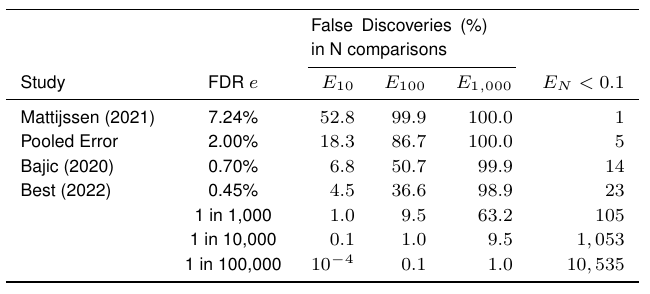{fig-alt="A table showing the family wise false discovery rate for N comparisons using several different estimates of striated comparison error rates. When the FDR is 7%, over 50% of 10-comparison samples would be expected to have a false positive. When the FDR is 2%, over 18% of 10-comparison samples would be expected to have a false positive. Additional columns are provided giving the expected frequency of 100 and 1000 comparisons under different error rates. The final column provides the maximum number of comparisons at the specified error rate which can be performed to keep the family wise false positive error rate under 10%."}

[2% Error -\> 5 total comparisons.]{.emph .meddarkblue .fragment}

[Minimum of 15 required to do even a simple wire-cut analysis.]{.emph .meddarkblue .fragment}

## Wire Cuts Conclusions

-   Wire cut forensics are not scientifically sound using current analysis methods

::: {.fragment .smaller}
but... this problem shows up in database searches, too!

-   IAFIS (Integrated Automated Fingerprint ID System)
-   NIBIN (Ballistics Database)
-   NDIS (National DNA ID System) and CODIS (Combined DNA ID System)
-   PDQ (Paint Data Query)
-   FISH (Forensic ID System for Handwriting)
:::

## Wire Cuts Conclusions

::: incremental
-   Automatic intelligence algorithms are not a good substitute for investigative work

-   Example: Oregon

    -   3 firearms examiners for the state
    -   Most firearms evidence run through NIBIN first
    -   Promising leads forwarded to examiners for manual assessment
:::

[This is a setup that could generate false-positives by design!]{.cerulean .emph .fragment}

## Wire Cuts Conclusions {.smaller}

::: incremental
-   Examiners should report and the defense should require

    -   overall length/area of surfaces generated during the examination $(b)$
    -   total consecutive length/area of recovered evidence $(d)$

-   Studies relating length/area of comparison surface to error rates are essential!

    -   No available black-box error rate for wire cuts
    -   Studies should be difficult, like casework!

-   Any database search used at any stage of the process should be disclosed along with

    -   $N$ items in the database used for comparison
    -   Number of results returned as 'similar' (top 20? top 5?)
    -   Protocols for confirmatory assessment
:::


## A Happy Ending

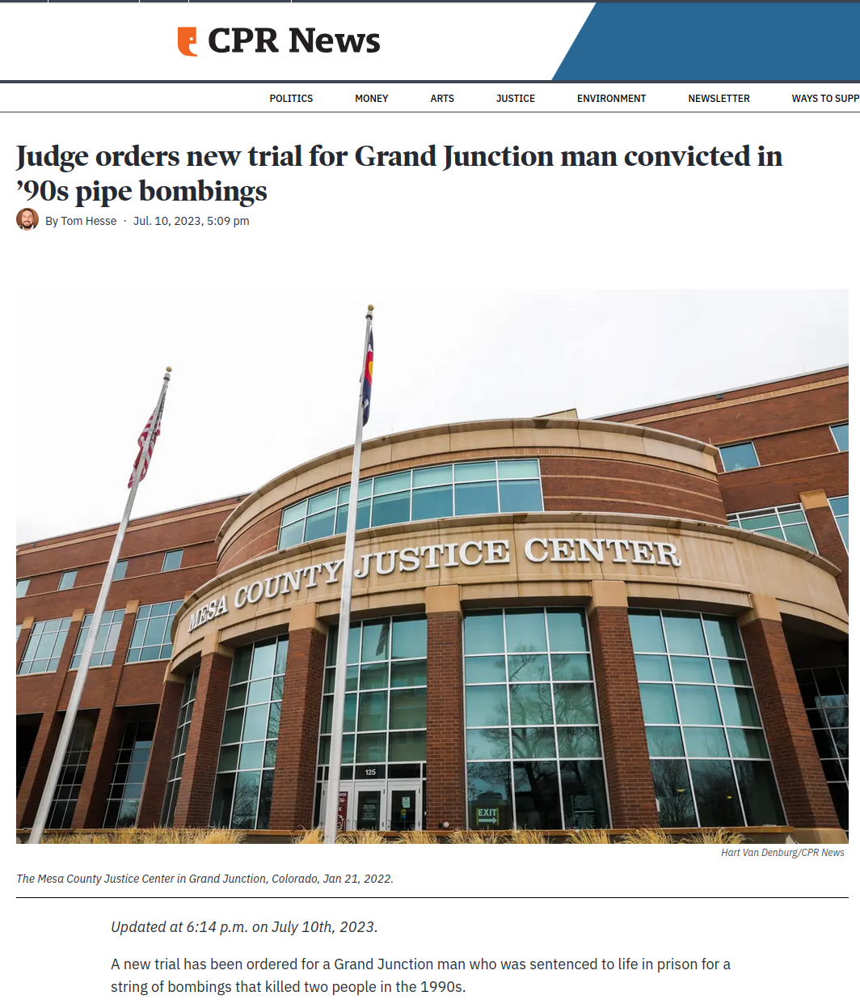{fig-alt="A Colorado Public Media story by Tom Hesse from July 10, 2023, titled 'Judge orders new trial for Grand Junction man convicted in '90s pipe bombings'. A picture of the Mesa County Justice Center is shown below the article title. Article url:  https://www.cpr.org/2023/07/10/judge-orders-new-trial-for-grand-junction-man-convicted-in-90s-pipe-bombings/" width="60%"}

# Conclusions {#conclusions .smaller}

## [Socially Responsible AI]{.emph .blue}

::: incremental

- Model assumptions and capabilities are critical ...     
[and can be a problem]{.fragment .emph .red}

  - Identify critical model capabilities
  - Assess whether the model(s) are fit for purpose

- Design critical algorithms to 

    - be explainable by design
    - have a human in the loop

- Get (and stay) involved in an applied domain

:::

# Questions? {.center}