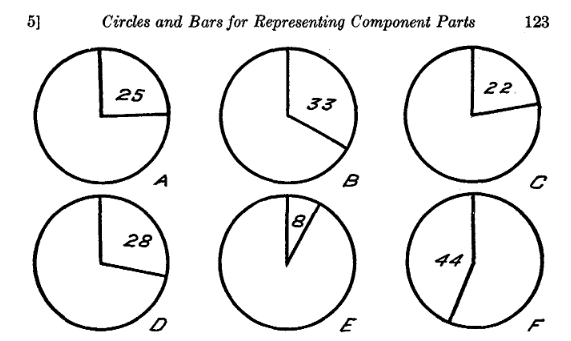
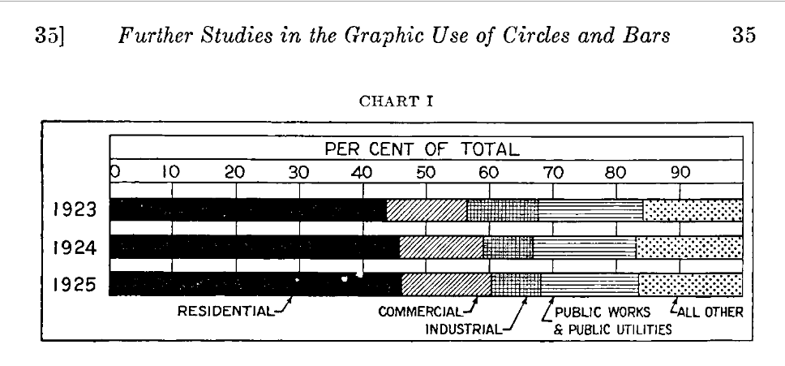
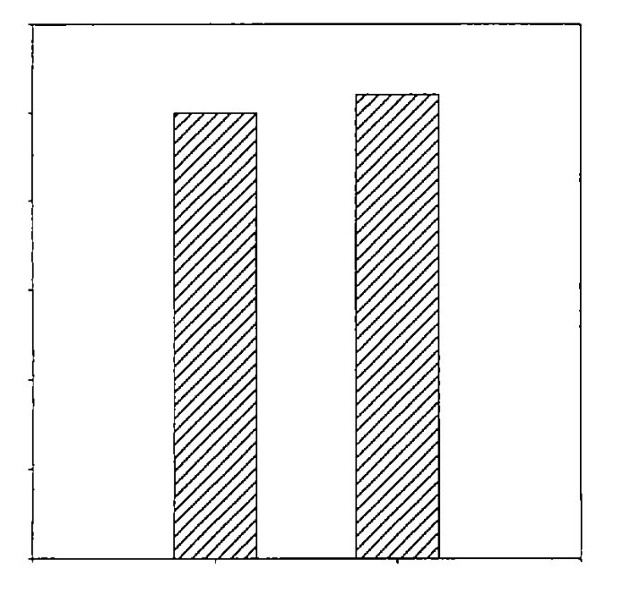
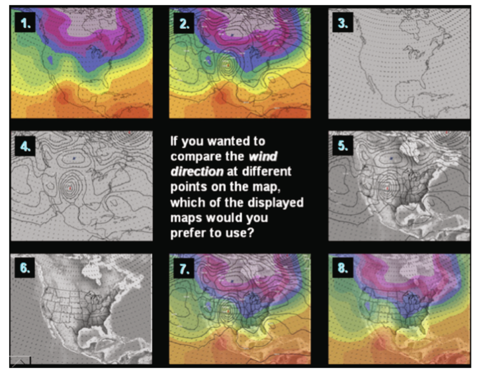
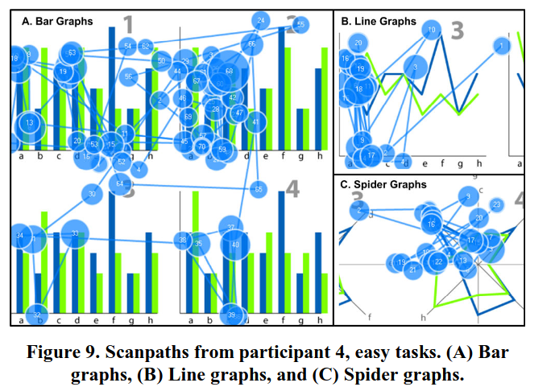
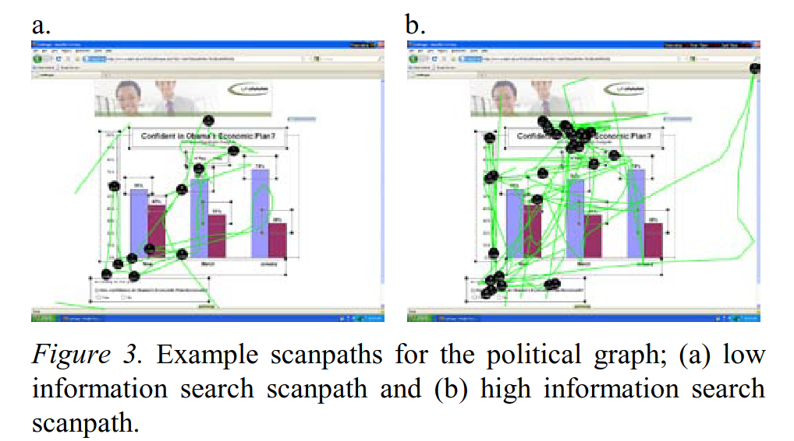
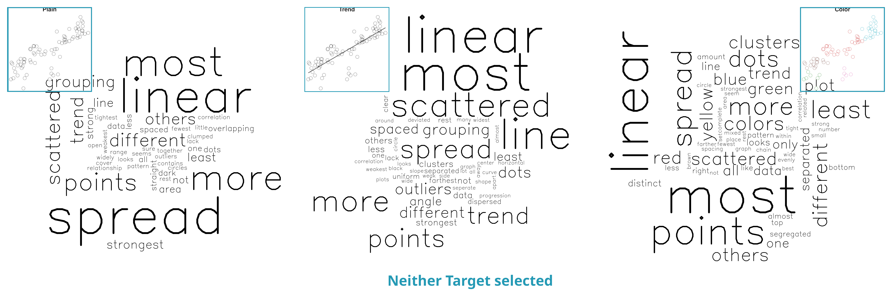
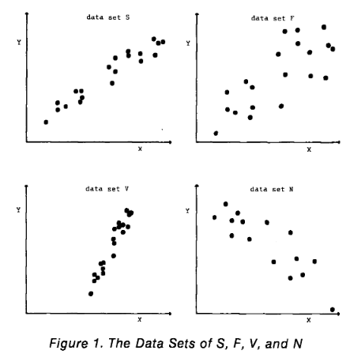
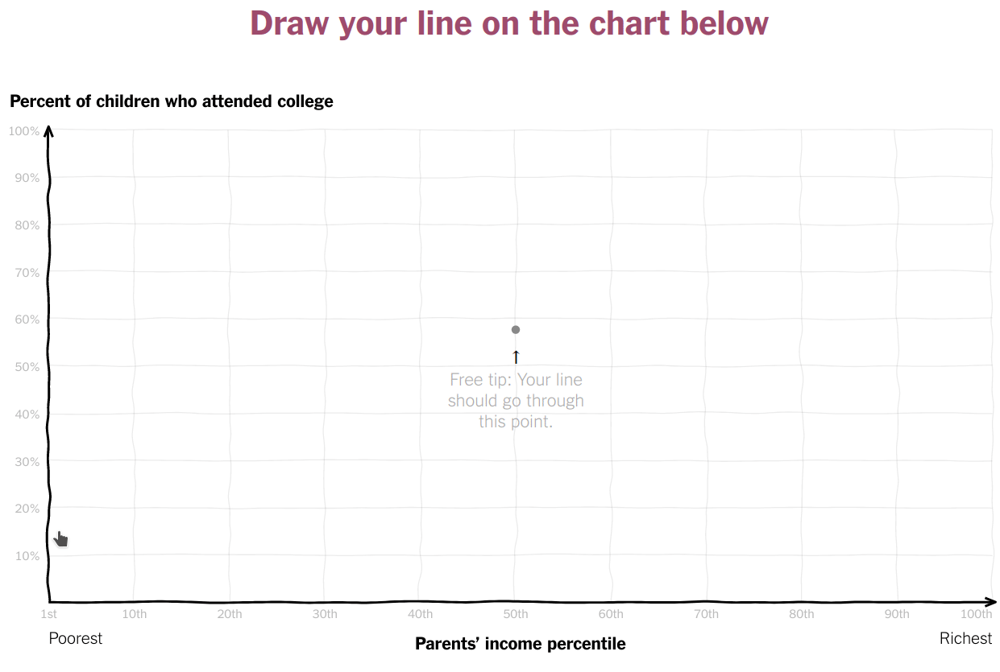

## Lineups

::: columns
::: {.column width="50%"}

:::

::: {.column .smaller width="50%"}
[A "Visual Hypothesis Test"]{.cerulean .emph}

-   Embed the question in array of charts

-   Can people identify the different plot?

-   Null model can be tricky to create

-   Test statistic is the visual evaluation

::: small
@bujaStatisticalInferenceExploratory2009\
@loyDiagnosticToolsHierarchical2013\
@majumderValidationVisualStatistical2013\
@vanderplasClustersBeatTrend2017\
@vanderplasStatisticalSignificanceCalculations2021
:::
:::
:::

## Numerical Estimation

::: columns
::: column
{width="80%" fig-align="center"}

{width="80%" fig-align="center"}
:::

::: column
::: smaller
-   Size of region?\
    @eellsRelativeMeritsCircles1926; @croxtonBarChartsCircle1927; @vanderplasFramedReproducingRevisiting2019
-   With scales?\
    @vonhuhnFurtherStudiesGraphic1927
-   Size of relationship compared to another region\
    @croxtonGraphicComparisonsBars1932
-   Very sensitive to question phrasing
:::
:::
:::

## Forced Choice

::: columns
::: column
{width="30%" fig-align="center"}

{width="100%" fig-align="center"}
:::

::: column
::: smaller
-   Force participants to answer a specific question

-   May be a size judgment (which is larger?)

    -   common in psychophysics experiments

-   May be a more complex decision incorporating other information

@hughesJustNoticeableDifferences2001\
@xiongBiasedAveragePosition2020\
@luModelingJustNoticeable2022
:::
:::
:::

## Eye Tracking

::: columns
::: {.column width="60%"}
-   Infer cognitive processes from directed (conscious) attention

-   May be accompanied by direct estimation or other protocols

<!-- - Can be combined with other methods -->

::: smaller
@gegenfurtnerExpertiseDifferencesComprehension2011\
@goldbergEyeTrackingVisualization2011\
@zhaoMindReadingUsing2013a\
@netzelComparativeEyetrackingEvaluation2017\
@liuChoosingOptimalMeans2023
:::
:::

::: {.column width="40%"}
{width="90%"}

{width="90%"}
:::
:::

## Think Aloud and Free Response

-   Stream of consciousness narration @guanValidityStimulatedRetrospective2006[; @cookeAssessingConcurrentThinkAloud2010]{.smaller}

-   Reasoning to justify a decision

## Direct Annotation

::: columns
::: column

:::

::: {.column .smaller}
-   Have participants visually fit statistics

    -   Usually directly annotating the chart with e.g. a regression line

-   Compare visual statistics to numerical calculations

-   Differences tell us about our implicit perception of data\
    [e.g. visual regression is more robust to outliers]{.smaller}

-   Also useful as a teaching tool

::: smaller
@bajgierVisualFitsTeaching1989\
@robinsonEyeFittingStraight2022\
@robinsonYouDrawIt2023
:::
:::
:::

## How Do We Test Graphics?

-   Testing method needs to be matched to level of engagement

-   Need to examine graphical choices across levels of engagement

::: notes
The next question we had was whether we can accurately predict/forecast exponential trends. This study is quite different from the last one - users were asked to draw lines on graphs interactively.
:::

## Q2: Inspiration {.smaller}

::: columns
::: column
-   [D. J. Finney (1951) Subjective Judgment in Statistical Analysis: An Experimental Study. *Journal of the Royal Statistical Society*](https://rss.onlinelibrary.wiley.com/doi/abs/10.1111/j.2517-6161.1951.tb00093.x)

-   [Frederick Mosteller et al. (1981) Eye Fitting Straight Lines. *The American Statistician*](https://www.tandfonline.com/doi/abs/10.1080/00031305.1981.10479335)

-   New York Times' 'You Draw It' features:

    -   [Family Income affects college chances](https://www.nytimes.com/interactive/2015/05/28/upshot/you-draw-it-how-family-income-affects-childrens-college-chances.html)
    -   [Just How Bad Is the Drug Overdose Epidemic?](https://www.nytimes.com/interactive/2017/04/14/upshot/drug-overdose-epidemic-you-draw-it.html)
    -   [What Got Better or Worse During Obama's Presidency](https://www.nytimes.com/interactive/2017/01/15/us/politics/you-draw-obama-legacy.html?_r=0)
:::

::: column

:::
:::

::: notes
There have been a number of statistical experiments with "eye fitting" regression models. The first was driven by the desire to reduce computation time; the second is much more psychological in nature. That study had students line up a transparency with a straight line on it to fit a regression line to some data. They found that students tended to fit the slope of the first PC rather than the least squares line.

More recently, The New York Times has used a really cool setup to have people predict data before showing them the actual trend. They use javascript and have people draw directly on the plot. The line can be curved, jagged, etc. - it's not restricted to a strictly linear set-up. We decided to adopt this approach because we didn't want to impose a specific functional form, because it's not totally clear that people are thinking exponentially or are actually good at drawing exponential curves.

The methods changed a bit, but the basic concept is the same.
:::

## Nat. Acad. of Science (NAS) Report {.r-fit-text}
::: columns
::: {.column width="40%"}

:::

::: {.column width="60%"}
> The adversarial process relating to the admission and exclusion of scientific evidence is **not suited to the task of finding "scientific truth."** The judicial system is encumbered by, among other things, judges and lawyers who generally lack the scientific expertise necessary to comprehend and evaluate forensic evidence in an informed manner... Judicial review, by itself, will not cure the infirmities of the forensic science community.
:::
:::
