```{r}
#| label: load_refs
#| echo: false
#| cache: false
#| include: false

library(tidyverse)
library(RefManageR)
BibOptions(check.entries = FALSE, 
           bib.style = "numeric", 
           cite.style = 'authoryear', 
           style = "html",
           hyperlink = FALSE, 
           no.print.fields = c("isbn", "urldate"),
           dashed = FALSE)
bb <- ReadBib("./CV.bib", check = T)
```

# Outline

1.  [Introduction](#introduction) <!-- Hi, I'm susan and I do an odd assortment of things -->
2.  [Perception & Statistical Graphics](#graphics) <!-- Career Award project -->
3.  [CSI: Statistics and the Fundamentals of Science](#csi-stats) <!-- Error Rates and Scientific Foundations in Forensics -->

# Introduction 😶‍🌫️☁️🌎 {#introduction}

## 🏫 Education

::: nolines
+:-------:+:------------------------------------------------------------------------------------------------------------------------------------------------------------------------------------------------------------------------------------------------+
| 2009    | BS, Psychology & Applied Math {style="position:absolute;right:10px;margin-top:0;margin-left:50px;margin-right:50px;max-width:150px;height:50px;" fig-alt="Texas state outline with ATM logo from Texas A&M university."} |
+---------+-------------------------------------------------------------------------------------------------------------------------------------------------------------------------------------------------------------------------------------------------+
| 2011    | MS, Statistics {style="position:absolute;margin-top:20px;right:10px;max-width:150px;height:100px;" fig-alt="A red I overlaid with STATE, the Iowa State university logo."}                                                |
+---------+-------------------------------------------------------------------------------------------------------------------------------------------------------------------------------------------------------------------------------------------------+
| 2015    | Ph.D., Statistics<br/>[Dissertation:]{.small}[[Perception of Statistical Graphics](https://srvanderplas.github.io/Dissertation/SusanVanderplas-DissertationFinalVersion.pdf)]{.emph}                                                            |
+---------+-------------------------------------------------------------------------------------------------------------------------------------------------------------------------------------------------------------------------------------------------+
:::

---

{fig-alt="A timeline of career moves, locations, and projects." width="95%" height="auto"}

## 📊 Recent Work

::: r-fit-text
```{r}
#| label: graphics-pubs
#| results: 'asis'
#| echo: false
#| cache: false
#| include: false

mypubs <- ReadBib("CV.bib") |> sort(sorting = "ydat")

newpubs <- as.data.frame(mypubs) |> 
  arrange(desc(date)) |> 
  filter(row_number() > 2) |>
  filter(!str_detect(keywords, "npr")) |>
  head(5) |>
  as.BibEntry()

NoCite(newpubs)
PrintBibliography(newpubs, .opts = list(sorting = "ydnt", no.print.fields = c("note", "file", "issn", "url-date", "url", "doi"), style="markdown"))
```

-   Can You See The Change? Visual Perception in Change Point Analysis (JCGS)\
    [Fudolig, Robinson, and Vanderplas. 2025]{.small}

-   Automated Residual Plot Assessment With the R Package autovi and the Shiny Application autovi.web (Aus & NZ Journal of Stats)\
    [Li, Cook, Tanaka, Vanderplas, and Ackermann. 2025]{.small}

-   Perception and Cognitive Implications of Logarithmic Scales for Exponentially Increasing Data: Perceptual Sensitivity Tested with Statistical Lineups (JCGS)\
    [Robinson, Howard, Vanderplas. 2025]{.small}

-   A Guide to Designing Experiments to Test Statistical Graphics (WIRE Computational Statistics)\
    [Robinson, Hofmann, Vanderplas. 2025]{.small}
:::

## 🔬 Recent Work

::: r-fit-text
-   Methodological problems in every black-box study of forensic firearm comparisons (Law, Probability, and Risk)\
    [Cuellar, Vanderplas, Luby, Rosenblum. 2024]{.small}

-   Incorrect statistical reasoning in *Guyll et al.* leads to biased claims about strength of forensic evidence (PNAS)\
    [Rosenblum, Chin, Ogburn, Nishimura, Westreich, Datta, Vanderplas, Cuellar, Thompson. 2024]{.small}

-   Hidden Multiple Comparisons Increase Forensic Error Rates (PNAS)\
    [Vanderplas, Carriquiry, Hofmann. 2024]{.small}

-   Amicus Briefs or Testimony filed in cases in Oregon, Washington, Michigan, Colorado, California, Maryland, Illinois, Washington D.C., New Jersey, Federal (Northern District of Florida)
:::

## 🐣 Coming Soon!

::: r-fit-text
Forensics:

-   `courtR` package for legal transcript studies
-   `highlightR` package for conserved text analysis
-   Assessing Algorithm Use and Testimony for Firearms and Toolmark Analysis
-   What Comes Next: A Constructive Vision for Forensic Firearms Analysis

Graphics:

-   `ggdibbler` package and paper - uncertainty visualization
-   Experiential Learning with Statistical Graphics: Writing, Reflection, and Suspense
-   Assessing Computer Vision models for Gestalt Perception
-   Parallel Coordinate Plots with Mixed-Type Variables
-   Visual Statistical Inference

:::

## 💵 Funded Grants

::: r-fit-text
-   2025-2030, NSF CAREER, What Do You See? Perception, Decisions, and Statistical Graphics     
(\$550,000)

-   2020-2024, NIST, CSAFE Project lead: Footwear Class Characteristics and Human Factors     
(\$20 mil for CSAFE, \$456,930 sub-award)

-   2019/2021 - 2023, NIJ, Automatic Acquisition and Identification of Footwear Class Characteristics     
(\$380,650)

-   2020-2023, USDA-NRCS, Improving the Economic and Ecological Sustainability of US Crop Production through On-Farm Precision Experimentation     
(\$4 mil total, \$400,000 for 3 UNL PIs)

-   2019-2022, NSF, Overcoming the Rural Data Deficit to Improve Quality of Life and Community Services in Smart & Connected Small Communities     
(\$1.5 mil total, \$123,445 sub-award)
:::

# Perception & Statistical Graphics {#graphics}

------------------------------------------------------------------------

```{r}
#| label: HR-diagram
#| fig-width: 8
#| fig-height: 5
#| out-width: "100%"
#| message: false
#| warning: false
#| echo: false
#| fig-cap: "[The Hertzsprung Russell diagram. Discovered independently by Ejnar Hertzsprung (1873–1967) and Henry Norris Russell (1877–1957). The diagram plots the color index of the star against the brightness (absolute magnitude) of the star. As a result, it is possible to discern that these two variables are related and change together over a star's life cycle: a hypothesis that only came to be because of this chart.]{.small}"
#| fig-alt: "A scatter plot showing the color index of a star on the x-axis and the absolute magnitude (brightness) of the star on the y-axis. Points are colored by spectral class, which varies from blue to white to yellow to red as the color index increases and the star's temperature decreases. Points are primarily located along a downward-sloping line from the top left to the bottom right, which is labeled the 'main sequence'. There is another set of points which diverges from the main sequence and extends out horizontally in the middle of the graph; these are labeled 'giants', and a few outliers that are above the giant cluster are labeled 'supergiants'. Below the main sequence stars, there are outliers which are labeled 'dwarfs'."
#| fig-dpi: 300
if (!file.exists("../data/stars.csv")) download.file("https://raw.githubusercontent.com/astronexus/HYG-Database/main/hyg/v3/hyg_v38.csv.gz", destfile = "../data/stars.csv.gz")
library(magrittr)
library(dplyr)
library(stringr)
library(ggplot2)
stars <- readr::read_csv("../data/stars.csv")

stars <- stars %>%
  mutate(Spectral.Class = str_extract(spect, "^.") %>%
           str_to_upper() %>%
           factor(levels = c("O", "B", "A", "F", "G", "K", "M"), ordered = T),
         EarlyLate = str_extract(spect, ".(\\d)") %>%
           str_replace_all("[^\\d]", "") %>% as.numeric(),
         Temp = 4600*(1/(.92*ci + 1.7) + 1/(.92*ci) + 0.62)) %>%
  filter(!is.na(Spectral.Class) & !is.na(EarlyLate) & !is.na(hip)) %>%
  arrange(Spectral.Class, EarlyLate) %>%
  mutate(SpectralClass2 = paste0(Spectral.Class, EarlyLate) %>% factor(., levels = unique(.)))

ggplot(data = filter(stars, dist < 500)) + 
  # annotate(x = -.25, xend = .75, y = -2, yend = -6.5, arrow = arrow(ends = "both", length = unit(.1, "cm")), geom = "segment", color = "grey") + 
  annotate(x = 0.125, xend = 2, y = 4.25, yend = 4.25, arrow = arrow(ends = "both", length = unit(.1, "cm")), geom = "segment", color = "grey") + 
  geom_point(aes(x = ci, y = -absmag, color = Spectral.Class), alpha = .3) + 
  scale_x_continuous("B-V Color Index", breaks = c(0, .5, 1, 1.5, 2), labels = c("Hot  0.0       ", "0.5", "1.0", "1.5", "           2.0  Cool")) + 
  scale_y_continuous("Absolute Magnitude (Brightness)", breaks = c(-8, -4, 0, 4), labels = c(8, 4, 0, -4)) + 
  scale_color_manual("Spectral\nClass", values = c("#2E478C", "#426DB9", "#B5D7E3", "white", "#FAF685", "#E79027", "#DA281F")) + 
  annotate(x = .25, y = -5.5, label = "Dwarfs", geom = "text", angle = -25, color = "white") + 
  annotate(x = .5, y = -3.75, label = "Main Sequence", geom = "text", angle = -28) + 
  annotate(x = 1.125, y = 0, label = "Giants", geom = "text") + 
  annotate(x = 1, y = 4.5, label = "Supergiants", geom = "text", color = "white") +
  theme(panel.background = element_rect(fill = "#000000"),
        legend.key = element_blank(), 
        panel.grid = element_line(colour = "grey40"),
        axis.text = element_text(color = "white"),
        text = element_text(size = 18, color = "white"), 
        legend.background = element_rect(fill = "#000000"),
        plot.background = element_rect(fill = "#000000")) + 
  ggtitle("Hertzsprung-Russell Diagram") + 
  coord_cartesian(xlim = c(-.25, 2.25), ylim = c(-12, 7)) + 
  guides(color = guide_legend(override.aes = list(alpha = 1)))
```

[Data from the [HYG Database](https://github.com/astronexus/HYG-Database). Shows stars within 500 AU.]{.small}

::: notes
John Tukey, a famous statistician often considered the father of statistical graphics, wrote in Exploratory Data Analysis (1977):

> The greatest value of a picture is when it forces us to notice what we never expected to see.
:::

## Cognitive Psychology for Charts

-   Graphics research has historically focused on\
    [accuracy]{.emph .red} and [response time]{.emph .red}

[But, that isn't how we use graphics!]{.fragment .emph .blue}

{.fragment fig-alt="A timeline showing different levels of graphical engagement, starting with initial perception, then using gestalt grouping, leveraging domain knowledge, fittting visual statistics and storytelling, visually conducted inference,  to grouping" width="100%"}

## Multimodal Testing [in Practice]{.emph .cerulean .center} {#logscales .center}

Joint work with [Emily Robinson]{.emph .darkred}

::: columns
::: {.column width="30%"}


2022: Eye Fitting Straight Lines in the Modern Era (JCGS)
:::

::: {.column width="5%"}
:::
::: {.column width="30%"}


2023: ‘You Draw It’: Implementation of Visually Fitted Trends with `r2d3` (JDS)
:::
::: {.column width="5%"}
:::
::: {.column width="30%"}


2025: Perception and Cognitive Implications of Logarithmic Scales for Exponentially Increasing Data (JCGS)
:::
:::


## Perception: Exp. Growth & Log Scales {.r-fit-text}

::: {.large .cerulean .emph .fragment}
3 different ways of engaging with the data
:::

Can we

-   Q1: **perceive** differences in [    ... Perceptual]{.fragment .emph .red}
-   Q2: **forecast** trends from [    ... Tactile]{.fragment .emph .green}
-   Q3: **estimate** and **use** [    ... Numerical]{.fragment .emph .blue}

graphs of exponential growth with log and linear scales?

[300 participants completed all 3 experiments]{.fragment .emph .cerulean}

::: notes
I'm a huge fan of lineups, but one of the issues I had with the COVID graphs I was seeing was that I wasn't convinced people were *interpreting* the data correctly.

I started thinking about why lineups wouldn't test things at the level I was hoping for, and eventually came up with this hierarchy - first, you have to be able to recognize that there is a difference between two things. Then, you have to be able to predict and forecast to map "data from the past" onto the future. Finally, you have to actually be able to read data off of the graph and act on it - doing numerical calculations and the like.

These are distinct psychological tasks, and they require different ways of interacting with a chart. So I'm going to describe 3 experiments that we've conducted relating to log scales.

These experiments were inspired by COVID, but we worked hard to not go anywhere near COVID data because while we were designing these experiments, it was a bit emotionally loaded. Even now that pandemic measures have ended, it's still too politically sensitive to touch, so we'll continue using non-covid data on follow-up studies.
:::

## Q1: Perception of Differences {.center}

## Q1: Perception of Differences

::: {layout-ncol="2"}
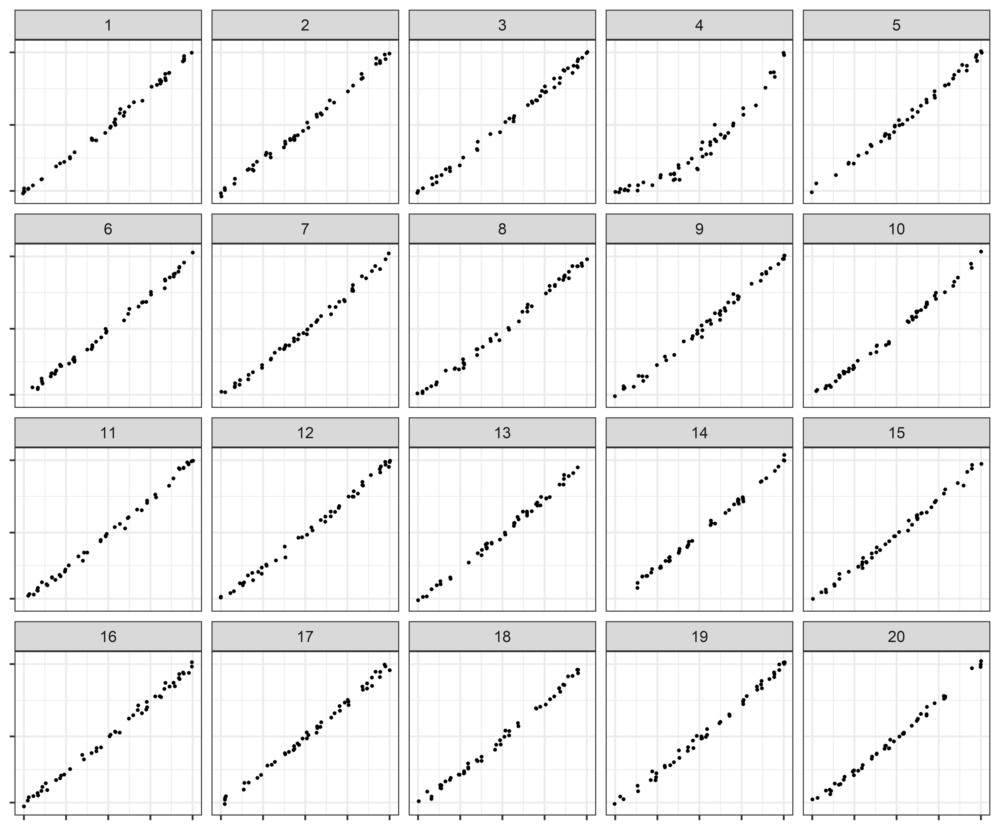

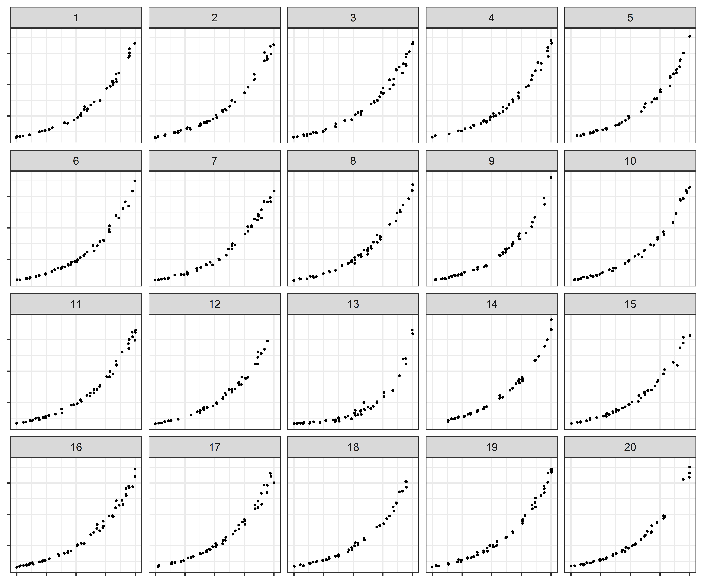
:::

::: notes

Here are a couple of example lineups from this experiment - the first is on a linear scale, the 2nd is on a log scale. While I generally tried throughout these experiments to make it clear that we were on a log scale, it is a very subtle difference in these lineups, and fixing that wasn't necessarily relevant to the question at hand -- since all sub-panels have the same axis breaks, we're actually testing whether we can distinguish the data, not the scales.

:::

<!-- XXX Go create a chart showing experiment layout factors XXX -->

## Q1: Perception of Differences {.r-fit-text}

```{r odds-ratio-plot, eval = F, fig.width = 5, fig.height = 2, fig.align='center', message = F, warning = F}
library(tidyverse)
slice_curvature <- read_csv("results/jsm-student-paper-slicediffs.csv") %>%
  select(SimpleEffectLevel, test_param,	"_test_param", OddsRatio,	Alpha,	Lower,	Upper,	AdjLower,	AdjUpper,	LowerOR,	UpperOR,	AdjLowerOR,	AdjUpperOR) %>%
  na.omit() %>%
  extract(SimpleEffectLevel, into = c("Target", "Null"), "curvature t-([MEH])_n-([EMH])", remove = F) %>%
  mutate(Target = factor(Target, levels = c("E", "M", "H"), labels = c("High", "Medium", "Low")),
         Null = factor(Null, levels = c("E", "M", "H"), labels = c("High", "Medium", "Low")))

dodge <- position_dodge(width=0.9)
odds_ratio_plot <- slice_curvature %>%
  ggplot(aes(x = OddsRatio, y = Null, color = Target, shape = Target)) + 
  geom_point(position = dodge, size = 3) + 
  geom_errorbar(aes(xmin = LowerOR, xmax = UpperOR), position = dodge, width = .1) +
  geom_vline(xintercept = 1) +
  theme_bw()  +
  theme(axis.title = element_text(size = 8),
        axis.text = element_text(size = 8),
        legend.title = element_text(size = 8),
        legend.text  = element_text(size = 8),
        legend.key.size = unit(0.7, "line")
        ) +
  scale_y_discrete("Null Plot Curvature") +
  scale_x_continuous("Odds ratio (on log scale) \n (Log vs Linear)", trans = "log10") + 
  scale_color_manual("Target Plot Curvature", values = c("#004400", "#116611", "#55aa55")) + 
  scale_shape_discrete("Target Plot Curvature")
odds_ratio_plot
```

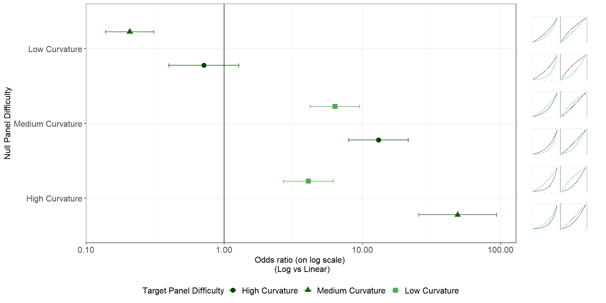

[Conclusion:]{.emph .cerulean} It's easier to spot a curve among lines than it is to spot a line among curves

@robinsonGuideDesigningExperiments2025

::: notes
We used a generalized linear mixed effects model to assess the probability of a correct target identification given factors like target and null plot type, participant skill level, and random effects due to the data generating process. The plot shown here is the resulting log odds ratio for log vs. linear scales, and we see that it is easier to detect curvature among a field of null lines than it is to detect linearity among a field of curved lines. In addition, we see that when there is a lot of contrast between the null and the target plot, that is, when the nulls are very curved and the target is very straight, there isn't much difference between the two graphs. However, if there is less contrast, the log scale allows us to perceive the differences better than the linear scale.

-   Log scales make us more sensitive to slight changes in curvature:
    -   Low Curvature Null vs. Medium Curvature Target on log scale is curve vs. line\
        (it's hard to see the straight-line target vs. the curved nulls)
    -   With Medium or High curvature Null plots, it's easier to spot the target on the log scale than on the linear scale
:::

## Q2: Forecasting Exponential Trends {.center}

## Q2: Forecasting (You-Draw-It) Goals

1.  Replicate Eye Fitting Straight Lines using the you-draw-it tool (4 charts) @robinsonEyeFittingStraight2022

2.  Explore exponential growth predictions on log and linear scale (8 charts)

    -   Points end 50% or 75% of the way across x-axis
    -   Rate of growth of $\beta$ = 0.1, 0.23
    -   Log or Linear scale

[12 total graphs to complete]{.emph .cerulean .large}

::: notes
First, we wanted to validate the "Eye fitting straight lines" method using You Draw it, by using datasets from the 1981 study, on the original linear scale. This would serve as a validation of the method and also help us test out our analysis method on data that was a bit more straightforward.

Then, the (main) goal is to see how terrible we are at predicting exponential growth when using a log scale and a linear scale.

We set things up with varying amounts of data -- so you have data to base your regression line up to either halfway or 3/4 of the way through the graph, and you have to then extend beyond the data by 25% or 50%.

We used two different rates of growth, and then either had a graph with a log or linear scale.

If you're keeping track, then there are 4 straight lines, and 8 sets of exponential data (generated on the fly from basic parameters). We saved both the data shown on the plot and the drawn smooth lines.
:::

## Q2: Forecasting (You-Draw-It)

::: {layout-ncol="2"}
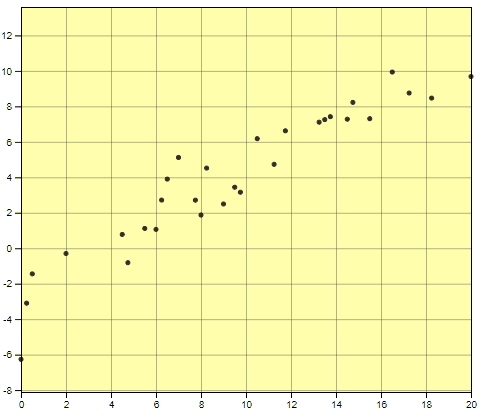

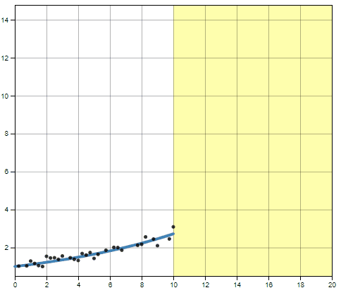
:::

## Q2: Forecasting (You-Draw-It)

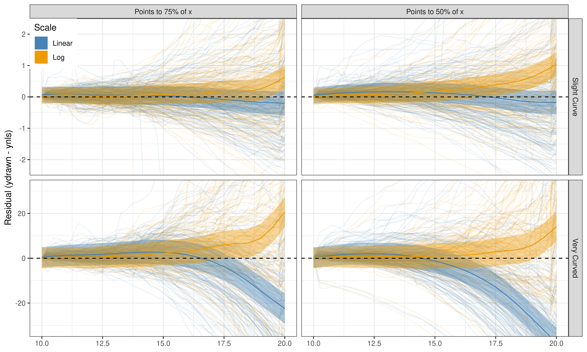{fig-alt="GAMM models of drawn curve residuals." width="100%"}

::: notes

This shows the residuals from an exponential regression on the data participants were shown. We made it even clearer by modeling the residuals using a generalized additive model, which has a flexible form and doesn't require too many assumptions about model structure.

It's clear that log scales and linear scales have very different outcomes -- we slightly overpredict with log scales, and underpredict with linear scales.

:::

## Q3: Numerical Estimation {.center}

## Q3: Numerical Estimation

-   Next level of engagement is estimating quantities from a graph

-   This is a much harder experiment to set up

    -   Phrasing matters a lot!
    -   Data matters a lot!

[How to make it generalizable?]{.center .large .emph .cerulean}

::: notes
One of my favorite parts of graphical inference is that it totally sidesteps this question of phrasing by encoding all of what would have been verbal questions into the graph itself.

This really is a huge improvement over past graphical methods -- there were studies showing that pie charts sucked from the early 1900s, but they were hampered by the generalizability of the questions - if you asked for someone to estimate the percentage of a pie slice, you got different conclusions than if you asked someone to make a judgment between two pieces of the pie.
:::

## Q3: Numerical Estimation

-   Use Ewoks and Tribbles - creatures that might multiply exponentially
-   One set on the linear scale, one set on log scale
-   Underlying trend is the same (within transformed x axis)
-   Different variability around the line

{width="50%" fig-align="center"}

## Q3: Numerical Estimation

Free response: Between $t_1$ and $t_2$, how does the population of $X$ change?

::: {layout="[-5, 40, -10, 40, -5]"}
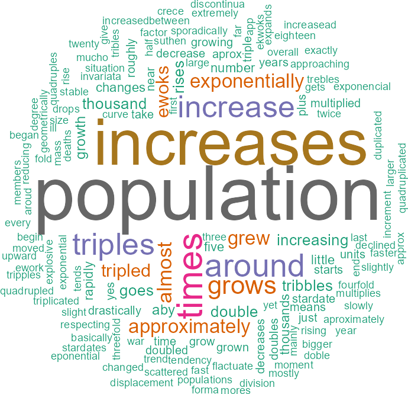

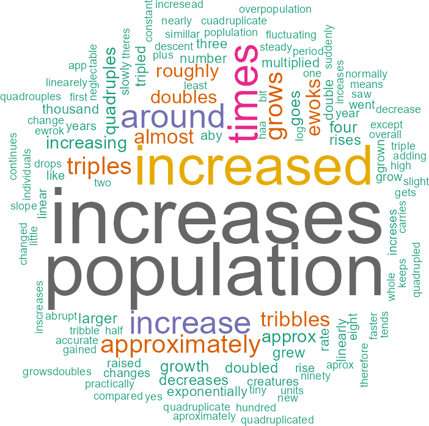
:::

## Q3: Numerical Estimation

Estimating Population given a year

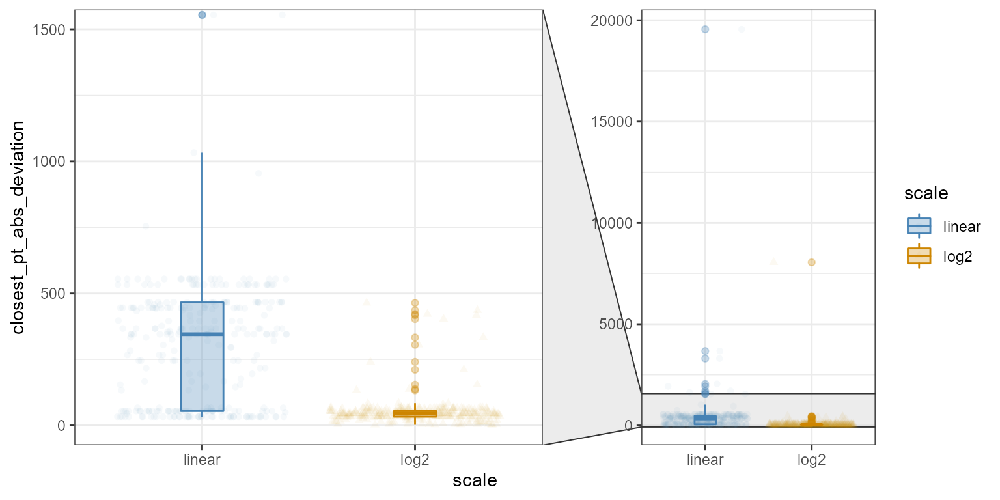{width="100%"}

::: notes
-   More variability in estimation on linear scale (which makes sense due to the fact that it's compressed into a small area of the plot)

-   Participants anchor estimates to specific points, not to an overall fitted trend
:::

## Q3: Numerical Estimation

From `Year1` to `Year2`, the population increases by \_\_\_\_ individuals

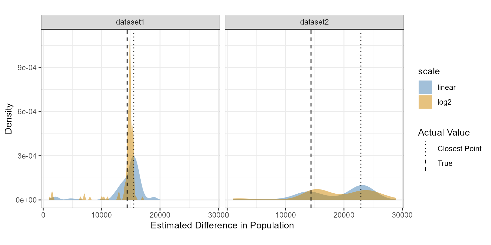

::: notes
-   in dataset 1, both points were close to the underlying value, and the estimates bear that out.

-   in dataset 2, one point was a bit of an outlier, and so we can see different estimation strategies appear: some participants answered using an overall trend/visual regression, while others answered using actual points.\
:::

## Q3: Numerical Estimation

How many times more creatures are there in `Year2` than `Year1`?

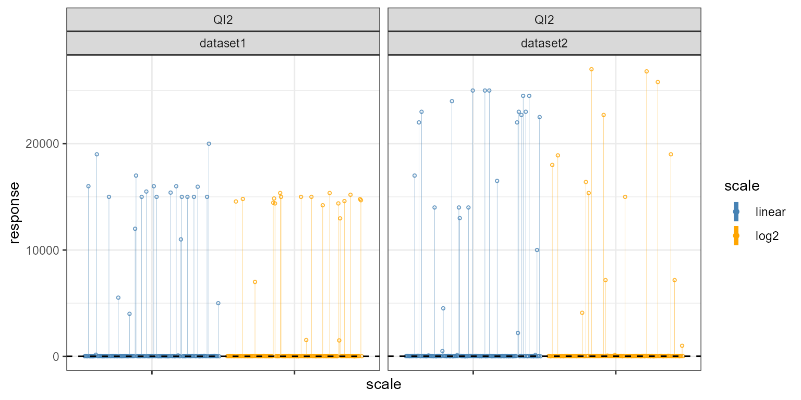

::: notes
-   the results show a fundamental lack of understanding on the part of many participants
:::

## Q3: Numerical Estimation

How many times more creatures are there in `Year2` than `Year1`?

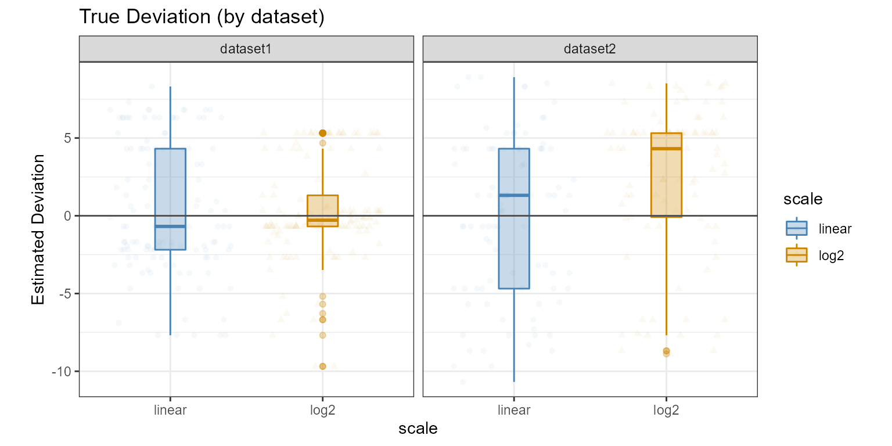

::: notes
-   As the questions get more mathematically complex, we also see that participants start using model-based strategies for estimation - they don't have the mental bandwidth to hold all of the estimates for specific points, arithmatic, etc. in their heads, so they take shortcuts like working off of a mental trendline.

-   Here, for the first time, the true deviation (deviation from the underling model) is a better match to participant estimates than the closest point deviation.
:::


## Q3: Numerical Estimation

How long does it take for the population in `Year 1` to double?

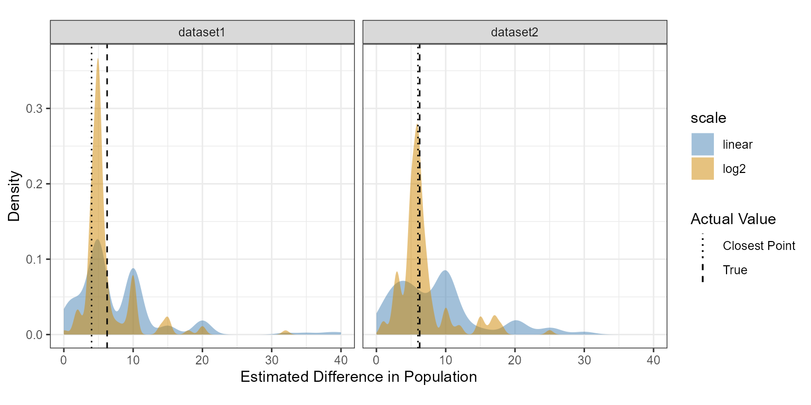

::: notes
-   strong anchoring effect at multiples of 5

-   Some conflict between true and closest point value in dataset 1 (mediated by rounding tendencies); dataset 2 was clear enough that participants could estimate 6

-   a lot more variability on the linear scale than the log scale in both cases
:::

## [Challenges]{.emph .red} & [Benefits]{.emph .cerulean}

::: incremental
1.  [Conflicting results]{.red} can be hard to reconcile

2.  Conducting multiple studies is [multiple times the work]{.red}\
    [(multiple times the payoff?)]{.cerulean .emph}

3.  [Greater insight]{.cerulean} into the tradeoffs of design decisions

:::

## [Challenges]{.emph .red} & [Benefits]{.emph .cerulean}

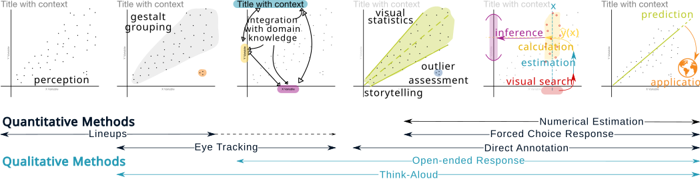

-   Testing method needs to be matched to level of engagement

-   Need to examine graphical choices across levels of engagement

# CSI: Statistics <br/> [& Scientific Foundations]{.emph .meddarkblue .fragment}{#csi-stats .center background-image="../images/dna.jpg" background-opacity="50%" background-size="cover"}

------------------------------------------------------------------------

::: r-stack
{.fragment fig-alt="Screenshot of an Innocence Project article titled “Three Freed, and FBI Continues to Review Ballistic Cases,” discussing unreliable bullet‑matching forensic methods and related overturned convictions. Article url: https://innocenceproject.org/news/three-freed-and-fbi-continues-to-review-ballistic-cases/"}

{.fragment fig-alt="Screenshot of an ABA Journal article titled “Crime labs under the microscope after a string of shoddy, suspect and fraudulent results,” including a photo illustration labeled “Crimes in the Lab” on evidence bags. Article url: https://www.abajournal.com/magazine/article/crime_labs_under_the_microscope_after_a_string_of_shoddy_suspect_and_fraudu"}

{.fragment fig-alt="Screenshot of a Washington Post opinion piece titled “Incredibly, prosecutors are still defending bite mark evidence,” displaying a dental X‑ray image beneath the headline. Article url: https://www.washingtonpost.com/news/the-watch/wp/2017/01/30/incredibly-prosecutors-are-still-defending-bite-mark-evidence/"}

{.fragment fig-alt="Screenshot of an Ars Technica article titled “Buggy breathalyzer code reflects importance of source review,” describing court‑ordered audits that found serious software flaws in breathalyzer machines. Article url: https://arstechnica.com/tech-policy/2009/05/buggy-breathalyzer-code-reflects-importance-of-source-review/"}

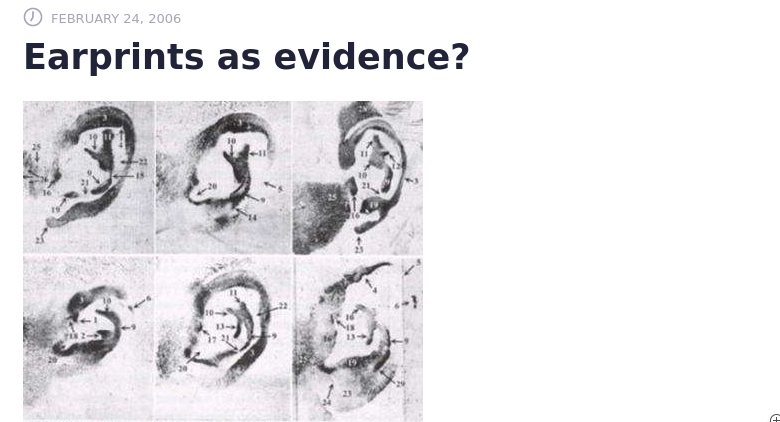{.fragment fig-alt="Screenshot of an article titled “Earprints as evidence?” with a grayscale image grid showing multiple photographed ears marked with numbered annotations used for forensic comparison. Article url: https://phys.org/news/2006-02-earprints-evidence.html"}

{.fragment fig-alt="Screenshot of an article from The Guardian in 2004 titled 'Earprint landed innocent man in jail for murder'. Article url: https://www.theguardian.com/uk/2004/jan/23/ukcrime1"}
:::

::: notes
In the past 20 years, CSI-style forensic analysis has taken quite a beating.

DNA is the gold standard for forensic evidence - a specific combination of genes is supposed to be unique to the individual, matches can be objectively determined with error rates that are quantifiable, and it could be used to reexamine evidence from old cases.

As organizations like the Innocence Project used DNA to revisit old cases, it became clear that there were *major* problems with the evidence used in criminal cases -- eyewitness testimony, false confessions, and shoddy forensics.

There were a number of very embarrassing cases where forensic evidence was shown to be faulty. As these cases happened, scientists started asking how this all went so wrong? Wasn't forensics ultimately based in science? Weren't there studies out there showing that forensic techniques had low error rates?

I'm going to briefly highlight a couple of contributions aimed at fixing these issues. All of this is very fundamental, not cutting-edge statistics, and that's by design -- courts don't want cutting-edge stuff, they want "general scientific acceptance" -- which means that this is ideal for those of you who are undergraduates, or from other departments -- while there are more sophisticated statistical techniques in here, we're not going to talk about them in detail - we're going to focus on the basics.

:::

## NAS Report (2009) {.r-fit-text}
[(National Academy of Science)]{style="position:absolute;top:60px;" .emph .red}

::: columns
::: {.column width="30%"}
{fig-alt="Cover of the 2009 NAS report. PDF at https://www.ojp.gov/pdffiles1/nij/grants/228091.pdf"}
:::
::: {.column .incremental width="70%"}
-   Senate commissioned in 2005

-   Focus areas:

    -   fundamentals of scientific method in forensics
    -   error rates for collection and analysis of forensic data
    -   use of forensic evidence in litigation

-   Important questions:

    -   Are disciplines scientifically reliable?
    -   How subjective/biased are methods?
    
:::
:::

::: notes
The NAS report focused on the use of science in forensics, how we know (or don't know) what error rates are for forensic methods, and how forensic evidence is used in court.

Primary concerns included whether disciplines are based on reliable scientific foundations, and whether practitioner bias could affect the results of the forensic comparisons.
:::


## NAS Report (2009) {.r-fit-text}
::: columns
::: {.column width="30%"}
{fig-alt="Cover of the 2009 NAS report. PDF at https://www.ojp.gov/pdffiles1/nij/grants/228091.pdf"}
:::

::: {.column width="70%"}
### [Recommendations]{.emph .red}

**Create a National Institute of Forensic Science** to manage 

- accreditation, 
- federal/state/local jurisdiction differences, 
- standard reporting language.

**Fund research** on forensic methods: 

- reliability, accuracy, validity
- automation & objective methods
- uncertainty quantification
:::
:::


::: notes

The NAS report suggested creating a national institute of forensic science. This institute is supposed to be separate from the department of justice, because the DOJ is pretty biased towards law enforcement, and during the DNA wars, they actually had people testifying that DNA was unreliable followed, audited by the IRS, and so on.

The NAS report also recommended that the NIFS fund research on method validity - again, something that shouldn't come from the DOJ because they generally only fund things that seem likely to be positive about the validity of methods. The NAS report also highlighted the importance of error rates, considering quality of evidence, and understanding the uncertainty of the conclusions of forensic analyses. Finally, the NAS report suggested the importance of research into automated techniques capable of enhancing forensic assessments.

We'll come back to these recommendations in a bit. The NAS report came out in 2009, and the forensic scandals continued, but the recommended national institute of forensic science never came to be.
:::

## PCAST Report (2016) {.r-fit-text}
[President's Council of Advisors on Science and Technology]{.emph .red style="position:absolute;top:60px"}

::: columns
::: {.column width="30%"}
{fig-alt="Screenshot of cover page of PCAST report; pdf available at https://obamawhitehouse.archives.gov/sites/default/files/microsites/ostp/PCAST/pcast_forensic_science_report_final.pdf"}
:::

::: {.column .smaller width="70%"}
> Judges' decisions about the admissibility of scientific evidence rest solely on **legal standards**; they are exclusively the province of the courts and PCAST does not opine on them. But, these decisions require making determinations about scientific validity. It is the proper province of the **scientific community** to provide guidance concerning scientific **standards for scientific validity**.
:::
:::

::: aside
The [Executive Summary](https://obamawhitehouse.archives.gov/sites/default/files/microsites/ostp/PCAST/pcast_forensic_science_report_final.pdf) is an excellent read.
:::


## PCAST Report (2016) {.r-fit-text}
::: columns
::: {.column width="30%"}
{fig-alt="Screenshot of cover page of PCAST report; pdf available at https://obamawhitehouse.archives.gov/sites/default/files/microsites/ostp/PCAST/pcast_forensic_science_report_final.pdf"}
:::

::: {.column .smaller width="70%"}
[Requirements for Scientific Validity]{.emph}

-   Empirical testing by
    -   multiple lab groups
    -   under casework like conditions,
    -   demonstrating that the method is **repeatable** and **reproducible** and
    -   providing estimates of the method's accuracy

-   **subjective** disciplines
    -   evaluated as a "black box" in the examiner's head.
    -   Studies: many examiners render decisions about many independent tests.

Without estimates of accuracy, an examiner's decision is [scientifically meaningless]{.emph .cerulean}: it has no probative value, and considerable potential for prejudicial impact.

:::
:::

## Current Status of Forensic Disciplines

::::: columns
::: {.column .small width="80%" margin="auto"}
+----------+-------------+-----------+----------+----------+
|          | Discipline  | Method    | Validity | Evidence |
+==========+=============+===========+==========+==========+
| 🧬       | DNA         | 🧪        | ✅       | 📚       |
+----------+-------------+-----------+----------+----------+
| 🧬       | DNA (mix)   | 🧪+🔎     | ❓\      | 📖📖\    |
|          |             |           | ✅[^1]c  | 📖       |
+----------+-------------+-----------+----------+----------+
| 🫆       | Fingerprint | 🔎 💻     | ✅[^2]   | 📚       |
+----------+-------------+-----------+----------+----------+
| 🔫       | Firearms    | 🔎 💻[^3] | ❓       | 📖       |
+----------+-------------+-----------+----------+----------+
| 👟       | Footwear    | 🔎        | ❓       | ❓       |
+----------+-------------+-----------+----------+----------+
| 🦱       | Hair        | 🔎        | 🚩🚩     | 📚       |
+----------+-------------+-----------+----------+----------+
| 😁       | Bitemark    | 🔎        | 🚩🚩     | 📚       |
+----------+-------------+-----------+----------+----------+
:::

::: {.column .small width="20%"}
+--------------+---------------+
|              | Meaning       |
+==============+===============+
| 🧪           | Lab           |
+--------------+---------------+
| 🔎           | Subjective    |
+--------------+---------------+
| 💻           | Algorithm     |
+--------------+---------------+
| ✅           | Valid         |
+--------------+---------------+
| ❓           | Unknown       |
+--------------+---------------+
| 🚩           | Invalid       |
+--------------+---------------+
| 📚           | Many Studies  |
+--------------+---------------+
| 📖           | Some Studies  |
+--------------+---------------+
:::
:::::

[^1]: In some situations

[^2]: high error rate

[^3]: Algorithms not used in lab practice

## Hidden Multiple Comparisons Increase Forensic Error Rates

Proceedings of the National Academy of Sciences, 2024

[Joint work with]{.emph} [**Heike Hofmann**]{.darkorange} and [**Alicia Carriquiry**]{.darkpurple}

:::::: columns
::: {.column width="30%"}


PNAS Paper Link
:::

::: {.column .r-fit-text width="10%"}
:::

::: {.column .smaller width="60%"}
This work was partially funded by the Center for Statistics and Applications in Forensic Evidence (CSAFE) through Cooperative Agreements 70NANB15H176 and 70NANB20H019 between NIST and Iowa State University, which includes activities carried out at Carnegie Mellon University, Duke University, University of California Irvine, University of Virginia, West Virginia University, University of Pennsylvania, Swarthmore College and University of Nebraska, Lincoln.
:::
::::::

## Toolmark Examination Primer

{fig-alt="A picture of a loaf of bread and a fresh stick of butter that has just been cut with a butter knife." width="50%"}

## Toolmark Examination Primer

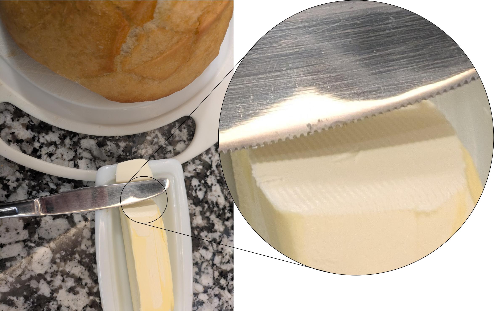{fig-alt="A picture of a loaf of bread and a fresh stick of butter that has just been cut with a butter knife. The cut butter has a circle around it, with the enlarged image in the circle shown on the right."}

## Toolmark Examination Primer

::: r-stack
{fig-alt="A picture of a steak knife (top) and a butter knife (bottom), with several test cuts from each knife arranged in two rows in the middle. The test cuts are labeled, and the 'evidence' is superimposed on top."}

{.fragment fig-alt="A picture of a steak knife (top) and a butter knife (bottom), with several test cuts from each knife arranged in two rows in the middle. The test cuts are labeled, and the 'evidence' is superimposed on top. The test cuts made with the steak knife have an X overlaid, while the test cuts made with the butter knife have a check overlaid, indicating that they match the evidence from the scene."}
:::

::: fragment
[How do we know this method is valid?]{.emph .meddarkblue .large}
:::

## A Specific Case -- Jimmy Genrich

:::: {layout-ncol="2"}
{fig-alt="A screenshot of an article by Meehan Crist and Tim Requarth from The Nation (Feb 26, 2018 issue). The title reads 'Forensic Science Put Jimmy Genrich in Prison for 24 Years. What if It Wasn’t Science?'. A mugshot is shown below the article title. Article url: https://www.thenation.com/article/archive/the-crisis-of-american-forensics/" height="750"}

::: fragment
{fig-alt="A Colorado Public Media story by Tom Hesse from July 10, 2023, titled 'Judge orders new trial for Grand Junction man convicted in '90s pipe bombings'. A picture of the Mesa County Justice Center is shown below the article title. Article url:  https://www.cpr.org/2023/07/10/judge-orders-new-trial-for-grand-junction-man-convicted-in-90s-pipe-bombings/" height="750" width="auto"}
:::
::::

## Motivation

::: smaller
> At trial, O’Neil testified that tools like the wire cutters found in Genrich’s residence were the only tools that could have been used to make the pipe bombs. “Agent O’Neil opined that the three of Mr. Genrich’s tools were the **only tools in the world that could have made certain marks found on pieces from the four bombs**,” Judge Gurley wrote in Monday's opinion.

> O’Neil was asked specifically at trial what he meant by the phrase “to the exclusion of any other tool.” “That the individual jaw, the location within that jaw on that particular side, was identified as having cut the wire in question to a degree of certainty to exclude any other tool,” he said, according to court transcripts referenced in Gurley’s decision. O’Neil said this was **true of needle-nosed pliers used on the bomb, slip-joint pliers, as well as the wire cutter**.
:::

[Source](https://www.cpr.org/2023/07/10/judge-orders-new-trial-for-grand-junction-man-convicted-in-90s-pipe-bombings/) (emphasis added)

## Personal Motivation

{fig-alt="An annotated picture of a messy garage, showing all of the tools which could conceivably make striated toolmarks, including visegrips, pliers, bolt cutters, pry bars, electrical tools, razor blades, hammers, tin snips, saws, and more." width="100%"}

## Constructive Scientific Proof<br>[from first principles]{.emph .meddarkblue .smaller}

::::: columns
::: {.column .r-fit-text width="70%"}
-   Understand
    -   how tools make marks
    -   tool wear over time
    -   tool manufacturing processes
    -   tool/material interaction
    -   mark type/frequency distribution
-   Track
    -   Frequency of tools in a local population
:::

::: {.column width="30%"}
[😓]{.extrabig .fragment}
:::
:::::

::: notes
Scientifically, we might boil this down to a series of engineering and materials science problems - understanding the types of marks which can occur on different types of tool materials through manufacture, wear, etc., and then understanding in turn how those tools transfer marks to other surfaces and how force, angle, and material hardness impact those marks.

Unfortunately, though, the number of different characteristics gets very quickly out of control and you end up with an exponential number of interactions very quickly.

Establishing the discipline from first principles is ... difficult, to say the least. You could probably do it with a combination of time, stubbornness, and statistical inference, but there is always a chance that a new manufacturing method will be developed that will produce new types/classes of markings.

But, there are other ways to handle this problem.
:::

## 📐 A Different Angle on the Problem

-   $e^{(1)}$: error rate for a single comparison

-   $e^{(N)}$: overall error rate, $N$ comparisons

-   Calculate $N$: \# comparisons between tool and evidence

-   [Ultimate question]{.emph .darkpurple}:\
    What does $e^{(1)}$ need to be for $e^{(N)}$ to be low[^4]?

[^4]: Low enough will be determined by courts⚖️, not statisticians... 🫣

## Wire Cuts

::: {layout="[[70,30],[100]]" layout-valign="bottom"}


:::

## Structural Parameters

{fig-alt="A profile image of the blades of each of four types of tools - wedge-type cuts (guillotine/wire cutters), scissors, pliers, and blades. All but pliers have two cutting surfaces, but the angles of each surface differ. Pliers have 4 cutting surfaces." width="80%" style="margin-left:auto;margin-right:auto;"}

-   Bladed Surfaces: $s \in \{2, 4\}, 1 \leq i \leq s$

-   Cut Surfaces (on one wire): $w \in \{1, 2\}, 1\leq j\leq w$

## Visual Examination

::::: columns
::: {.column width="80%"}
-   Test cuts made along the blade(s) of the tool

-   At least $N_{ij} = b_i/d_j$ comparisons for each blade surface $i$ and cut wire surface $j$

-   Manual alignment: estimate the minimum comparisons
:::

::: {.column width="20%"}
{fig-alt="An image of a comparison microscope, which allows viewing two samples simultaneously in order to align them." width="18%" style="position:absolute;top:0;right:20px;"}
:::
:::::

{width="100%" fig-alt="A diagram showing a blade cut (long, thin) with striations compared to a wire cut (semi-circle shape, short) aligned with the blade cut. There are multiple non-overlapping positions along the blade cut where the wire cut could fit, and each is shown with an empty hemisphere." style="position:absolute;bottom:0px;left:20px;"}

## Visual Examination

{width="100%" fig-alt="A diagram showing a blade cut (long, thin) with striations compared to a wire cut (semi-circle shape, short) aligned with the blade cut. There are multiple non-overlapping positions along the blade cut where the wire cut could fit, and each is shown with an empty hemisphere." style="position:absolute;top:40%;left:20px;"}

Adj. comparisons are non-overlapping $\Rightarrow$ "independent"[^5]

[^5]: There are peak-valley dependence structures in profile data, but conditioning on tool/material/manufacturing, we would **expect** statistical independence between adjacent comparisons

## Algorithmic Comparison

Scans -\> Cross Section -\> "Signature"\
(remove gross topology)

{fig-alt="An animated gif of a wire cross-section sliding along a composite cross section generated from a blade cut."}

## Number of Comparisons

```{r}
nc <- floor(15000/0.645 - 2000/0.645 + 1)
Ncomp1 <- format(nc, big.mark=",")
Ncomp2 <- format(nc*2, big.mark=",")
```

|                  | Minimum (Manual) | Maximum (Algorithm)       |
|------------------|------------------|---------------------------|
| blade size       | $b=15 \text{mm}$ | $b=15000 \mu \text{m}$    |
| cutting surfaces | $s=2$/blade      | $s=2$/blade               |
| wire size        | $d=2 \text{mm}$  | $d=2000 \mu \text{m}$     |
| wire surface     | $w=1$            | $w=1$                     |
| resolution       |                  | $r=0.645 \mu \text{m/px}$ |
| \# per side      | 7.5              | `{r} Ncomp1`              |
| \# total         | 15               | `{r} Ncomp2`              |

This assumes a single wire and a single possible tool.

## So How Bad Is the Problem?

For error rate $e$ and $n$ comparisons

$$P(\text{no false positive errors}) = 1 - \left(1 - e\right)^n$$

::: fragment
[Simple probability 🎲 strikes again!]{.emph .darkcerulean}
:::

## So How Bad Is the Problem?

-   Estimated false positive error rate for striated comparisons from bullets and firing pins: 0.45 - 7.24%.

    -   [**Pooled estimate**: 2%]{.emph .darkgreen}

    -   Not enough error rate studies on wires

    -   Bullets have additional structure to facilitate alignment

    -   Wires have additional complexity

        -   shorter sequences
        -   more dependence on angle

[$\Rightarrow$ **2% is a generous estimate...**]{.emph .meddarkblue .fragment}

## So How Bad Is the Problem?

To keep the overall false positive rate under 10%...

{fig-alt="A table showing the family wise false discovery rate for N comparisons using several different estimates of striated comparison error rates. When the FDR is 7%, over 50% of 10-comparison samples would be expected to have a false positive. When the FDR is 2%, over 18% of 10-comparison samples would be expected to have a false positive. Additional columns are provided giving the expected frequency of 100 and 1000 comparisons under different error rates. The final column provides the maximum number of comparisons at the specified error rate which can be performed to keep the family wise false positive error rate under 10%."}

[2% Error -\> 5 total comparisons.]{.emph .meddarkblue .fragment}

[Minimum of 15 required to do even a simple wire-cut analysis.]{.emph .meddarkblue .fragment}

## Conclusions

-   Wire cut forensics are not scientifically sound using current analysis methods

::: fragment
but... this problem shows up in database searches, too!

-   IAFIS (Integrated Automated Fingerprint ID System)
-   NIBIN (Ballistics Database)
-   NDIS (National DNA ID System) and CODIS (Combined DNA ID System)
-   PDQ (Paint Data Query)
-   FISH (Forensic ID System for Handwriting)
:::

## Conclusions

::: incremental
-   Automatic intelligence algorithms are not a good substitute for investigative work

-   Example: Oregon

    -   3 firearms examiners for the state
    -   Most firearms evidence run through NIBIN first
    -   Promising leads forwarded to examiners for manual assessment
:::

[This is a setup that could generate false-positives by design!]{.cerulean .emph .fragment}

## Conclusions

::: incremental
-   Examiners should report and the defense should require

    -   [overall length/area of surfaces generated during the examination $(b)$]{.small}
    -   [total consecutive length/area of recovered evidence $(d)$]{.small}

-   Studies relating length/area of comparison surface to error rates are essential!

    -   [No available black-box error rate for wire cuts]{.small}
    -   [Studies should be difficult, like casework!]{.small}

-   Any database search used at any stage of the process should be disclosed along with

    -   [$N$ items in the database used for comparison]{.small}
    -   [Number of results returned as 'similar' (top 20? top 5?)]{.small}
    -   [Protocols for confirmatory assessment]{.small}
:::

# Questions? {.center}