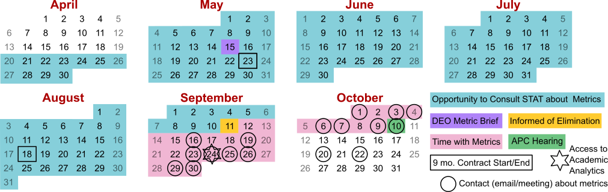
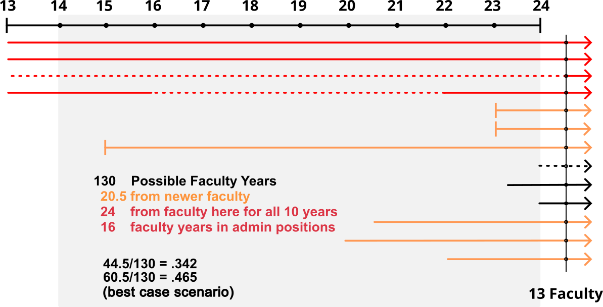
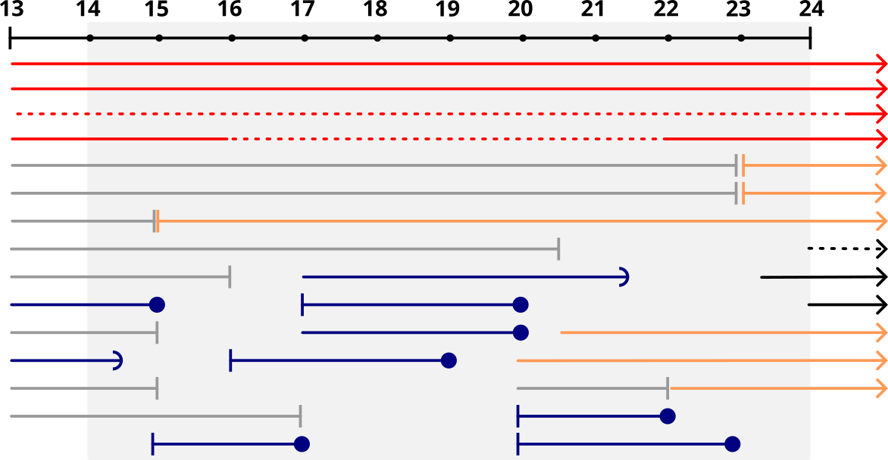
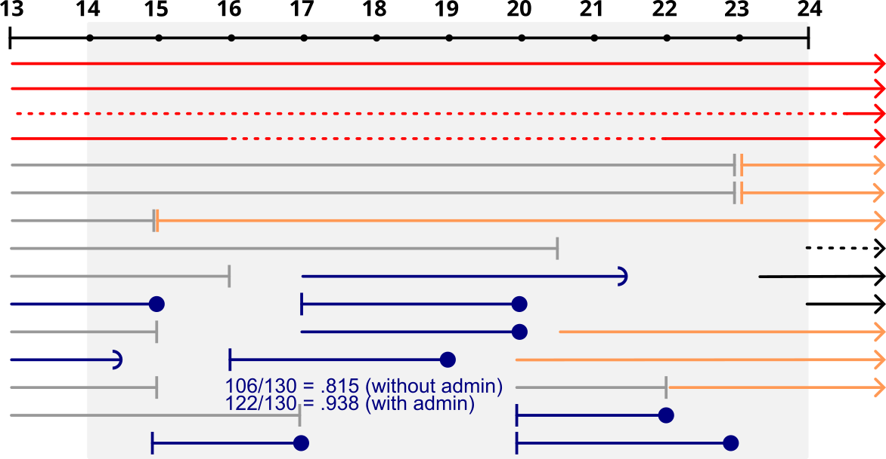
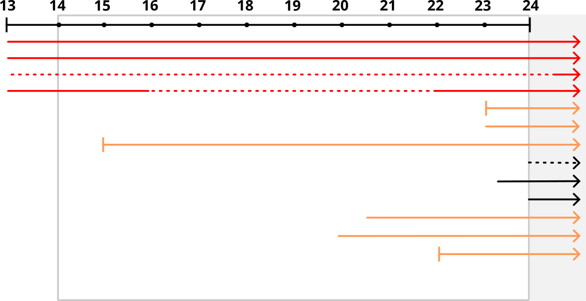
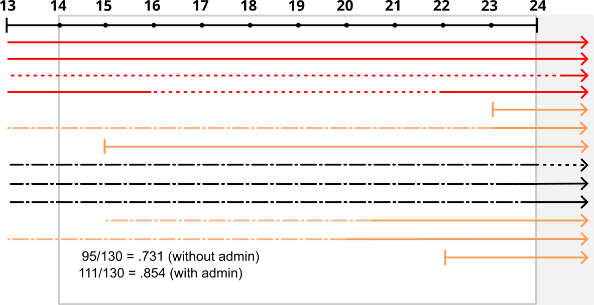
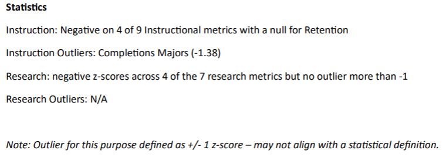
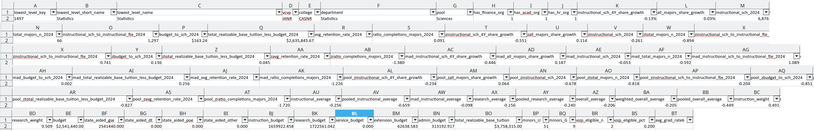
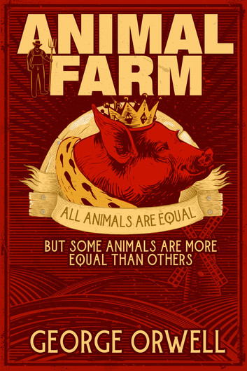

<!-- i1.pickpik.com/photos/267/86/417/puzzle-match-fit-missing-fa33f58f5f5e6b5da980d9c4b83ec8b8.jpg -->

```{=html}
<!-- 
# Introduction {background-image="images/puzzle.jpg" background-opacity=.1}

- Understand how performance was evaluated
  - What can be fixed
  - What can't be fixed
  - Missing pieces
- Identify possible improvements
- Prepare for future evaluations -->
```

# Outline

1.  Timeline

2.  Administration's Claims

3.  Data and Analysis (& Flaws)

    -   Distributions
    -   Inference
    -   Observational Units
    -   Ratios
    -   Comparisons

4.  Conclusion

```{r}
#| label: setup
#| include: false
#| cache: false


library(readxl)
library(dplyr)
library(tidyr)
library(tidyselect)
library(patchwork)
library(ggrepel)
library(stringr)
library(tidyverse)
metrics1 <- read_xlsx("data/tabled_department_metrics.xlsx", sheet = 1)
metrics2 <- read_xlsx("data/tabled_department_metrics.xlsx", sheet="Detail") |>
  mutate(lowest_level_key = as.integer(lowest_level_key) |> as.character())
deptmoji <- read.csv("data/dept-emoji.txt", header = T)

metrics <- left_join(metrics2, metrics1) |>
  select(1:10, sort(peek_vars())) |>
  relocate(hide, .after=last_col()) |>
  relocate(matches("mad"), .after=last_col()) |>
  relocate(matches("pool"), .after=last_col()) |>
  left_join(deptmoji)

stats_full <- read.csv("data/disciplines/Statistics, Department of - Full Data.csv_.csv")
unis <- readr::read_csv("data/Institution - Comparing Institutions.csv")
stats_full <- stats_full |> 
  left_join(unis |> 
              select(Institution_id, Carnegie, `AAU Member`, `Land Grant`, Sector),
                                      by = c("institutionid"="Institution_id"))

unl <- stats_full |> slice(grep("Lincoln", institutionname))
unl_depts <- readr::read_csv("data/Institution - Comparing Units - Departments.csv")


eliminate <- c("Statistics", "Educational Administration", "Landscape Architecture Program", 
                   "Community and Regional Planning", "Earth and Atmospheric Sciences",
                   "Textiles, Merchandising, and Fashion Design")

merger1 <- c("Agricultural Economics", "Agricultural Leadership, Education and Communication")

merger2 <- c("Entomology", "Plant Pathology")

realign <- c(merger1, merger2, "Journalism", "Interior Design", "Sports Communication", "Advertising", "Architecture", "Finance")

unl_depts <-unl_depts |> 
  separate_wider_delim(
    cols=Discipline, delim=" - ", names=c("Toss", "Focus"), 
    too_few="align_start") |>
  mutate(
    Focus = ifelse(is.na(Focus), "Single Discipline", Focus),
    short_name = gsub(", Department of","", Unit), 
    short_name = gsub(", School of","", short_name)) |>
  select(-Toss) # toss the left-over string

rank_by_var <- function(data, value_var, name_var, name) {
  stopifnot(value_var %in% names(data))
  
  data_sort <- data |> mutate(var = data[[value_var]]) |> arrange(desc(var))
  idx <- grep(name, data_sort[[name_var]])
  if(length(idx) > 1) 
  stop(sprintf("Multiple values found for <%s>", name))
  if(length(idx) == 0) 
  stop(sprintf("No values found for <%s>", name))

  min(which(data_sort$var == as.numeric(data_sort$var[idx])))
}

percentile <- function(rank, n) {
  (n-rank+1)/n*100
}

rank_to_score <- function(rank, n, c=3/8, best=1) {
  if (best == 1) rank <- n - rank + 1
  Q <- (rank-c)/(n - 2*c +1)

  qnorm(Q)
}


stats_public <- stats_full |> filter(Sector=="Public") 
rank_public <- stats_public |> rank_by_var ("sri", "institutionname", "Lincoln")
n_public <- nrow(stats_public)
```

```{r data-prep}

# Read the CSV file
big10 <- read_csv("data/big10_universities_18_with_abbr.csv")

# Separate the primary and secondary color hex codes
# big10 <- big10 %>%
#   separate(colors_hex, into = c("primary_color", "secondary_color"),
#            sep = " / ", fill = "right", remove = FALSE)
big10$bigten <- "Big Ten"


stats_r12 <- read_csv("data/Statistics, Department of - Benchmarking - R12.csv")


r12 <- unis |> slice(grep("Doctoral Universities", Carnegie)) |>
  mutate(`AAU Member` = ifelse(is.na(`AAU Member`), " Not", `AAU Member`))
r12 <- r12 |> left_join(stats_r12 |> select(Institution_Id,Unit, SRI), by = c("Institution_id"="Institution_Id"))
stats_full <- stats_full |> left_join(unis |> select(Institution_id, Carnegie, `AAU Member`, `Land Grant`, Sector),
                                      by = c("institutionid"="Institution_id"))


```

```{r warning = FALSE, message = FALSE}
teaching <- metrics1
tabled <- metrics2

tabled_sri <- tabled |> filter(!is.na(sri)) |> filter(!is.na(department))


unl_depts <- unl_depts |> 
  mutate(
    Unit_name = gsub(", School of", "", Unit),
    Unit_name = gsub(", Department of", "", Unit_name)
  )
tabled_sri$unit_name <- gsub(".*School of ", "", tabled_sri$lowest_level_name)

matches <- expand.grid("tabled_unit_name" = unique(tabled_sri$unit_name), "Unit_name" = unique(unl_depts$Unit_name)) %>%
  mutate(distance = stringdist::stringdist(tabled_unit_name, Unit_name, method = "jw"))  # Jaro–Winkler distance

best_match <- matches |> group_by(tabled_unit_name) |>  slice_min(distance, n = 1) %>%
  ungroup()

# Journalism is not in the right category

joined_sri <- best_match |>
  left_join(tabled_sri, by = c("tabled_unit_name"="unit_name")) %>%
  left_join(unl_depts |> filter(SRI==max(SRI), .by="Unit_id"), by = "Unit_name") 

joined_sri <- joined_sri |>
  mutate(
    Unit_name = ifelse(tabled_unit_name=="Journalism", "Journalism", Unit_name))

joined_sri <- joined_sri |> left_join(teaching)

joined_sri <- joined_sri |> mutate(
  fate = ifelse(Unit_name %in% eliminate, "Elimination", 
                ifelse(Unit_name %in% realign, "Realign", "Safe"))
)
```

```{r}
averages_fte <- teaching |>
  left_join(
  tabled |> filter(acad_end_year == 2024) |> 
    select(lowest_level_key, contains("fte")))

research <- averages_fte |> select(research_average, appointment_apportionment_percent_research_fte, lowest_level_short_name) 

teaching <- averages_fte |> select(instructional_average, appointment_apportionment_percent_teaching_fte, lowest_level_short_name) 
```

```{r}

eliminate_short <- c("Statistics", 
                "EDAD", 
                "LARC", 
                "CRP", 
                "EARTH",
                "TMFD")
merger1_short <- c("Ag Econ", "ALEC")
merger2_short <- c("Entomology", "Plant Path")

dept_colors <- tibble(lowest_level_short_name = list(eliminate_short, merger1_short, merger2_short), 
color = c("#d00000", "#249ab5", "#f48a1f")) |>
unnest(lowest_level_short_name)

dept_teaching <- left_join(dept_colors, teaching)
dept_research <- left_join(dept_colors, research)


ggteach <- teaching |> ggplot(aes(x = appointment_apportionment_percent_teaching_fte, y = instructional_average)) +
  geom_hline(yintercept = 0, linetype = 2, colour = "grey60") +
  geom_point() + 
  geom_smooth(method="lm") + 
  geom_point(aes(color=color), size = 4, data = dept_teaching) +  
  geom_text_repel(aes(color=color, label = lowest_level_short_name), size = 4, data = dept_teaching) +
  scale_color_identity() + 
  xlab("Teaching FTE in AY 23/24") + 
  ggtitle("Teaching Average by Department Size")

ggres <- research |> 
  ggplot(aes(x = appointment_apportionment_percent_research_fte, y = research_average)) +
    geom_hline(yintercept = 0, linetype = 2, colour = "grey60") +
  geom_point() + geom_smooth(method="lm") + 
  ggtitle("Research Average by Department Size") +
  geom_point(aes(color=color), size = 4, data = dept_research) +   
  scale_color_identity() +  
  geom_text_repel(aes(color=color, label = lowest_level_short_name), size = 4, data = dept_research) + 
  xlab("Research FTE in AY 23/24")
```

# Timeline

## Setting the Stage

::: incremental
-   Structural budget deficit since at least 2020
    -   Cuts every year from 2020-2024[:]{.fragment} [\$75
        million]{.emph .red}
-   2025 cuts:
    -   Eliminate the structural deficit: [\$21 million
        (estimated)]{.emph .red .fragment}
    -   Extra [\$6.5 million]{.emph .red} [for "our share of UN system
        cuts"]{.fragment}
:::

## The Chancellor's Executive Leadership Team (ELT)

Responsible for assembling data, building metrics, and developing the
budget cut proposal

::: {.smaller layout-ncol="4"}
{fig-alt="Picture of Josh Davis"}

{fig-alt="Picture of Mark Button a.k.a. Bark Mutton"}

{fig-alt="Picture of Tiffany Heng-Moss."}

{fig-alt="Picture of Jennifer Nelson."}
:::

::: notes
The Chancellor was actually only the figurehead: the FS Exec committee
was told by a reliable source that the Chancellor didn't even have
access to the shared drive for assembling the cuts.

Data was assembled by

-   the Institutional Effectiveneess and Analytics group (for tuition,
    enrollment, etc) under EVC Button

-   the Office of Research and Innovation (for research -- grants, pubs,
    books, etc) under VC Nelson
:::

## Fac Senate & FS Exec Cmte

::: {.incremental style="ul, li { margin: 0; padding: 2px;"}
-   March - Prog Eval Rubric will be from Coordinating Commission on
    Postsecondary Education (CCPE)
    <!-- - Budget reduction rubric will be from [Coordinating Commission on Postsecondary Education (CCPE) guidelines](https://ccpe.nebraska.gov/sites/default/files/AP_Guidelines_Review%20of%20Existing%20Instructional%20Programs.pdf) -->
    {fig-alt="CCPE minimum performance standards, taken from https://ccpe.nebraska.gov/sites/default/files/AP_Guidelines_Review%20of%20Existing%20Instructional%20Programs.pdf"}
:::

::: {.incremental style="ul, li { margin: 0; padding: 2px;"}
-   April - Broad outline of metrics [(the devil is in the
    details!)]{.emph .red .fragment}

-   May - Timeline, draft metrics presented to DEOs/Deans

-   June - Degree cuts likely, ELT plan due June 30

    -   [Interim EVC: Commitment to transparency, treating all depts
        equally]{.smaller}
    -   [FS Exec: "Why the gatekeeping? Get faculty input!!"
        -]{.smaller}[DEOs not able to share info w/ faculty]{.emph
        .purple}

-   July - APC officers notified that APC will handle cuts

-   August - APC meets

    -   [VC Davis - metric data is proprietary/confidential]{.smaller}
:::

## Department POV {.smaller}

<!-- - May 16 - Measure Definitions/FAQ Document Date -->

-   May 15 - Academic Program Metrics discussion

    -   Dept Exec Officers (DEOs), Deans, ELT
    -   Marked confidential -- cannot be shared with faculty

-   August 15 - Metric values provided to Stat DEO {#fig-stat-metrics
    .lightbox}

-   August 18 - Metric definitions provided to Stat Department Faculty

-   Sept 11 - Affected units notified by EVC Button or Interim VC
    Heng-Moss

-   shortly afterward - Full metrics spreadsheet begins circulating
    unofficially

-   Oct 1-10 - APC hearings

```{r}
#| echo: false
#| include: false
library(lubridate)
dt <- round(difftime(ymd("2025-09-11"), ymd("2025-04-22"), units = "days")/10)*10
dt2 <- difftime(ymd("2025-10-10"), ymd("2025-09-11"), units = "days")
```

## Timeline {.smaller}

{width="100%" fig-align="center"}

-   $\approx `r dt`$ days where ELT **could have** talked to a
    Statistician
-   Within `r dt2` days, we found a *huge* number of problems
-   ELT wanted us to have 0 days to examine the "full" metrics data[^1]

[^1]: Technically, full data would be individual-level, not
    department-level

# Examining the Claims

## Budget Cuts with Quantitative Data

Reasonable strategy [... so where did things go wrong?]{.fragment .emph
.green}

. . .

```{r}
#| out-width: "80%"
#| fig-align: "center"
ggteach + ggres & theme_bw()
```

[Each additional FTE raises the average ... significantly]{.fragment}

## 

::::: columns
::: {.column width="40%"}
Highly ranked departments eliminated!!
:::

::: {.column width="60%"}
```{r}
#| fig-width: 6
#| fig-height: 8
#| out-width: "90%"
#| fig-align: "center"

unl_depts <- read_csv("data/Institution - Comparing Units - Departments.csv")

unl_depts <-unl_depts |> 
  separate_wider_delim(
    cols=Discipline, delim=" - ", names=c("Toss", "Focus"), 
    too_few="align_start") |>
  mutate(
    Focus = ifelse(is.na(Focus), "Single Discipline", Focus),
    short_name = gsub(", Department of","", Unit), 
    short_name = gsub(",? (Johnny Carson )?School of","", short_name),
    short_name = gsub(" Engineering", " Engr", short_name),
    short_name = gsub(" Program", "", short_name)) |>
  select(-Toss) # toss the left-over string


unl_depts_sum <- unl_depts |> 
  group_by(Unit,  short_name, `Number of Units`) |> 
  summarize(`SRI Percentile` = max(`SRI Percentile`),
            `SRI Rank` = max(`SRI Rank`)
            ) |> 
  ungroup()
  
eliminate <- c("Statistics", 
               "Educational Administration", 
               "Landscape Architecture", 
               "Community and Regional Planning", 
               "Earth and Atmospheric Sciences",
               "Textiles, Merchandising, and Fashion Design")

merger1 <- c("Agricultural Economics", "Agricultural Leadership, Education and Communication")
merger2 <- c("Entomology", "Plant Pathology")


unl_depts_sum <- unl_depts_sum |> 
  mutate(Unit = reorder(factor(Unit), `SRI Percentile`, function(x) max(x))) |>
  group_by(Unit) |>
  mutate(sri_max = max(`SRI Percentile`),
         is_max = `SRI Percentile` == sri_max) |>
  ungroup() |>
  mutate(Quintile = cut_number((-1)*sri_max, 5),
         Proposed = ifelse(short_name %in% eliminate, "Eliminate", 
                           ifelse(short_name %in% merger1, "Merger1",
                                 ifelse(short_name %in% merger2, "Merger2", "Not Mentioned")))) |>
  mutate(rank_label = sprintf("%d / %d", `SRI Rank`, `Number of Units`))


unl_depts_sum_dept_label <- unl_depts_sum |> 
  group_by(Unit) |>
  slice_max(`SRI Percentile`, with_ties = T) |>
  select(Unit, Quintile, `SRI Percentile`, Proposed, short_name)  |>
  unique()

unl_depts_sum_label <- unl_depts_sum |> 
  group_by(Unit) |>
  slice_max(`SRI Percentile`, with_ties = T) |>
  mutate(rank_label = sprintf("%d / %d", `SRI Rank`, `Number of Units`),
         n_depts = `Number of Units`) |>
  select(Unit, Quintile, Proposed, n_depts, short_name) |>
  unique()

unl_depts_labels <- left_join(unl_depts_sum_dept_label, unl_depts_sum_label) |>
  left_join(select(unl_depts_sum, Unit, short_name)) |>
  unique()

unl_depts_sum |>
  ggplot(aes(x = `SRI Percentile`, y = Unit)) + 
  geom_point(size = 3, aes(colour = Proposed, alpha = is_max)) + 
  geom_text(data = unl_depts_labels, aes(x = `SRI Percentile`, label = short_name, colour = Proposed), nudge_x = -2, hjust = 1) + 
  theme_bw() + 
  ylab("") + 
  ggtitle("UNL unit SRI Percentile compared to all Academic Analytics peers") +
  facet_grid(Quintile~., space="free", scale="free") +
  theme(strip.text = element_text(size=0)) + 
  scale_x_continuous(limits = c(0, 110), expand=expand_scale(mult = c(.2, 0), add = c(.1, 0))) +
  theme(axis.text.y = element_blank(), axis.ticks.y = element_blank(), 
        plot.title.position = "plot", legend.location = "plot", legend.position = c(0, 1), legend.justification = c(-0.01, 1.01)) + 
  scale_colour_manual(values = c( "#d00000", "#249ab5", "#f58a1f", "grey40")) +
  geom_text(data = unl_depts_labels, aes(label=n_depts), x = 108, hjust=1, colour = "grey40") + 
  scale_alpha_manual(guide = "none",values = c(.4, 1))

```
:::
:::::

## Choice of Metrics

-   Teaching performance

-   Research performance

    -   Only for tenure-track faculty

::: incremental
Rolled into metrics:

-   AAU membership criteria
-   Salaries
-   ~~Extension~~
-   ~~Revenue~~
-   ~~Service~~
:::

## Claims

::::: columns
::: column
-   ~~Transparent Process~~

-   Departments were *consulted* before plan was announced

-   All departments were treated equally
:::

::: column
[Can't see/fix the data $\Rightarrow$ not transparent]{.emph .red}
:::
:::::

## Claims

::::: columns
::: column
-   ~~Transparent Process~~

-   ~~Departments were *consulted* before plan was announced~~

-   All departments were treated equally
:::

::: column
[Can't see/fix the data $\Rightarrow$ not transparent]{.emph .red}

[...Informed, not consulted, one day before]{.emph .red}
:::
:::::

# Data and Analysis [Flaws]{#data-flaws .emph .fragment .red}

::: small90
```         
                                  🍓                  
                                  🍊        🍑        
    🫐              🍓  🍓  🍓🍓🍊🍊  🍓    🍑🍑                          🍉
    🫐🫐🍇🍇        🍓🍓🍓🍓🍊🍊🍊🍊🍊🍊  🍑🍑🍑🍑🍏                    🍉🍉🍉
  🫐🫐🍇🍇🍇  🍓🍓🍓🍓🍓🍊🍊🍊🍊🍊🍊🍊🍊🍑🍑🍑🍑🍏🍏🍏🍏  🍍🍍      🍉🍉🍉🍉🍉🍉
🫐🫐🍇🍇🍇🍓🍇🍓🍓🍊🍊🍊🍊🍊🍊🍊🍊🍊🍊🍑🍑🍑🍏🍏🍏🍏🍏🍆🍉🍉🍍🍍🍉🍉🍉🍉🍉🍉🍉🍉
```
:::

# Observational Units

## Units

**Observational unit**:\
[the entity from which data is collected in a
study]{style="position:absolute;right:10px;"} <br/> <br/> **Analysis
unit**:\
[the entity from which data is analyzed in a
study]{style="position:absolute;right:10px;"} <br/> <br/> Mapping
between these can be tricky\
[but it is critical to get it right!!]{.emph .red .fragment
style="position:absolute;right:10px;"}

## Observation vs. Analysis

-   Instructional metrics: typically observed at the class or instructor
    level, analyzed by department

-   Research metrics: observed at the faculty level, analyzed by
    department

Complicated process for how to map individuals to departments by
apportionment

But, individuals in a department change over time!

::: notes
In addition, even "over time" is a bit tricky here - some of the data
uses academic year but reports the start year, some uses academic year
but reports the end year, and some uses fiscal year, which is close but
not quite the academic year.

There may even be a few calendar-year variables that snuck in, but it's
very hard to tell by the metric descriptions, which are not always
precise.

To be conservative, we've included all of 2013-2024 here, but the basic
idea holds regardless -- you have to take into account the unit of
observation and account for how that is measured.
:::

## Department Composition



::: notes
Fundamental flaw in the way metrics are calculated -- only current
faculty are included! -- this is a mistake by the research office that
they refused to correct because it seems they didn't understand either
the problem or the solution(s) available.

One solution would be to consider the full department composition during
the 11-year interval.
:::

## Department Composition



## Department Composition



::: notes
If we include the productivity of all faculty in the departments within
this period, we get 118/132 faculty-years -- pretty close, particularly
given that if we include the 16 hours of administrators, we're at just
over 132 faculty-years. This corresponds to an observational unit of the
department during the time period in question.

This would actually yield a reasonably close estimate of the
department's productivity over the interval. It just requires that we
consider both retired faculty and faculty who have left for industry or
academic positions at non-Academic Analytics universities. The data
doesn't necessarily support this, but it's not terrible.

However, it's a retrospective look at the department's productivity and
reputation. The composition of the department has changed over the last
10 years.
:::

## Department Composition



## Department Composition



-   Still need to adjust for time since degree

::: notes
If we instead account for the productivity of current members of the
department over the interval in question, then we get 89/132
person-years, or about 2/3 of the time. This forward-looking view
corresponds to an observational unit of the current department, and an
analytical unit of the faculty within the department.

We'd still want to correct for the missing years that faculty didn't
have degrees and were likely not publishing. Of course, there is a
nonlinear effect in productivity - new professors take some time to get
a research program going, but it's still important to exclude the years
before current faculty had doctorates, so as to not disadvantage younger
departments.

After all, metrics that don't treat young departments well will waste
the investment the university made when new faculty were hired and
actions taken using those metrics may hurt departments that need such
investments.
:::

# Distributions

## What's in a Distribution?

]{.small}](images/normal-dist-height.png)

-   Statistical definition: A function that gives probabilities of
    occurrence for possible events

::: notes
Distributions make a lot of sense when we e.g. measure a group of
similar things with the goal of learning something about the whole group
of things - like the average, or the variability.
:::

## What's in a Distribution?

Operationally, to create distributions, we need:

-   Comparable observational units (individuals)
-   Consistent measurement method
-   Reason to think evaluating the group of individuals makes sense

::: notes
But, for a grouping of things to make sense, they have to be comparable,
and measured consistently, and there needs to be a reason to treat all
of these things the same.

For instance, a distribution of heights of a class makes sense. Creating
a distribution of heights of objects in a house... makes less sense. You
need a reason to group all of the objects in a house and treat them as
similar.
:::

## What's in a Distribution?

```{r}
#| fig-width: 8
#| fig-height: 5
#| label: fruit-sep
library(ggplot2)
library(tibble)
library(ggdist)
library(ggthemes)
library(tidyr)
library(dplyr)
library(forcats)
data <- tribble(~fruit, ~size, ~count, 
"🫐", 1, 1, "🫐", 2, 2, "🫐", 3, 3, "🫐", 4, 1,
"🍇", 3, 1, "🍇", 4, 2, "🍇", 5, 3, "🍇", 6, 2, "🍇", 7, 1,
"🍓", 6, 1, "🍓", 8, 2, "🍓", 9, 2, "🍓", 10, 1, "🍓", 11, 3, "🍓", 12, 2, "🍓", 13, 2, "🍓", 14, 1, "🍓", 15, 1, "🍓", 16, 1, "🍓", 18, 1, "🍓", 20, 1, 
"🍊", 10, 1, "🍊", 11, 1, "🍊", 12, 1, "🍊", 13, 2, "🍊", 14, 2, "🍊", 15, 3, "🍊", 16, 3, "🍊", 17, 4, "🍊", 18, 5, "🍊", 19, 3, "🍊", 20, 2,
"🍑", 20, 1, "🍑", 21, 2, "🍑", 22, 3, "🍑", 23, 4, "🍑", 24, 3, "🍑", 25, 1,
"🍏", 23, 1, "🍏", 24, 1, "🍏", 25, 2, "🍏", 26, 3, "🍏", 27, 2, "🍏", 28, 1, 
"🍆", 28, 1, 
"🍉", 29, 1, "🍉", 30, 1, "🍉", 33, 1, "🍉", 34, 2,  "🍉", 35, 2, "🍉", 36, 3, "🍉", 37, 4, "🍉", 38, 3, "🍉", 39, 2,
"🍍", 30, 1, "🍍", 31, 2, "🍍", 32, 1) |>
  uncount(count) |>
  mutate(fruit2 = fct_reorder(fruit, size, mean),
  fruit3 = factor((4+as.numeric(fruit2)) %% 5))
  

ggplot(data, aes(x = size, shape = fruit, y = fruit3)) + 
  stat_dots(dotsize=.8, binwidth=1, overflow = "compress") + 
  scale_shape_identity() + 
  theme_minimal() + 
  theme(axis.text.y = element_blank(), axis.title.y = element_blank(), axis.ticks.y = element_blank(), axis.text.x = element_blank()) + 
  ggtitle("Apples, Oranges, and Eggplant?")
```

::: notes
We used the metaphor of comparing apples and pumpkins in our APC
hearing, because the biggest apple in the world is never going to be
able to compete on size with pumpkins -- they're entirely different. But
the apple might be tastier as a snack.

There are very large differences between our departments -- how many
students can reasonably take a single class, whether graduate students
or faculty teach undergraduate classes, whether research is done in a
lab, an archive, a field, or at a computer, ... I can keep going.

In reality, any respectable R1 land-grant university has a whole fruit
salad and then some.
:::

## What's in a Distribution?

```{r}
#| fig-width: 8
#| fig-height: 2
#| label: fruit-sep2
data2 <- data |>
  group_by(fruit) |>
  summarize(size = mean(size), n = n()) |>
  mutate(z = (size-mean(size))/sd(size)) |>
  arrange(z)

data2str <- data2$fruit |> paste(collapse = " < ")
data |>
  group_by(size) |>
  arrange(fruit2) |>
  summarize(fruit = paste(fruit2, collapse="\n")) |>
ggplot(aes(x = size, y = 0, label = fruit)) + 
  geom_text(hjust=0.5, vjust=0)+ 
  scale_y_continuous(limits = c(0, 0.1)) + 
  scale_shape_identity() + 
  theme_minimal() + 
  theme(axis.text.y = element_blank(), axis.title.y = element_blank(), axis.ticks.y = element_blank(), axis.text.x = element_blank()) + 
  ggtitle("Apples, Oranges, and Eggplant?")
```

::: incremental
-   Mixture distributions can be useful in some situations... IF the
    goal is to understand the whole system

-   They're less helpful if the goal is ranking groups\
    `r data2str`
:::

::: notes
And while a good university will have a lot of variation on any metric
across departments, grouping them into a single distribution for the
purposes of identifying poorly-performing departments misses the
structural differences between departments.

Ultimately, this is a misuse of statistics. We teach our intro stats
students to start by identifying a question that makes sense to answer,
and then determining whether the data is available to answer that
question.

Without correcting for structural differences between departments, it is
not possible to actually answer the question of interest -- which
departments are performing poorly?
:::

## What's in a Distribution?

Our *actual* mixture distribution is more like this:

```{r}
#| fig-width: 8
#| fig-height: 3
#| out-width: "100%"
#| output-location: fragment
metrics |>
  select(avg=instructional_average, emoji) |>
  na.omit() |>
  mutate(x = floor(avg*10)/10) |>
  unique() |>
  group_by(x) |>
  summarize(label = paste(emoji, collapse="\n", sep = "")) |>
ggplot(aes(x = x, y = 0, label = label)) + geom_text(hjust=0.5, vjust=0) + 
scale_y_continuous(expand = expand_scale(mult = 0, add=c(.05, .25))) + 
theme_void()
```

::: notes
When the administration puts all of the departments across the
university into a single distribution, to assess e.g. teaching
efficiency, they ignore the fact that English, with its service courses
and programs at the grad and undergrad level, is simply not comparable
to Educational Administration, with a graduate program and courses that
are only taken by majors.

Generating fewer credit hours doesn't make EDAD a poorly performing
department -- it simply means it's a different type of program than
English.

In reality, a university should have a fruit salad of departments --
some small, some large, some with service courses, some with majors-only
courses, some with graduate programs only, and some with undergraduate
programs only.
:::

## What's in a Distribution?

Or this:

```{r}
#| fig-width: 8
#| fig-height: 3
#| out-width: "100%"
#| output-location: fragment
metrics |>
  select(avg=research_average, emoji) |>
  na.omit() |>
  mutate(x = floor(avg*10)/10) |>
  unique() |>
  group_by(x) |>
  summarize(label = paste(emoji, collapse="\n", sep = "")) |>
ggplot(aes(x = x, y = 0, label = label)) + geom_text(hjust=0.5, vjust=0) + 
scale_y_continuous(expand = expand_scale(mult = 0, add=c(.05, .25))) + 
theme_void()
```

::: notes
But, it gets more ridiculous than the fruit salad image, because
research norms differ too!

Business school faculty often don't compete for federal research grants,
but they may do consulting work or compete for private grants -- but
even those grants will never be the size of physics grants that pay for
time to rent a particle accelerator. In Classics or English, a grant may
pay for travel to an archive for a week or two. In Statistics, we
generally need to pay for a research assistant for a few semesters.
Engineers need to buy equipment AND pay for research assistants, while
some people in medicine-adjacent fields might need to pay for clinical
trials, which are even more expensive than engineers toys!

Ultimately, putting all of these departments into a single distribution
only tells you what the norms are of a field relative to other fields --
it doesn't tell you whether the Statistics department is a good
Statistics department.
:::

## What's in a Distribution?

Or this:

```{r}
#| fig-width: 8
#| fig-height: 3
#| out-width: "100%"
#| output-location: fragment
metrics |>
  select(avg = overall_average, emoji) |>
  na.omit() |>
  mutate(x = floor(avg*10)/10) |>
  unique() |>
  group_by(x) |>
  summarize(label = paste(emoji, collapse="\n", sep = "")) |>
ggplot(aes(x = x, y = 0, label = label)) + geom_text(hjust=0.5, vjust=0) + 
scale_y_continuous(expand = expand_scale(mult = 0, add=c(.05, .25))) + 
theme_void()
```

::: notes
Whenever you calculate an average, you have to ask yourself why. In most
cases, it's pretty simple -- you want to know what a typical value might
be. But when you're looking at university departments, it doesn't really
help to identify that Music is the most "typical" department according
to the overall average of research and instructional metrics. What does
that even mean, when you're comparing to Engineering, English, and
Agronomy?

And if the "average" department doesn't make sense, then it also doesn't
make sense to try to pull out the departments with the worst overall
average metric -- because ultimately, you're mostly just identifying
departments with majors-only courses that tend to have lower enrollment
caps that also have smaller research grants.
:::

## What's in a Distribution?

If you *have* to work with a mixture distribution, you must account for
**lurking variables**:

-   instructional norms\
    (lab/classroom space, pedagogy, instruction method)
-   amount of grant funding that's available in the discipline
-   citation accumulation rate.... [and many, many more]{.green .emph
    .fragment}

[Statistics can be used to adjust for these factors,]{.fragment} [but
not accounting for structural differences]{.fragment}[invalidates
conclusions]{.emph .cerulean}

## What is in a Z score?

::: incremental
$Z$-scores can be used in two different ways:

1.  make metrics on different scales comparable

2.  make observations from different distributions (more) comparable

```{r}
#| fig-width: 10
#| fig-height: 3
#| fig-align: "center"
density <- ggplot() + 
  geom_function(fun = dnorm, colour = "#d00000", linewidth = 1) + 
  xlab("Z-score") + 
  ggtitle("The Prototypical Bell Curve") + xlim(c(-4,4)) + 
  theme_bw() 
cdf <- ggplot() + 
  geom_function(fun = pnorm, colour = "#d00000", linewidth = 1) + 
  xlab("Z-score") + ylab("Probability") + 
  ggtitle("Area under the curve (CDF) of Prototypical Bell Curve") + xlim(c(-4,4)) + 
  theme_bw() 
density + cdf
```
:::

## What is in a Z score?

-   Standardization makes **metrics** on different scales comparable

```{r}
set.seed(202510)
X1 <- rnorm(15, mean = 3, sd = 2)
X2 <- rnorm(15, mean = 0, sd = 5)
X3 <- rnorm(15, mean = -1, sd = 1)

dframe <- tibble(X = c(X1, X2, X3), metric=paste0("M",rep(1:3, times=c(15,15,15))))
dframe |> ggplot(aes(x = X, y = metric, colour = metric)) + 
  geom_point(size = 5, alpha = 0.8) + theme_bw() + ylab("") + 
  ggtitle("Metrics on different scales") + 
   xlab("Score")
```

## What is in a Z score?

-   Standardization makes **metrics** on different scales comparable

```{r}
dframe |> 
  group_by(metric) |> 
  mutate(X = (X - mean(X))/sd(X)) |>
  ggplot(aes(x = X, y = metric, colour = metric)) + 
  geom_point(size = 5, alpha = 0.8) + theme_bw() + ylab("") + 
  ggtitle("Standardized Metrics") + xlab("Standardized Score")

```

## What is in a Z score?

-   Standardization helps with apples to pumpkins comparisons:

```{r}
apples <- rnorm(50, mean=4, sd = 1)
pumpkins <- rnorm(25, mean=12, sd = 3)

dframe <- tibble(size = c(apples, pumpkins), 
                 type = rep(c("apples", "pumpkins"), times = c(50, 25)))

dframe |> 
  ggplot(aes(x = size)) + 
  geom_dotplot(aes(fill = type, width=type), binpositions = "all") + 
  scale_fill_manual(values=c("#d00000", "darkorange")) + 
  theme_bw() + xlab("Diameter in inch") + 
  scale_y_continuous(NULL, labels=NULL)

```

## What is in a Z score?

-   Standardization **within** different groups:

```{r}
p1 <- dframe |> group_by(type) |>
  mutate(std_size = (size - mean(size))/sd(size)) |> ungroup() |>
  ggplot(aes(x = std_size)) + 
  geom_dotplot(aes(fill = type, width=type), alpha = 0.9, binpositions = "all") + 
  scale_fill_manual(values=c("#d00000", "darkorange")) + 
  theme_bw() + xlab("Standardized Diameter") + 
  scale_y_continuous(NULL, labels=NULL)
p1
```

## What is in a Standardization?

```{r}
#| fig-height: 7
p2 <- dframe |> ungroup() |>
  mutate(std_size = (size - mean(size))/sd(size)) |> ungroup() |>
  ggplot(aes(x = std_size)) + 
  geom_dotplot(aes(fill = type, width=type), alpha = 0.9, binpositions = "all") + 
  scale_fill_manual(values=c("#d00000", "darkorange")) + 
  theme_bw() + xlab("Alleged Z-Score") + 
  scale_y_continuous(NULL, labels=NULL, limits=c(0,1)) + 
  ggtitle ("Standardization across groups") 
p1 <- p1 + ggtitle ("Standardization WITHIN groups")
p2/p1
```

# Inference

## Metrics Documentation {.smaller}

[From Distributions of Instructional Metrics, May 17, 2025 by Jason
Casey]{.smaller}

> With all of these metrics, there is **no inferential interpretation
> being made: the values are known descriptives, rather than estimates
> of a parameter**.

-   OK, but... values don't come from the same distributions
    -   Grad-only (or grad-dominant) programs vs. undergrad programs
    -   Grant funding isn't similar across disciplines
    -   Department size matters - excess capacity -\> maximize SCH

[And we're back to 🍎 and 🎃.]{.fragment}[The interpretation is
important!]{.emph .red}

## Metrics Documentation {.smaller}

[From Distributions of Instructional Metrics, May 17, 2025 by Jason
Casey]{.smaller}

> Our use of the z-score was as a simple scaling mechanism to aid in
> creating a centroid (i.e., the instructional averages).

> [Neither]{.emph .larger .black} [positive]{.larger .emph .blue} nor
> [negative]{.larger .emph .red} z-scores carry [any
> interpretation]{.emph .larger .black} other than distance from the
> mean in standard deviations.

> A negative score does not imply that a unit does something poorly, nor
> does a positive imply the opposite interpretation.

## Justification {.incremental}



-   Budget cuts based on metrics are fundamentally inferential.
-   Not all inference is directly about parameters.

## Justification

> Educational administration is one of the lower performing units by UNL
> metric analysis for instruction and research. [The unit was negative
> on seven of nine instruction metrics and six of eight research
> metrics.]{.emph .red}

-- Josh Davis, Vice Chancellor, EDAD APC Hearing, Oct 9 2025

## 

]{.small}](images/wobegon-map.jpg){width="80%"}

<audio>

<source src="images/above-average.mp3" type="audio/mp3">

</audio>

## Skewed Distributions

```{r}
#| fig-width: 8
#| fig-height: 4
#| out-width: "100%"
instructional_metrics_long <- metrics |> 
  filter(acad_end_year==2024 & !is.na(research_average)) |>
  select(department, lowest_level_short_name, lowest_level_name, starts_with("z")) |>
  pivot_longer(-c(1:3), names_to = "metric", values_to = "value") |>
  mutate(type="instructional") 

research_metrics_long <- metrics |>
  filter(acad_end_year==2024 & !is.na(research_average)) |>
  select(department, lowest_level_short_name, lowest_level_name, matches("z_score|sri_aau_public_peers")) |>
  select(-research_avg_z_score_equally_weighted) |>
  pivot_longer(-c(1:3), names_to = "metric", values_to = "value") |>
  mutate(type="research") 

metrics_long <- bind_rows(instructional_metrics_long, research_metrics_long) |>
  mutate(metric = str_remove_all(metric, "_z_score|_2024|^z") |> 
           str_replace_all(pattern = c("instructional"="instr", "normalized"="norm", 
                                       "completions"="compl", "research" = "rsch",
                                       "total_realizable_base_tuition" = "real_tuition",
                                       "rsch_awards" = "rsch"))) |>
  arrange(type, metric) |>
  mutate(metric = factor(metric, levels = unique(metric), ordered = T))

metrics_long_sum <- metrics_long |>
  group_by(metric, type) |>
  summarise(mean = mean(value, na.rm = T), sd = sd(value, na.rm = T), NAs = sum(is.na(value)), woebegone = mean(value<0, na.rm = T)*100)

ggplot(metrics_long, aes(x=value, fill = type)) + geom_histogram() + 
  facet_wrap(~metric) + 
  guides(fill = "none") + 
  geom_text(data = metrics_long_sum, aes(x = Inf, y = Inf, label = sprintf("Mean: %.02f\nSD: %.02f\n%0.0f%% below 0", mean, sd, woebegone)), hjust = 1.1, vjust =1.1, size = 3) + 
  theme_bw() + 
  geom_vline(xintercept=0) + 
  theme(axis.title = element_blank()) +
  xlab("Alleged Z-scores")

```

. . .

Normalized scores should have mean = 0 and variance = 1

## "Transparency"



-   Without $\mu_X$ and $\sigma_X$, there is no connection between an
    individual X and its Z-score.

-   Alleged "Z-scores" provided to departments were [wrong]{.large .emph
    .blue}

. . .

[It was not possible for departments to vet the data]{.emph .red .large}

## Skewed Distributions

An exam where
`r sprintf("%0.0f%%", mean(metrics$awards_normalized==0, na.rm =T)*100)`
score zero is [a bad exam]{.emph .red}.

. . .

```{r}
#| fig-width: 7
#| fig-height: 5
#| fig-align: "center"
ggplot(metrics, aes(x = awards_normalized)) + geom_histogram(breaks = seq(0, 0.5, .02)) + theme_bw() + xlab("(Highly Prestigious) Awards per Faculty Member") + ylab("# Departments")
```

::: notes
Most of us are instructors as well as researchers -- if nearly 90% of
the class gets a zero on an exam (assuming they showed up, etc.) then
the exam is most likely the problem, not the students.

Similarly, if most of the class gets a 100% on the exam, the exam is
also not useful for separating students out by what they know and don't
know.

The goal -- if your goal is to differentiate what students know and
don't -- should be to have variability in the scores.
:::

## Skewed?? -- Better Metrics

-   Make the metric more inclusive: faculty with other awards are an
    indication of future potential for highly prestigious awards

```{r}
#| fig-width: 8.5
#| fig-height: 4.5
#| fig-align: "center"
set.seed(202510)
metrics |> filter(!is.na(research_average), !is.na(awards_normalized)) |>
  mutate(
  all_awards_normalized = ifelse(awards_normalized==0, rexp(n(), rate = 5), rexp(n(), rate = 1)),
  all_awards_normalized = pmax(all_awards_normalized, awards_normalized),
  Awards = ifelse(awards_normalized==0, "Other","Highly Prestigious")
) |> 
  ggplot(aes(x = all_awards_normalized)) + 
  geom_histogram(aes(fill = Awards), colour = "grey30") + 
  scale_fill_manual("Dept with\nhighly prestigious\nawards", values = c( "#d00000", "darkgrey")) +
  theme_bw()

```

## (Still) Skewed?? -- Better Statistics

-   Use ranks, not raw values

-   Ranks can be converted to Z-scores

```{r}
#| fig-width: 6
#| fig-height: 3
#| fig-align: "center"
Z <- seq(-4, 4, by = 0.01)
dframe <- data.frame(Z, prob = pnorm(Z))
dframe |> 
  ggplot(aes(x = Z, y = prob)) + geom_line() + 
  theme_bw() + 
  xlab("Z-score") + 
  ylab("Percentiles/Probabilities") + 
  ggtitle("Cumulative distribution function")
```

-   if **denominator** is known, Z-scores and percentiles can be
    converted into ranks

# Ratios & Normalization

## Ranks and Percentiles

> The research performance of the Statistics Department at UNL is ranked
> 39th best out of 158 Statistics Departments.

-   ranks and percentiles are essentially ratios, and therefore depend
    very much on the denominator $n$

-   interpretation changes drastically depending on the denominator

## `citations_2014_2023_avg`

::: small
AcA for 2020 to 2023: 11 faculty, 123 articles with 2,157 citations
<br><br>

+---------------+------------+------------+------------+------------+
| Metric        | Ca         | Value      | Rank       | P          |
|               | lculation  |            |            | ercentile  |
+===============+============+============+============+============+
| Citation      | 2,157 /    | 17.5       | 38         | 75.9%      |
| count **per   | 123        |            |            |            |
| article**     |            |            |            |            |
+---------------+------------+------------+------------+------------+
| Article count | 123 / 11   | 11.2       | 27         | 82.9%      |
| **per         |            |            |            |            |
| faculty**     |            |            |            |            |
+---------------+------------+------------+------------+------------+
| Citation      | 2,157 / 11 | [196       | 34         | 78.5%      |
| count **per   |            | .1]{.red}  |            |            |
| faculty**     |            |            |            |            |
+---------------+------------+------------+------------+------------+

<br> <br> `citations_2014_2023_avg` for Statistics: 311.6167 ... ???

... what *is* the denominator?
:::

## `citations_2014_2023_avg`

::: small
+---------------+------------+------------+------------+------------+
| Metric        | Ca         | Value      | Rank       | P          |
|               | lculation  |            |            | ercentile  |
+===============+============+============+============+============+
| Citation      | 2,157 /    | 17.5       | 38         | 75.9%      |
| count **per   | 123        |            |            |            |
| article**     |            |            |            |            |
+---------------+------------+------------+------------+------------+
| Article count | 123 / 11   | 11.2       | 27         | 82.9%      |
| **per         |            |            |            |            |
| faculty**     |            |            |            |            |
+---------------+------------+------------+------------+------------+
| Citation      | 2,157 / 11 | [196       | 34         | 78.5%      |
| count **per   |            | .1]{.red}  |            |            |
| faculty**     |            |            |            |            |
+---------------+------------+------------+------------+------------+

: AcA for 2020 to 2023: 11 faculty, 123 articles with 2,157 citations

+---------------+------------+------------+------------+------------+
| Metric        | Ca         | Value      | Rank       | P          |
|               | lculation  |            |            | ercentile  |
+===============+============+============+============+============+
| Citation      | 4,670 /    | 16.2       | 68         | 57.0%      |
| count **per   | 289        |            |            |            |
| article**     |            |            |            |            |
+---------------+------------+------------+------------+------------+
| Article count | 289 / 11   | 26.3       | 21         | 86.7 %     |
| **per         |            |            |            |            |
| faculty**     |            |            |            |            |
+---------------+------------+------------+------------+------------+
| Citation      | 4,670 / 11 | [424       | 49         | 69.0%      |
| count **per   |            | .5]{.red}  |            |            |
| faculty**     |            |            |            |            |
+---------------+------------+------------+------------+------------+

: AcA for 2014 to 2023: 11 faculty, 289 articles with 4,670 citations

`citations_2014_2023_avg` for Statistics: 311.6167 [$\approx$ 310.3 =
(196.1 + 424.5)/2???]{.fragment .red}
:::

## Different Disciplines:

[different citation cultures `r emo::ji("apple")`
`r emo::ji("halloween")`]{.large .emph}

::: smaller
+--------+--------+--------+--------+--------+--------+--------+
| Dept   | Ci     | F      | Cit    | Rank   | out of | Per    |
|        | t      | aculty | a      |        |        | c      |
|        | ations |        | tions/ |        |        | entile |
|        |        |        | F      |        |        |        |
|        |        |        | aculty |        |        |        |
+========+=======:+=======:+=======:+=======:+=======:+=======:+
| Sta    | 2157   | 11     | 196.1  | 34     | 158    | 78.5%  |
| t      |        |        |        |        |        |        |
| istics |        |        |        |        |        |        |
+--------+--------+--------+--------+--------+--------+--------+
| P      | 15959  | 29     | 550.3  | 76     | 127    | 40.1%  |
| hysics |        |        |        |        |        |        |
+--------+--------+--------+--------+--------+--------+--------+
:::

<br/> <!-- - Statistics: <br> -->
<!--   citations per faculty: 2,157/11 = 196.1 <br>  -->
<!--   $r_{158} = 34$, or 78.5% -->

<!-- - Physics: <br> -->

<!--   citation count per faculty  15,959/29 = 550.31 <br>  -->

<!--   $r_{127} = 76$, or 40.1% -->

```{r}
#| fig-height: 2
metrics2 |> ggplot(aes(x = citations_normalized_z_score, fill = lowest_level_short_name %in% c("Statistics", "PHYS"))) + geom_histogram() + theme_bw() + 
  scale_fill_manual(values = c("darkgrey", "#d00000")) + theme(legend.position="none") 
```

## What is in an average?

-   Statisticians like averages: $X_1, X_2, ... X_n$ with the same mean
    $\mu$ and the same variance $\sigma^2$,

$$
\frac{X_1 + X_2 + ... + X_n}{n} = \bar{X} \  {\dot\sim} \ N\left(\mu, \frac{\sigma^2}{n}\right)
$$

-   Averages allow more precision, better predictions, more confident
    conclusions

-   ... so why is dividing by `t_tt_headcount_2014_2023_avg` a problem?

## What is in a ratio?

::: small
-   If $X$ and $N$ are BOTH random variables, $\frac{X}{N}$ has ratio
    distribution:

```{r}
#| fig-height: 4
set.seed(204734984)
X <- rnorm(1000, mean = 2000, sd = 50)
N <- rnorm(1000, mean = 10, sd = 1.5)
text_df1 <- data.frame(
  x = 300, y = 300, 
  scenario = c("Divide by 10"),
  distribution = "X/10 %~% N(200, 50^2/10)")

text_df2 <- data.frame(
  x = 300, y = 60, 
  scenario = "Divide by N, E[N] = 10",
  distribution = "X/N %~% Ratio~Distribution")

dframe <- data.frame(Citations = c(X,X), FTE = c(rep(10, 1000), N), scenario = rep(c("Divide by 10", "Divide by N, E[N] = 10"), each=1000))
dframe |>
  ggplot(aes(fill=scenario)) + 
  geom_histogram(aes(x = Citations/FTE, fill = scenario)) +
#  geom_density(aes(x = Citations/FTE, colour = scenario), fill=NA) +
  facet_grid(scenario~., scale = "free") + 
  theme_bw() + 
  xlab("X/N") + 
  ggtitle(expression("Simulation: 1000 draws of X, N  with X ~ N(2000, 50^2), N ~ N(10, 1.5^2)")) +
  guides(fill = "none") + 
  geom_text(aes(x = x, y = y, label=distribution), 
            data = text_df1, parse=TRUE, size = 5) +
  geom_text(aes(x = x, y = y, label=distribution), 
            data = text_df2, parse=TRUE, size = 5) +
  theme(legend.position = "none")
```

Any signal gets lost in the variability, metrics do not reflect actual
performance
:::

## Ratios in the Metrics

::: small
-   `p1_expenditures_normalized`[^2] = $$
    \frac{\text{p1_expenditures_2014_2023_avg}}{\text{t_tt_headcount_2014_2023_avg}}
    $$

-   `total_sponsored_awards_inc_nuf_rsch_pub_serv_teach_avg_awards_budget`
    = $$
    \frac{\text{Average_total_sponsored_awards_inc_nuf_rsch_pub_serv_teach_fy2020_fy2024}}{\text{budget_from_evc_file_state_appropriated_budget}}
    $$

-   `instructional_sch_4Y_share_growth` =

Change in share (percentage) of total instructional SCH from AY2020 to
AY2024

<br> - ... every metric was 'normalized', most are ratios of RVs rather
than averages
:::

[^2]: Variable names are taken from the documentation provided by the
    ELT. 😵‍💫

## What is in a Cauchy Distribution?

::: small
-   Cauchy: X/Y with E\[Y\] = 0. Division by zero, statistically
    speaking

```{r}
#| fig-height: 5
set.seed(20251108)
used <- na.omit(metrics2$research_awards_growth_inc_nuf_fy20_fy24)
n <- length(used)
lp_data <- data.frame(x = c(used, rcauchy(n*8, scale=434868)), id = rep(sample(9,9, replace=FALSE), each = n))
lp_data |>
  ggplot(aes(x = x)) + 
  geom_histogram() + 
  facet_wrap(~id) + geom_histogram() + 
  scale_x_continuous(NULL, labels = NULL) + 
  scale_y_continuous(NULL, labels = NULL) +theme_bw() +
  ggtitle("Which of these plots looks different from the others?") 
```

-   `research_awards_growth_inc_nuf_fy20_fy24` [is in plot
    \#`r lp_data$id[1]`]{.emph .fragment .red .large}
:::

## What should have been done?

Observational units

-   Research performance measures [products]{.emph .red} by faculty
    members, one at a time

-   Teaching performance measures [classes]{.emph .blue}, one at a time

-   Data based on single products and classes are auditable

But:

-   Internal record keeping seems inconsistent, full of errors
-   Rather than addressing errors in data and biases in metrics, told
    "nothing will change"

# Comparisons

## Scholarly Research Index (SRI)

-   measure created by Academic Analytics to evaluate research
    performance

-   based on \# awards, \# books, \# citations, \# articles, \# grants,
    grant dollars, (clinical) trials and patents

```{r}
#| fig-width: 6
#| fig-height: 3.5
#| fig-align: "center"
metrics2 |> ggplot(aes(x = appointment_apportionment_percent_research_fte, y = sri_aau_public_peers)) + 
  theme_bw() + xlab("Research FTE") + geom_smooth(method="lm") + geom_point() 
```

```{r}
#| fig-width: 10
#| fig-height: 6
#library(tidyverse)
library(plotly)

unis <- read.csv("data/Institution - Comparing Institutions.csv")
unis <- unis |> mutate(
  aau_r1 = ifelse(Carnegie=="Doctoral Universities: Very High Research Activity", "R1",
                  ifelse(Carnegie=="Doctoral Universities: High Research Activity", "R2",
                  "Other")),
  aau_r1 = ifelse(AAU.Member=="AAU Member", paste(aau_r1, "in AAU"), aau_r1),
  aau_r1 = factor(aau_r1, levels = c("R1 in AAU", "R1", "R2", "Other"))
)
  
# stats <- read.csv("data/disciplines/Statistics, Department of - comparison to Stats.csv")
# 
# physics <- read.csv("data/disciplines/Physics and Astronomy, Department of - Full Data.csv_.csv")
# physics <- physics |> left_join(unis, by=c("institutionid" = "Institution_id"))
# 
# stats <- stats |> left_join(unis, by=c("institutionid" = "Institution_id"))
# 
# gg <- stats |> 
#   filter(Sector == "Public") |>
#   ggplot(aes(y = facultycount_pct, x = sri)) + 
#   geom_point(size = 3, aes(colour = aau_r1, text=institutionname)) + 
#   theme_bw() +
#   xlab("Scholarly Research Index (SRI)") + 
#   ylab("Number of Faculty, Percentile") + 
#   geom_point(size = 5, pch = 21, colour = "#d00000", 
#              data = stats |> filter(institutionname=="University of Nebraska - Lincoln")) + 
#   ggtitle("Statistics in Public Universities") +
#   scale_color_brewer("Classification", palette = "GnBu", direction = -1)
# 
# ggplotly(gg)
# 
# 
# gg_ph <- physics |> 
#   filter(Sector == "Public") |>
#   ggplot(aes(y = facultycount_pct, x = sri)) + 
#   geom_point(size = 3, aes(colour = aau_r1, text=institutionname)) + 
#   theme_bw() +
#   xlab("Scholarly Research Index (SRI)") + 
#   ylab("Number of Faculty, Percentile") + 
#   geom_point(size = 5, pch = 21, colour = "#d00000", 
#              data = physics |> filter(institutionname=="University of Nebraska - Lincoln")) + 
#   ggtitle("Physics in Public Universities") +
#   scale_color_brewer("Classification", palette = "GnBu", direction = -1)
# 
# ggplotly(gg_ph)

combined <- readr::read_csv(file = dir("data/disciplines/", pattern="csv", full.names = TRUE))
unl <- combined |> filter(institutionname=="University of Nebraska - Lincoln") |>
  mutate(comparisongroupname = factor(comparisongroupname),
         comparisongroupname = reorder(comparisongroupname, (-1)*sri))
combined <- combined |> left_join(unis, by=c("institutionid" = "Institution_id")) |>
  mutate(
    comparisongroupname = factor(comparisongroupname, levels = levels(unl$comparisongroupname))
  )

```

## SRI for all Statistics Departments

::: small
```{r}
#| fig-width: 6
#| fig-height: 4.5
#| fig-align: "center"
dots <- combined |> filter(Sector=="Public") |>
  filter(comparisongroupname=="Statistics") |>
  ggplot(aes(x = sri)) + 
  geom_vline(xintercept = 0) +
  geom_dotplot(aes(fill = (institutionname=="University of Nebraska - Lincoln")), alpha = 0.8, width = 0.9) +
  theme_bw() + 
  scale_fill_manual(values = c("darkgrey", "#d00000")) +
  theme(legend.position = "none") + ggtitle("Statistics at Public Universities") + 
  xlab("Scholarly Research Index") + scale_y_continuous(NULL, labels = NULL)
dots 
```

SRI allows -- under certain circumstances -- a comparison across fields,
SRI percentiles by field would be better
:::

## SRI for all Statistics Departments

```{r}
#| fig-width: 7
#| fig-height: 6.75
#| fig-align: "center"

sri_means <- combined |> filter(Sector=="Public") |>
  filter(comparisongroupname=="Statistics") |>
  group_by(aau_r1) |>
  summarise(mean_sri = round(mean(sri), 1))
  
combined |> filter(Sector=="Public") |>
  filter(comparisongroupname=="Statistics") |>
  ggplot(aes(x = sri)) + 
  geom_vline(xintercept = 0) +
  geom_vline(aes(xintercept = mean_sri, colour = aau_r1), data = sri_means) +
  geom_dotplot(aes(fill=aau_r1),
    #colour = (institutionname=="University of Nebraska - Lincoln")), 
    alpha = 0.8) +
  theme_bw() + 
  ggtitle("Statistics at Public Universities") + 
  xlab("Scholarly Research Index") + 
  scale_y_continuous(NULL, labels = NULL) +
  scale_colour_discrete("Classification", palette="viridis") + 
  scale_fill_discrete("Classification", palette="viridis") + 
  guides(colour = "none") + facet_grid(aau_r1~., space="free") 
```

## SRI for all Statistics Departments

```{r}
#| fig-width: 7
#| fig-height: 6.75
#| fig-align: "center"

combined |> filter(Sector=="Public") |>
  filter(comparisongroupname=="Statistics") |>
  ggplot(aes(x = sri)) + 
  geom_vline(xintercept = 0) +
  geom_vline(xintercept = 0.5, linetype=2) +
  geom_vline(aes(xintercept = mean_sri, colour = aau_r1), data = sri_means) +
  geom_dotplot(aes(fill=aau_r1),
    #colour = (institutionname=="University of Nebraska - Lincoln")), 
    alpha = 0.8) +
  theme_bw() + 
  ggtitle("Statistics at Public Universities") + 
  xlab("Scholarly Research Index") + 
  scale_y_continuous(NULL, labels = NULL) +
  scale_colour_discrete("Classification", palette="viridis") + 
  scale_fill_discrete("Classification", palette="viridis") + 
  guides(colour = "none") + facet_grid(aau_r1~., space="free") +
  geom_segment(x=0, xend = 0.5, y=.75, yend = 0.75, 
               arrow = arrow(ends = "last", length = unit(.15, "inches")), 
               data = data.frame(aau_r1=factor("R2",
                                               levels=levels(combined$aau_r1)))) +
  geom_text(x = .6, y = .75, label="Expectation for SRI\nincreases\nfrom 0 to 0.5", 
            hjust=0, data = data.frame(aau_r1=factor("R2",
                                               levels=levels(combined$aau_r1))))
```

## SRI Shift for other Departments

```{r}
sri_means <- combined |> 
  filter(Sector == "Public") |> 
  group_by(comparisongroupname) |> 
  summarize(sri_public = mean(sri), 
            sri_min = min(sri), 
            sri_max = max(sri), 
            sri_r1_public = mean(sri[aau_r1 %in% c("R1 in AAU", "R1")]),
            sri_aau_public = mean(sri[aau_r1=="R1 in AAU"]),
            sri_aau_min = min(sri[aau_r1=="R1 in AAU"]),
            sri_aau_max = max(sri[aau_r1=="R1 in AAU"])
            )
sri_means |>
  ggplot(aes(x = sri)) +
  geom_hline(yintercept = 0.5, colour = "grey70") +
  geom_vline(xintercept = 0) +
  geom_vline(aes(xintercept = sri_aau_public), 
             linetype = 2, 
             data = sri_means |> mutate(aau_r1 = "R1 in AAU")) +
  geom_point(y = 0.5, size = 5, colour = "#d00000",
             data = combined |> 
               filter(institutionname=="University of Nebraska - Lincoln")) + 
  facet_wrap(~comparisongroupname) + xlim(c(-.9, 1)) + 
  theme_bw() +
  scale_y_continuous(NULL, labels = NULL, limits = c(0, 1)) + 
  xlab("Scholarly Research Index (SRI)") +
  geom_segment(aes(xend = sri_aau_public),x=0, y=.75, yend = 0.75, 
               linewidth = 1.25, colour = "#440154", alpha = 0.9,
               arrow = arrow(ends = "last", length = unit(.15, "inches"))) +
  geom_text(x = -0.05, y = 0.25, hjust = 1, 
            label="Average SRI\nPublic Universities",
            data = sri_means |> 
              filter(comparisongroupname == "Astronomy and Astrophysics")) +
  geom_text(x = 0.4, y = 0.25, hjust = 0, 
            label="Average SRI\nPublic AAU",
            data = sri_means |> 
              filter(comparisongroupname == "Astronomy and Astrophysics"))


```

"All departments are treated the same way" -- Definitely not!

## Checking the Claims

::::: columns
::: column
-   ~~Transparent Process~~

-   ~~Departments were consulted before plan was announced~~ ???

-   All departments were treated equally 😬😱
:::

::: column

<!-- [Image from https://www.kobo.com/us/en/ebook/animal-farm-george-orwell-2]{.bottom} -->
:::
:::::

## Missed Opportunity

-   Rather than using Public AAU as a measuring stick to punish with

-   Use difference strategically for investment:

    SRI$_{\text{Public AAU}}$ - SRI$_{\text{Public}}$

-   Size of differences indicate AAU relevance

# Conclusions

## Metrics

-   Statistical fundamentals matter! distributions, observational units,
    variance, and real-world interpretation

-   The general description of the metrics sounds good, but

    -   The implementation is incredibly problematic

-   Inferential **intent** - using metrics to make these choices

    -   Disclaimers don't fix the results -- negative scores were used
        to infer poor performance

[- AAU metrics are like the hard, summative problems on exams -- it's
important to measure the precursors]{.emph .red}

## Fixes

-   Use SRI percentile instead of the other research metrics (translate
    to a z-score if necessary)

-   Don't take ratios of random quantities

-   Compare like to like -- graduate vs. undergraduate credit hours,
    service vs. major courses.

-   Only evaluate stable programs -- use a 5-year grace period
    (consistent with CCPE guidelines)

[- Involve statisticians in the process!!]{.emph .fragment .red .large}
