```{r}
#| label: setup
#| cache: false

library(ggplot2)
library(dplyr)
library(tidyr)
library(readr)
library(stringr)
library(lubridate)
library(magrittr)

library(nullabor)
library(vinference)
library(palmerpenguins)

set_theme(theme_bw())

library(ggpop)
library(distributional)
library(ggdibbler)
library(ragg)
library(systemfonts)
library(datasauRus)
data("datasaurus_dozen")
data("penguins")

library(knitr)

system_fonts() |>
  filter(stringr::str_detect(name, "Awesome7Free-Solid")) |>
  filter(row_number()==n()) |>
  pull(path) |>
  register_font("fa-solid", plain=_)

system_fonts() |>
  filter(stringr::str_detect(name, "NotoColorEmoji")) |>
  pull(path) |>
  register_font("noto-color-emoji", plain=_)

library(showtext)
# library(fontawesome)
library(ggtext)
# library(emojifont)
# 
# load.fontawesome()
showtext_opts(dpi = 300)
```


```{r}
#| include: false
#| eval: false

data.frame(x = rnorm(500)) |> ggplot(aes(x = x)) + geom_histogram()


```
```{r}
#| include: false
#| eval: false
#| fig-width: 8
#| fig-height: 5
#| fig-dpi: 300
#https://knowyourchances.cancer.gov/your_chances.html
chances_of_death <- tibble(
  outcome = c("Accident", "Breast Cancer", "Liver Disease", "Heart Disease/Blood Pressure", "Diabetes", "Stroke", "Colon Cancer","Cervical Cancer", "Other", "Survive"), 
  prob = c(0.004618, 0.00981,  0.000905, 0.000870 + 0.000365, 0.000561, 0.000452, 0.000448, 0.000293, 0.007240 + 0.000912, 1-0.017645), 
  facode = c("car-burst", "ribbon", "wine-glass", "heart-pulse", "candy-cane", "brain", "poop", "venus", "skull-crossbones", "person")) |>
  arrange(desc(outcome))


survival <- dist_categorical(prob = list(chances_of_death$prob), 
                             outcomes = list(chances_of_death$outcome))
set.seed(204493078)
df <- tibble(outcome = unlist(generate(survival, 800))) |>
  mutate(outcome = factor(outcome, levels = chances_of_death$outcome, ordered = T)) |>
  arrange(desc(outcome)) |>
  mutate(x = ((row_number() -1) %% 40), 
         y = floor((row_number() - 1 - x)/40),
         survive = outcome == "Survive") |>
  left_join(select(chances_of_death, -prob))

df |>
ggplot() + 
  geom_text(aes(x = x, y = y, label = facode, color = outcome), family = 'fa-solid', hjust = 0.5, vjust = 0.5, size = 3) + 
  theme_void() +
  scale_color_manual(
    "Outcome", 
    values = c(
      "Accident" = "#f58220", 
      "Breast Cancer" = "#f692a1", 
      "Colon Cancer" = "#5d5741",
      "Liver Disease" = "#f6bd17",
      "Other" = "#6b9e85",
      "Heart Disease" = "#288dc2",
      "Blood Pressure" = "#01add8",
      "Survive" = "black"), drop=F) +
  guides(color = guide_legend(override.aes = list(label = c("car-burst", "ribbon", "poop", "wine-glass", "skull-crossbones", "person")), nrow =1)) + 
  ggtitle("10-Year Outcomes, according to National Cancer Institute", subtitle = "38 year old white female, never smoked") + 
  theme(legend.position = "bottom", legend.direction = "horizontal")
```


# Why Visualization?

## Why Visualization?

::: columns

::: {.column width="10%"}
::: {.fragment fragment-index=1}
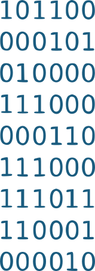{fig-width="80%" fig-alt="a rectangle of 0s and 1s representing binary data."}
:::
:::

::: {.column width="20%"}
::: {.fragment fragment-index=2}
{fig-width="90%" fig-alt="a human seated at an old fashioned computer"}
:::
:::

::: {.column width="60%" .small .r-fit-text}
::: {.fragment fragment-index=3}
$$ \begin{align*}
L(\alpha_i, \beta_i | y_{i,\boldsymbol{n}_i}) = \prod_{j=1}^{n_i} \frac{\beta_i^{\alpha_i}}{\Gamma(\alpha_i)} y_{ij}^{\alpha_i - 1} \text{exp}(-\beta_i y_{ij})&\end{align*}
$$
:::

<br/>

::: {.fragment fragment-index=4}
$$ \hat\alpha_i, \hat\beta_i $$
:::

:::
:::


::: columns
::: {.column width="10%"}
:::

::: {.column width="60%"}
::: {.fragment fragment-index=6}
```{r}
#| eval: false
#| include: false
source("model-res.R")

ggsave("model-results.svg", p, width = 1200, height = 600, units = "px", dpi=300)
```
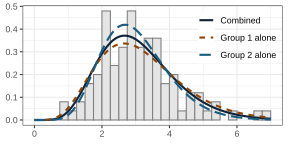{fig-alt="A histogram with three densities overlaid. The data in the histogram is skewed right and has a peak between two and three. The densities are labeled 'combined', 'group 1 alone', and 'group 2 alone', and use both color and solid/dotted lines to indicate which line belongs to each label. The group 2 alone density has the highest peak, followed by the combined density, while the group 1 alone density has the lowest peak and the widest dispersion." fig-width="100%"}
:::
:::

::: {.column width="5%"}
:::

::: {.column width="25%"}
::: {.fragment fragment-index=5}
{fig-alt="The globe" .move-way-up .move-way-left}
:::
:::
:::

::: {.notes}

It's a familiar tale. You get some data. You sit down and read it into your program of choice, and then start building a statistical model. You get some pretty estimates, and then it's time to communicate those estimates to someone out there in the world -- the owner of the data, the public, the funding agency. Most of the time, our first step is to create some sort of chart that shows our data along with some model summaries - the model predictions, the posterior predictive distribution, the risk. 

Why do visualizations help us so much?

:::


## Why Visualization? 

::: {.incremental}

- Communicate information about data 

    - Doesn't (always) require statistics knowledge    
    [$\Rightarrow$ helpful with the general public]{.fragment}

- Visualization uses *higher bandwidth channels* than text

:::


## Higher Bandwidth {.scrollable}
### What Helps More?

::: columns

::: {.column width="27%" .small}
###### Full Data

```{r}
datasaurus_dozen |>
  filter(dataset=="dino") |>
  arrange(x, y) |>
  select(x, y) |>
  DT::datatable(options = list(pageLength=5, dom='tp', pagingType="simple", oLanguage=list(oPaginate=list(sNext=">", sPrevious="<"))), rownames = F) |>
  DT::formatRound(1:2, digits=2)
```
:::


::: {.column width="32%"}

::: {.fragment fragment-index=1 .small}

###### Summary Stats
```{r}
#| label: dino-summary
#| out-extra: '.fragment fragment-index=1'
datasaurus_dozen |>
  filter(dataset=="dino") |>
  select(x, y) |>
  summarize(across(everything(), c(mean = mean, sd = sd))) |>
  pivot_longer(everything()) |>
  separate_wider_delim(name, delim = "_", names = c("var", "stat")) |>
  pivot_wider(names_from = var, values_from=value) |>
  rename(Stat = "stat") |>
  knitr::kable(digits = 2, format = 'pipe')

```
:::

:::

::: {.column width="40%"}

::: {.fragment fragment-index=2 .smaller}
###### A Plot
```{r}
#| fig-width: 4
#| fig-height: 4
#| fig-alt: "A scatterplot that shows the outline of a T-rex"


datasaurus_dozen |>
  filter(dataset=="dino") |>
ggplot(aes(x = x, y = y)) + geom_point() +  
  theme(axis.title = element_blank())
```
:::
:::

:::


## Why Visualization? 

- Communicate information about data 

    - Doesn't (always) require statistics knowledge    
    $\Rightarrow$ helpful with the general public

- Visualization uses *higher bandwidth channels* than e.g. tables

::: fragment
- Well designed graphics can be a form of    
[external cognition]{.emph .large .cerulean-dk}
:::


```{r}
#| label: linear-data-grammar
#| include: false
set.seed(2034928)
tbl <- tibble(x = 1:100 + rnorm(100, 0, .1), y = x + rnorm(100, sd=2))
p <- ggplot(tbl, aes(x = x, y = y)) + geom_point()
ggsave("grammar-transform-linear.svg",p,  width=1200, height=1200, units = "px", dpi = 300)
p + scale_x_sqrt()
ggsave("grammar-transform-xsqrt.svg", width=1200, height=1200, units = "px", dpi = 300)

p + scale_x_log10()
ggsave("grammar-transform-xlog10.svg", width=1200, height=1200, units = "px", dpi = 300)

p + scale_x_reverse()
ggsave("grammar-transform-reverse.svg", width=1200, height=1200, units = "px", dpi = 300)

p + scale_x_continuous(transform = "reciprocal", breaks = c(50, 20, 10, 5, 2, 1))
ggsave("grammmar-transform-xinv.svg", width=1200, height=1200, units = "px", dpi = 300)

```

```{r}
#| dependson: linear-data-grammar
#| include: false
library(xkcd)
library(ggplot2)


ggplot(tbl, aes(x = x, y = y)) + geom_point() + geom_smooth()
ggsave("grammar-theme-bw.png", width= 1200, height = 1200, units = "px", dpi = 300)


ggplot(tbl, aes(x = x, y = y)) + geom_point() + geom_smooth() + theme_grey()
ggsave("grammar-theme-grey.png", width= 1200, height = 1200, units = "px", dpi = 300)


dataman <- data.frame(x = 90, 
                      y = 40,
                      scale = 10,
                      ratioxy = 1,
                      angleofspine = -pi / 2,
                      anglerighthumerus = -pi / 6,
                      anglelefthumerus =  7*pi / 6,
                      anglerightradius =pi / 5,
                      angleleftradius = -6*pi / 5,
                      anglerightleg = 3 * pi / 2 - pi / 12,
                      angleleftleg = 3 * pi / 2 + pi / 12,
                      angleofneck = -pi / 2)
mapping <- aes(x = x, y = y, scale = scale, ratioxy = ratioxy, 
               angleofspine = angleofspine,
               anglerighthumerus = anglerighthumerus, 
               anglelefthumerus = anglelefthumerus,
               anglerightradius = anglerightradius, 
               angleleftradius = angleleftradius,
               anglerightleg = anglerightleg, 
               angleleftleg = angleleftleg, 
               angleofneck = angleofneck)

ggplot(tbl, aes(x = x, y = y)) + geom_point() + geom_smooth() + theme_xkcd() +   xkcdman(mapping, dataman) +
  annotate(x = 10, y = 90, label = "Courtesy of the xkcd package", geom = "text", hjust=0, family = "xkcd")
ggsave("grammar-theme-xkcd.png", width= 1200, height = 1200, units = "px", dpi = 300)


```

<!--
# The Grammar of Graphics 

## The Grammar of Graphics
::: columns

::: column
Wilkinson (2005) created a *grammar* of *graphics*:

- [Data]{.emph .large}

::: 

::: {.column}
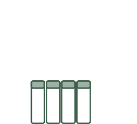{fig-alt="A graphical representation of a spreadsheet with 4 variables in columns"}
:::
:::

## Grammar of Graphics
::: columns

::: column
Wilkinson (2005) created a *grammar* of *graphics*:

- Data
- [Aesthetics]{.emph .large}

::: {.fragment fragment-index=1}
Map variables in the **data** to aspects of the **chart**
:::

::: 

::: {.column}
::: { .r-stack}
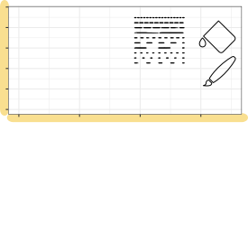{fig-alt="A plot with the x- and y- axis highlighted, showing only a grid. A paint bucket, paintbrush, and set of dotted and dashed lines illustrate other aesthetics." .fragment fragment-index=1}

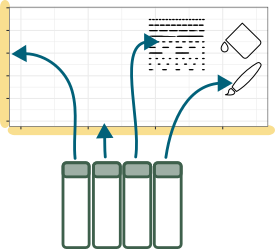{fig-alt="A plot with the x- and y- axis highlighted, showing only a grid. A paint bucket, paintbrush, and set of dotted and dashed lines illustrate other aesthetics. Below the plot, four columns of data in a table layout are shown, with arrows from each column to the x- and y- axis, dotted and dashed lines, and paintbrush." .fragment fragment-index=2}

:::
:::
:::

## Grammar of Graphics
::: columns

::: column
Wilkinson (2005) created a *grammar* of *graphics*:

- Data
- Aesthetics
- [Geoms]{.emph .large}

**geom**etric objects drawn onto a chart    
[(points, lines, rectangles, circles, ...)]{.fragment fragment-index=1}

::: 

::: {.column}
::: { .r-stack}
{fig-alt="A plot with the x- and y- axis highlighted, showing only a grid. A paint bucket, paintbrush, and set of dotted and dashed lines illustrate other aesthetics. Below the plot, four columns of data in a table layout are shown, with arrows from each column to the x- and y- axis, dotted and dashed lines, and paintbrush."}

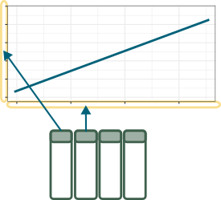{fig-alt="Geometric mappings for a line - x and y position. An additional variable could be mapped to line color or type, if there are multiple lines." .fragment fragment-index=1}

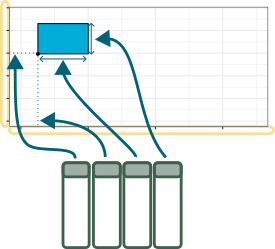{fig-alt="Geometric mappings for a rectangle - x, y, length, and width. An additional variable could be mapped to color." .fragment fragment-index=2}

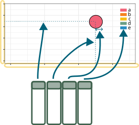{fig-alt="Geometric mappings for a circle - x and y position (for the center), radius, and fill." .fragment fragment-index=3} 


:::
:::
:::


## Grammar of Graphics
::: columns

::: column
Wilkinson (2005) created a *grammar* of *graphics*:

- Data
- Aesthetics
- Geoms
- [Transformations]{.emph .large}

[Apply a function to a variable mapping.]{.smaller .fragment fragment-index=1}

[Most commonly applied to axes and color scales]{.smaller .fragment fragment-index=2}


:::

::: column
::: {.r-stack}

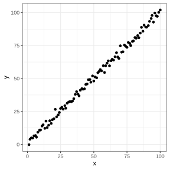{fig-alt="A scatterplot with linear x and y transformed scales." .fragment fragment-index=1}


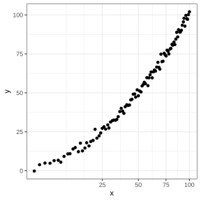{fig-alt="A scatterplot with a square-root transformed x axis scale." .fragment fragment-index=2}


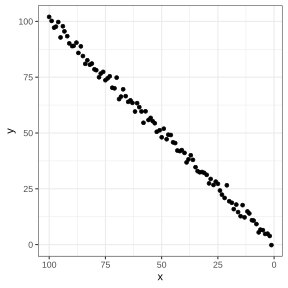{fig-alt="A scatterplot with a reverse-transformed x-axis scale." .fragment fragment-index=3}


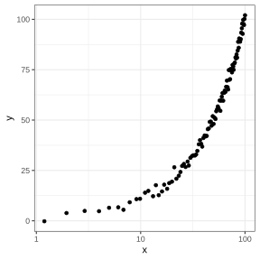{fig-alt="A scatterplot with a log-10 transformed x-axis scale." .fragment}


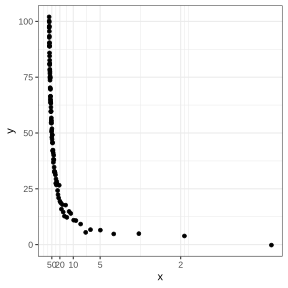{fig-alt="A scatterplot with an inverse (1/x) transformed x-axis scale." .fragment}


:::
:::

:::

## Grammar of Graphics
::: columns

::: column
Wilkinson (2005) created a *grammar* of *graphics*:

- Data
- Aesthetics
- Geoms
- Transformations
- [Layers]{.emph .large}

::: 

::: {.column}
::: { .r-stack}
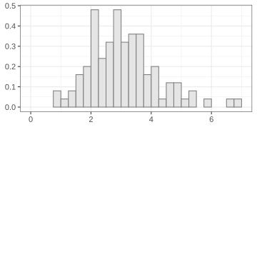{fig-alt="A histogram of some data" .fragment}


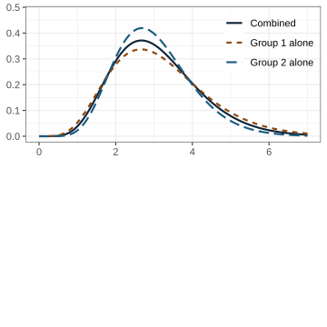{fig-alt="A density plot containing three density curves, which are indicated using color and line type." .fragment}


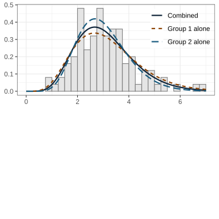{fig-alt="A histogram with three densities overlaid. The data in the histogram is skewed right and has a peak between two and three. The densities are labeled 'combined', 'group 1 alone', and 'group 2 alone', and use both color and solid/dotted lines to indicate which line belongs to each label. The group 2 alone density has the highest peak, followed by the combined density, while the group 1 alone density has the lowest peak and the widest dispersion." .fragment}

:::
:::
:::


## Grammar of Graphics
::: columns

::: column
Wilkinson (2005) created a *grammar* of *graphics*:

- Data
- Aesthetics
- Geoms
- Transformations
- Layers
- [Facets]{.emph .large}

::: 

```{r}
#| include: false
library(ggplot2)
data(diamonds)

ggplot(data = diamonds) + 
  geom_point(aes(x = carat, y = price, color = color))
ggsave("grammar-facets-none.svg", width= 1200, height = 1200, units = "px", dpi = 300)

ggplot(data = diamonds) + 
  geom_point(aes(x = carat, y = price, color = color)) + 
  facet_wrap(~cut) 
ggsave("grammar-facets-cut.svg", width= 1200, height = 1200, units = "px", dpi = 300)


ggplot(data = diamonds) + 
  geom_point(aes(x = carat, y = price, color = color)) + 
  facet_wrap(~clarity) 
ggsave("grammar-facets-clarity.svg", width= 1200, height = 1200, units = "px", dpi = 300)
```

::: {.column}
::: { .r-stack}

{fig-alt="a scatterplot of diamond carat weight by price, with points colored by categorical diamond color from D (best) to J (worst)." .fragment}

{fig-alt="a scatterplot of diamond carat weight by price, with points colored by categorical diamond color from D (best) to J (worst). There are subplots for each different cut rating (Fair, Good, Very Good, Premium, Ideal)." .fragment}

{fig-alt="a scatterplot of diamond carat weight by price, with points colored by categorical diamond color from D (best) to J (worst). There are subplots for each different clarity." .fragment}
:::
:::
:::


## Grammar of Graphics
::: columns

::: column
Wilkinson (2005) created a *grammar* of *graphics*:

- Data
- Aesthetics
- Geoms
- Transformations
- Layers
- Facets
- [Themes]{.emph .large}

::: 

::: {.column}
::: { .r-stack}

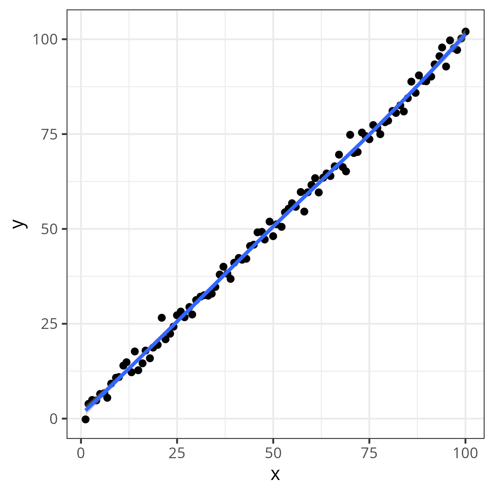{fig-alt="A demonstration of theme_bw()" .fragment}

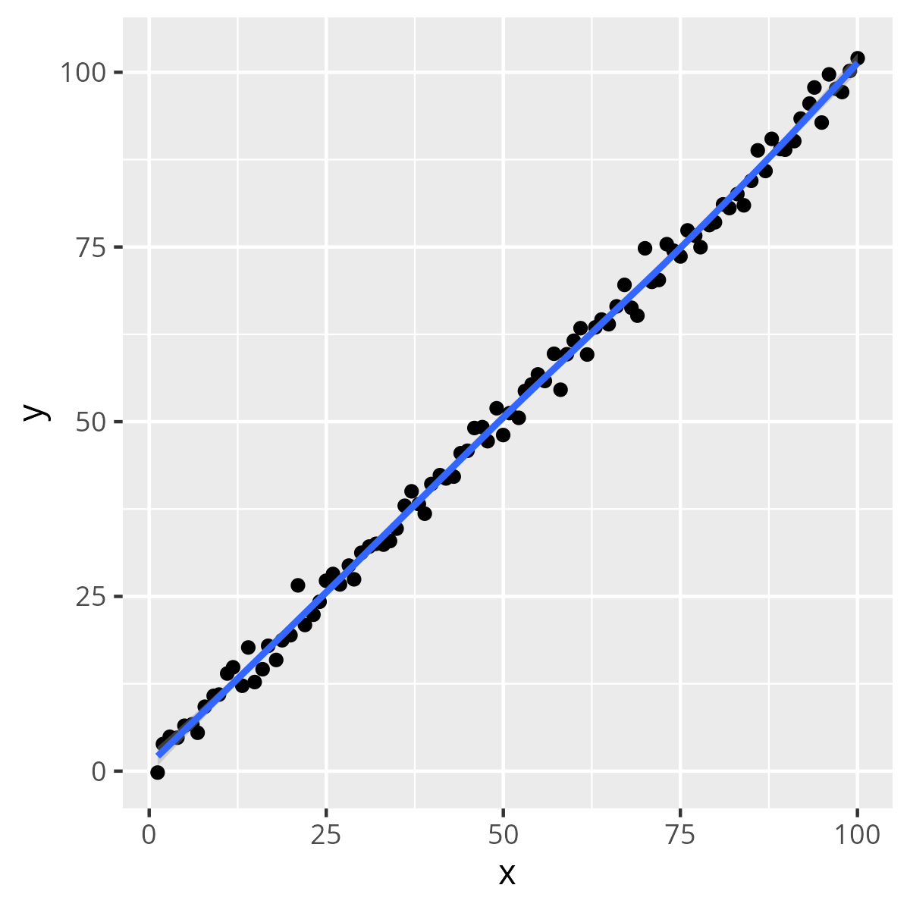{fig-alt="A demonstration of theme_grey()" .fragment}


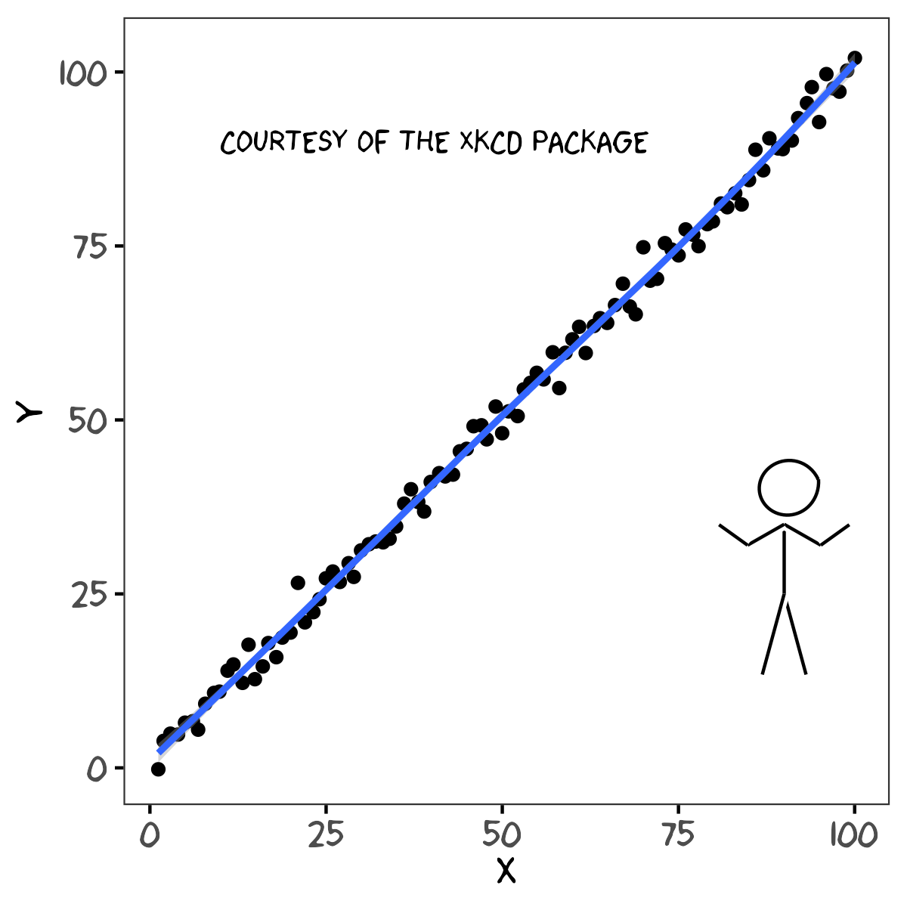{fig-alt="A demonstration of theme_xkcd()" .fragment}


:::
:::
:::
-->

# Making Good Graphics

## Visualization Design Principles

::: columns
::: column

Map your most important variables to more accurate channels

:::

::: column

1. Position - common scale (BEST)
2. Position - nonaligned scale
3. Length, direction, angle
4. Area
5. Volume, curvature
6. Shading, color (WORST)

[(Cleveland, 1984; Heer and Bostock, 2009)]{.smaller}

:::

:::

## Preattentive Perception

-   Combinations of preattentive features require attention

    -   Double-encoding (using multiple features for the same variable) is ok

```{r}
#| echo: false
#| fig-width: 4
#| fig-height: 4
#| label: fig-preattentive1
#| fig-subcap: 
#|   - "Shape"
#|   - "Color"
#| layout-ncol: 2
#| out-width: "45%"

set.seed(153253)
data <- data.frame(expand.grid(x=1:6, y=1:6), color=sample(c(1,2), 36, replace=TRUE))
data$x <- data$x+rnorm(36, 0, .25)
data$y <- data$y+rnorm(36, 0, .25)
suppressWarnings(library(ggplot2))
new_theme_empty <- theme_bw()
new_theme_empty$line <- element_blank()
# new_theme_empty$rect <- element_blank()
new_theme_empty$strip.text <- element_blank()
new_theme_empty$axis.text <- element_blank()
new_theme_empty$plot.title <- element_blank()
new_theme_empty$axis.title <- element_blank()
# new_theme_empty$plot.margin <- structure(c(0, 0, -1, -1), unit = "lines", valid.unit = 3L, class = "unit")

data$shape <- c(rep(2, 15), 1, rep(2,20))
library(scales)
ggplot(data=data, aes(x=x, y=y, color=factor(1, levels=c(1,2)), shape=factor(shape), size=I(5))) + 
  geom_point() +
  scale_shape_manual(guide="none", values=c(19, 15)) + 
  scale_color_discrete(guide="none") + 
  new_theme_empty

data$shape <- c(rep(2, 25), 1, rep(2,10))
ggplot(data=data, aes(x=x, y=y, color=factor(shape), shape=I(19), size=I(5)))+
  geom_point() +  
  scale_color_discrete(guide="none") + 
  new_theme_empty
```

## Preattentive Perception 

-   Combinations of preattentive features require attention

    -   Double-encoding (using multiple features for the same variable) is ok
    
```{r}
#| echo: false
#| fig-width: 4
#| fig-height: 4
#| label: fig-preattentive2
#| fig-subcap: 
#|   - "Shape and Color (dual encoded)"
#|   - "Shape and Color (different variables)"
#| layout-ncol: 2
#| out-width: "45%"
set.seed(1532534)
data <- data.frame(expand.grid(x=1:6, y=1:6), color=sample(c(1,2), 36, replace=TRUE))
data$x <- data$x+rnorm(36, 0, .25)
data$y <- data$y+rnorm(36, 0, .25)
suppressWarnings(library(ggplot2))
new_theme_empty <- theme_bw()
new_theme_empty$line <- element_blank()
# new_theme_empty$rect <- element_blank()
new_theme_empty$strip.text <- element_blank()
new_theme_empty$axis.text <- element_blank()
new_theme_empty$plot.title <- element_blank()
new_theme_empty$axis.title <- element_blank()
# new_theme_empty$plot.margin <- structure(c(0, 0, -1, -1), unit = "lines", valid.unit = 3L, class = "unit")

data$shape <- data$color
ggplot(data=data, aes(x=x, y=y, 
                      color=factor(color), 
                      shape=factor(shape))) + 
  geom_point(size = 5) +
  scale_shape_manual(guide="none", values=c(19, 15)) +
  scale_color_discrete(guide="none") + 
  new_theme_empty

data <- data %>%
  mutate(sample = row_number() %in% sample(1:n(), 4)) %>%
  mutate(shape = if_else(sample, if_else(shape == 1, 2, 1), shape))

ggplot(data=data, aes(x=x, y=y, 
                      color=factor(color), 
                      shape=factor(shape))) + 
  geom_point(size = 5) +
  scale_shape_manual(guide="none", values=c(19, 15)) +
  scale_color_discrete(guide="none") + 
  new_theme_empty
# qplot(data=data, x=x, y=y, color=factor(color), shape=factor(shape), size=I(5))+scale_shape_manual(guide="none", values=c(19, 15)) + scale_color_discrete(guide="none") + new_theme_empty
```


## Grouping in Charts
::: columns
::: column

```{r}
#| fig-width: 6
#| fig-height: 4
tb <- read_csv("TB_notifications_2026-07-20.csv")

tb_long <- tb |> 
  dplyr::select(country, iso3, year, new_sp_m04:new_sp_fu) |>
  pivot_longer(cols=new_sp_m04:new_sp_fu, names_to="sexage", values_to="count") |>
  mutate(sexage = str_replace(sexage, "new_sp_", "")) |>
  mutate(sex=substr(sexage, 1, 1), 
         age=substr(sexage, 2, length(sexage))) |>
  dplyr::select(-sexage)
tb_ky <- tb_long |> 
  filter(country == "Kenya") |>
  dplyr::select(country, year, sex, age, count) |>
  mutate(age = factor(age, levels = c("04", "514", "014", "1524", "2534", "3544", "4554", "5564", "65", "u"), labels = c("0-4", "5-14", "0-14", "15-24", "25-34", "35-44", "45-54", "55-64", "65+", "Unk"))) |>
  filter(!age%in% c("0-4", "5-14", "0-14", "Unk")) |>
  filter(year == 2012)
tb_ky |>
  ggplot(aes(x=sex, y=count, fill=sex)) +
  geom_bar(stat="identity", position="dodge") + 
  facet_wrap(~age, ncol=6) +
  scale_fill_manual("Sex", values = c("#DC3220", "#005AB5")) + guides(fill = "none") + scale_x_discrete("Sex") + scale_y_continuous("# TB Cases") + ggtitle("TB Indicdence, Kenya, 2012")

```
- Compare TB diagnoses by gender for each age

:::
::: column

```{r}

#| fig-width: 6
#| fig-height: 4
tb_ky |>
  ggplot(aes(x=age, y=count, fill=age)) +
  geom_bar(stat="identity", position="dodge") + 
  facet_wrap(~sex, ncol=2) +
  scale_fill_brewer("", palette="Paired") +
  guides(fill="none")+ scale_x_discrete("Age") + scale_y_continuous("# TB Cases") + ggtitle("TB Indicdence, Kenya, 2012")

```
- Compare TB diagnoses within ages for each gender

:::
:::

## Leveraging Associations

[XKCD Color Survey](https://blog.xkcd.com/2010/05/03/color-survey-results/) - Fully saturated color names

::: r-stack

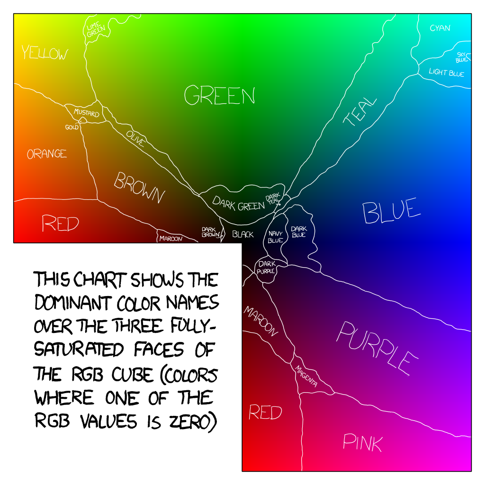{fig-alt="Fully saturated color map from xkcd color survey." .fragment}

```{r}
#| fig-width: 8
#| fig-height: 6
#| out-extra: '.fragment'
xkcdcolors <- tibble(orig = readLines("https://xkcd.com/color/satfaces.txt")) |>
  separate_wider_regex(orig, patterns = c("\\[", R = "\\d{1,3}", ", ", G="\\d{1,3}", ", ", B = "\\d{1,3}", "\\] ", colorname = ".*")) |>
  mutate(across(R:B, as.numeric)) |>
  mutate(across(R:B, \(x) x/255, .names = "d{.col}"),
         color = rgb(dR, dG, dB)) 

r0 <- filter(xkcdcolors, R==0)
g0 <- filter(xkcdcolors, G==0)
b0 <- filter(xkcdcolors, B==0)

r0fix <- r0 |>
  mutate(x = B, y = G)
g0fix <- g0 |>
  mutate(x = B, y = -R)
b0fix <- b0 |>
  mutate(x = -R, y = G)

cubefix <- bind_rows(r0fix, g0fix, b0fix) |> unique()

# cubefix |>
# ggplot(aes(x =x, y = y, fill = color)) + geom_tile() +
#   scale_fill_identity() + 
#   theme_void() + 
#   coord_fixed()

simplecolors <-
cubefix |>
  mutate(simplename1 = stringr::str_remove_all(colorname, "(dark|light|lime|sky|navy) ")) |>
  mutate(simplename2 = stringr::str_replace_all(simplename1, c("maroon" = "red", "gold" = "yellow", "olive" = "yellow", "mustard" = "yellow", "magenta" = "pink"))) |>
  group_by(simplename2, simplename1) |>
  summarize(count = n(), dR=median(dR), dG = median(dG), dB = median(dB), color = rgb(dR, dG, dB), .groups = "drop_last") |>
  mutate(count2 = sum(count)) |>
  ungroup() |>
  arrange(desc(count2)) |>
  mutate(simplename2 = factor(simplename2, levels = unique(simplename2), ordered = T))


simplecolors |>
  mutate(color = sample(color, size = n())) |>
  ggplot(aes(x = simplename2, y = count, fill = color)) + scale_fill_identity() + geom_col(position = "stack")  + 
  xlab("Simplified Color Names") + ylab("# RGB Colors") + 
  coord_flip()
# ggsave(filename = "associations-color-non-matching.svg", width= 1200, height = 1200, units = "px", dpi = 300)
```

```{r}
#| fig-width: 8
#| fig-height: 6
#| out-extra: '.fragment'
simplecolors |>
  ggplot(aes(x = simplename2, y = count, fill = simplename1)) + geom_col(position = "stack")  + 
  guides(fill='none') +
  xlab("Simplified Color Names") + ylab("# RGB Colors") + 
  coord_flip()
# ggsave(filename = "associations-color-default.svg", width= 1200, height = 1200, units = "px", dpi = 300)
```

```{r}
#| fig-width: 8
#| fig-height: 6
#| out-extra: '.fragment'

ggplot(simplecolors, aes(x = simplename2, y = count, fill = color)) + scale_fill_identity() + geom_col(position = "stack")  + 
  xlab("Simplified Color Names") + ylab("# RGB Colors") + 
  coord_flip()
# ggsave(filename = "associations-color-matching.svg" , width= 1200, height = 1200, units = "px", dpi = 300)

```

:::

## Leveraging Associations

::: r-stack

```{r}
#| echo: false
#| dev: ragg_png
# https://www.ers.usda.gov/data-products/fruit-and-tree-nuts-data/fruit-and-tree-nuts-yearbook-tables
fruit <- read_csv("FruitYearbookSupplyandAvailability_GTables.csv") 
# fruit_emo <- tibble(commodity_element = unique(fruit$commodity_element)) |>
#   mutate(fruit = str_replace(commodity_element, pattern = " fruit", "")) |>
#   mutate(fruit = str_split(fruit, pattern = " ", simplify = F)) |>
#   unnest(cols = c(fruit)) |>
#   mutate(fruit = stringr::str_replace_all(fruit, c("ies$" = "y", "Peaches" = "peach", "Mangoes" = "mango", " fruit$" = "", "s$"= "")) |> stringr::str_to_lower()) |>
#   filter(fruit != "and") |>
#   mutate(emoji = purrr::map(fruit, emojifont::search_emoji)) |>
#   mutate(emoji = purrr::map(emoji, \(x) x[which.min(nchar(x))])) |>
#   unnest(cols = emoji) |>
#   group_by(commodity_element) |>
#   slice_head(n=1) |>
#   filter(!is.null(emoji)) |>
#   filter(!emoji %in% c("firefighter", "sweet_potato", "palm_tree", "date")) |>
#   group_by(emoji) |>
#   arrange(nchar(commodity_element)) |>
#   slice_head(n=1)


citrus <- fruit |>
  filter(variable%in% c("Supply", "Imports", "Exports"), commodity_element %in% c("Oranges", "Lemons")) |>
  mutate(year = as.numeric(stringr::str_extract(year_value, "\\d{4}")), month = if_else(is.na(month), year_start_month, month)) |>
  mutate(date = lubridate::my(paste(month, " ", year))) |>
  filter(!stringr::str_detect(table_name, "juice")) |>
  pivot_wider(id_cols = c(table_name:month, commodity_element:geographic_extent, unit, date, year), names_from = variable, values_from = value) |>
  mutate(emo = case_when(commodity_element=="Oranges" ~ "🍊", 
                         commodity_element=="Limes" ~ "🍋‍🟩",
                         commodity_element=="Lemons" ~ "🍋",
                         TRUE ~ ""),
         emo2 = case_when(commodity_element=="Oranges" ~ "1f34a", 
                         commodity_element=="Limes" ~ "lime",
                         commodity_element=="Lemons" ~ "1f34b",
                         TRUE ~ ""),)
last_citrus <- citrus |>
  group_by(commodity_element, emo) |>
  filter(date == max(date)) |>
  ungroup()

# library(emojifont)

citrus |>
  ggplot() + geom_line(aes(x = date, y=Supply/1000, color = commodity_element), size = 2) + 
  geom_point(data = last_citrus , aes(x = date, y=Supply/1000, shape = emo), size =3) + scale_shape_identity() +
  scale_color_manual("Citrus", values = c("Oranges" = "orange", "Limes" = "limegreen", "Lemons" = "yellow3")) + 
  scale_y_continuous("Supply, Billions of Pounds")
```

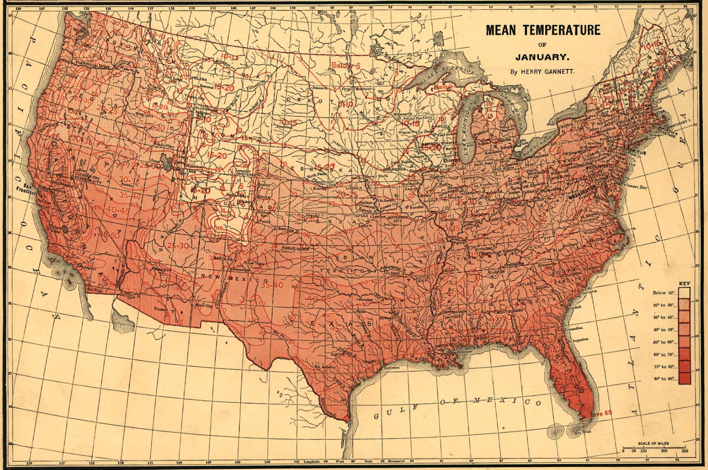{fig-alt="A map from the 1880 statistical atlas which shows the average January temperature across the continental US." .fragment width="100%"}

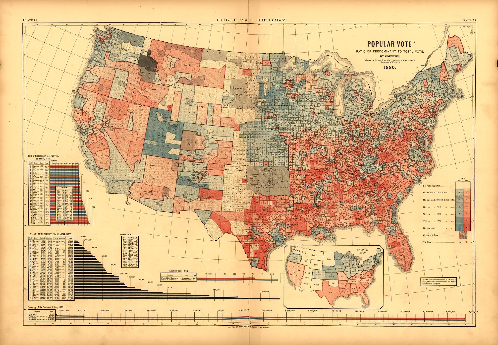{fig-alt="Map of 1880 election results showing the Republican party in blue and the Democratic party in red. The colors commonly used for each party were not consistently assigned until color TV became common." .fragment width="100%"}
:::

<!-- Cold = blue, red = hot, and so on -->
<!-- Using emoji and graphics to minimize legend reading reqs -->

## Know Your Audience {.incremental}

- Associations are audience and culture dependent

  - Victorian era colors: pink was for males, blue for females
  
- Rates of color deficiency - 10% of males, 0.2% of females

- 🚦Stoplight color schemes are standard for some industries 😭


# What Do You See?

```{r}
#| fig.width: 8
#| fig.height: 6
#| out.extra: ".fragment .center"
set.seed(2043908)
tmp <- datasaurus_dozen |>
  filter(dataset=="dino") 
ggplot(lineup(null_permute("x"), tmp)) + geom_point(aes(x=x, y=y)) + facet_wrap(~.sample) + theme(axis.text=element_blank(), axis.title = element_blank())
```

## Which One Is Not Like the Others?
```{r}
#| fig-width: 7
#| fig-height: 7
#| dpi: 300
#| out-width: "60%"
#| echo: false
#| warning: false

data(penguins)

set.seed(4209483)
penguin_ranks <- penguins |>
  filter(species == "Gentoo") |>
  mutate(across(3:6, rank, .names="rank_{.col}")) 

ggplot(lineup(null_permute('rank_bill_depth_mm'), penguin_ranks, pos = 4)) + geom_point(aes(x = rank_bill_depth_mm, y = rank_bill_length_mm)) + facet_wrap(~.sample) + theme(axis.text=element_blank(), axis.title=element_blank())
```

## Statistics and Charts {.smaller}

::: columns
::: column
A **statistic** is a quantity    
🔲computed from values in a sample    
🔲used for a statistical purpose [[Wikipedia](https://en.wikipedia.org/wiki/Statistic)]{.small}

$$\overline{x} = \frac{1}{n}\sum_{i=1}^n x_i$$

A **chart** is a graphical representation for data visualization, in which the data is represented by symbols [[Wikipedia](https://en.wikipedia.org/wiki/Chart)]{.small}

:::

::: column
::: fragment
Charts are    

✅ computed from values in a sample 

✅ used for a statistical purpose

<br/><br/>
:::

::: fragment
[So... charts **are** statistics!]{.huge .emph .cerulean}
:::

:::
:::

## Testing Statistics

[Data from [Tidy Tuesday, 2020-09-01](https://github.com/rfordatascience/tidytuesday/blob/master/data/2020/2020-09-01/readme.md)]{.bottom}

```{r}
#| include: false
#| cache: true

key_crop_yields <- readr::read_csv('https://raw.githubusercontent.com/rfordatascience/tidytuesday/main/data/2020/2020-09-01/key_crop_yields.csv')
fertilizer <- readr::read_csv('https://raw.githubusercontent.com/rfordatascience/tidytuesday/main/data/2020/2020-09-01/cereal_crop_yield_vs_fertilizer_application.csv')
tractors <- readr::read_csv('https://raw.githubusercontent.com/rfordatascience/tidytuesday/main/data/2020/2020-09-01/cereal_yields_vs_tractor_inputs_in_agriculture.csv')
land_use <- readr::read_csv('https://raw.githubusercontent.com/rfordatascience/tidytuesday/main/data/2020/2020-09-01/land_use_vs_yield_change_in_cereal_production.csv')
arable_land <- readr::read_csv('https://raw.githubusercontent.com/rfordatascience/tidytuesday/main/data/2020/2020-09-01/arable_land_pin.csv')
```

```{r}
#| echo: false
#| message: false
#| fig-width: 8
#| fig-height: 4
#| out-width: "100%"


df <- key_crop_yields %>%
  filter(Entity == "Americas") %>%
  rename(Corn = `Maize (tonnes per hectare)`)

ggplot(df, aes(x = Year, y = Corn, group = Entity)) + 
  geom_line() + 
  ggtitle("Maize Production in the Americas") + 
  scale_y_continuous("Tonnes per hectare")
ggsave(filename = "maize-plot.png", units="px", width = 1200, height=1200, dpi = 300)
```

::: notes
Suppose we have this data, and we want to determine whether there is a relationship between Maize production and time.

If we were testing this statistically, we'd fit a linear regression to the data, and test to see whether the slope is equal to 0, right?

We can do that graphically as well: if there is no relationship, then it doesn't matter which Y value is assigned to which X value - we can just shuffle the production values independently of time.
:::

## Testing Statistics

-   If statistics are charts, then what is the reference distribution?

-   What constitutes an "extreme" or "significant" chart?

## Testing Statistics
::: columns
::: column
Hypothesis testing:

::: {.incremental}

-   take a sample

-   calculate a test statistic

-   compare test statistic to reference distribution\
    (formed by $H_0$)

-   if it is unlikely, reject null hypothesis
:::
:::

::: column
Visual hypothesis testing:

::: {.incremental}
-   take a sample

-   create a test chart

-   compare chart to a reference distribution of others generated under $H_0$

-   if test chart "stands out" then reject null hypothesis
:::
:::
:::

::: notes
Using the hypothesis that there is no relationship between X and Y, we can create a reference distribution of other graphs generated by shuffling the Y values.

Do you think you'll be able to pick out the reference chart?
:::

## Testing Statistics

```{r}
#| label: maize
#| echo: false
#| fig-align: "center"
#| fig-width: 7
#| fig-height: 5
#| out-width: "90%"


library(nullabor)
fit <- lm(Corn ~ Year, data = df)
fit.reg <- tibble(df, .resid = residuals(fit), .fitted = fitted(fit))
coefs <- coefficients(summary(fit))
lineup_coefs <- rnorm(19, 0.02, sd = 2*coefs[2,2])
lineup_coefs <- c(lineup_coefs[1:14], coefs[2,1], lineup_coefs[15:19])
intercept <- c(rnorm(14, coefs[1,1], 2*coefs[1,2]), coefs[1,1], rnorm(5, coefs[1,1], 2*coefs[1,2]))

lineup_data <- tibble(.sample = 1:20, intercept = intercept, coef = lineup_coefs) %>%
  mutate(data = list(tibble(Year = df$Year, Corn = df$Corn, resid = resid(fit)))) %>%
  unnest(data) %>%
  mutate(y = intercept + coef*Year + resid)

ggplot(lineup(null_permute("Corn"), n = 20, pos = 15, df), aes(x = Year, y = Corn)) + geom_line() + facet_wrap(~.sample) + 
  ggtitle("Maize Production in the Americas") + 
  scale_y_continuous("Tonnes per hectare") + 
  theme_bw() + theme(axis.text = element_blank())
```

::: notes
Now, this is a very easy example, because we all know there's been a massive increase in crop yields over the last 50 years. But, you can see how this paradigm is powerful - you can easily tell which plot is "different", and if I ask 20 different people to evaluate it, I'd wager at least 19 would say "plot 15 is different".

You'll also notice that we didn't have to ask anything statistical in nature - all of our hypotheses are embedded into the statistical lineup through the generation of the other 19 plots. We call these lineups because they're similar to the criminal procedure of the same name.

The powerful part of this is that we can test for statistical significance of data even in cases where the effect is very subtle, or not easily mathematically quantified, as long as we can generate realistic "null" data through a reasonable mechanism.
:::

## Testing Statistics
::: columns
::: {.column .smaller}
-   Plot: A **statistical lineup**

-   Method: **visual inference**\
    (graphical hypothesis test)

-   Many factors influence the results

    -   the data
    -   the plot type
    -   the plot aesthetics\
        [(color, shape, etc.)]{.small}
    -   extra statistical features\
        [trend lines, error bars]{.small}
:::

::: column
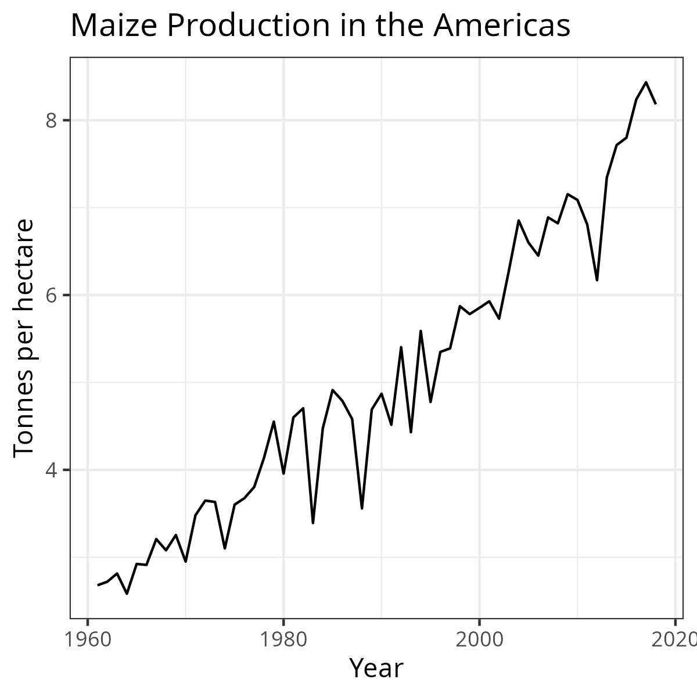 
:::
:::

<!-- class:middle,center,inverse -->

## Visualizing Uncertainty

Data -> 

Graphics -> 

[Graphical Testing]{.emph .sage-dk .fragment} -> 

[Graphical Significance]{.emph .sage-dk .fragment}

[One method for incorporating and assessing uncertainty with charts]{.fragment}

## {.center}

Uncertainty is an [inherent]{.emph .large .sage-dk} property     
of data and statistics -     
[it is not easily separated or contained.]{.fragment .emph .aggie-blue}


# Uncertainty  Visualization ❓🫨 📐

## {background-image="types-of-uncertainty.svg" background-size="95%" background-image-alt="A collage of different types of uncertainty and goals of uncertainty visualization. The top left shows a spaghetti plot of hurricane tracks based on different model starting conditions, with the label 'prediction uncertainty'. The top right shows a risk pictogram of 10-year outcomes for a 38 year old white female who has never smoked; the vast majority of the outcomes are survival, with accident, breast cancer, colon cancer, liver disease, and other causes of death represented. The plot has the label 'risk perception'. In the center, there is a sketch of a hand flipping a coin. On the center left, there is a cartoon depiction of the trolley problem with the label 'rational decision making', and in the bottom left there is a screenshot of the NY Times election needle in 2016, showing one representation of uncertainty from missing data. In the bottom center, there is a picture of calipers with the label 'measurement uncertainty', and on the bottom right there is a histogram with the label 'what do RVs even mean'."}

::: notes

Why uncertainty is a hard thing to pin down

:::


## Goal(s) of Uncertainty Visualization

Communicate the Legitimacy of Conclusions

```{r}
#| fig-alt: A set of two distributional bar charts made up of 100 samples each. A black line at y=5 stretches across both charts. The first chart has red bars and is labeled 'amateurs' with a silly face emoji, and has extremely high variance, with most bars between 1 and 9. The second is labeled 'serious science' with a microscope emoji and has very low variance, with almost all bars between 4.5 and 5.5. 
#| fig-width: 6
#| fig-height: 3
#| fig-dpi: 300
set.seed(2049809823)
tibble(x = dist_normal(5, c(.2, 2)), label = c("Serious science! 🔬", "Amateurs 🥸")) |>
  sample_expand(times=100) |>
  group_by(label) |>
  summarize(mean = mean(x), se = sd(x), lb = mean-se, ub = mean+se) |>
  ggplot() + geom_hline(yintercept=5) + 
  geom_col(aes(x = label, y = mean, fill = label)) + 
  geom_errorbar(aes(x = label, ymin = lb, ymax = ub), width = .2) + 
  guides(fill = 'none') + theme(axis.title = element_blank()) 
ggsave(filename = "uncertainty-bar-chart.png", width=6, height =3, dpi = 300, units = "in")

```


## Goal(s) of Uncertainty Visualization

Communicate the Legitimacy of Conclusions

::: columns
::: column
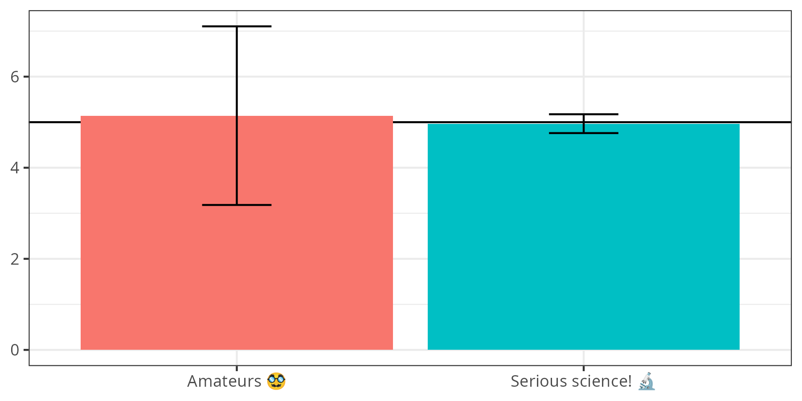{fig-alt="Bar chart showing two groups: amateurs and serious science. The amateurs bar has a much larger error bar than the serious science bar."}
:::

::: column
Requires understanding

- what error bars show (variance)
- how the error bar is computed ($\pm 1 \sigma$)
- how that translates to real data  (most data within 2*bars)
:::
:::

## Goal(s) of Uncertainty Visualization

Communicate the Legitimacy of Conclusions

```{r}
#| fig-alt: A set of two distributional bar charts made up of 100 samples each. A black line at y=5 stretches across both charts. The first chart has red bars and is labeled 'amateurs' with a silly face emoji, and has extremely high variance, with most bars between 1 and 9. The second is labeled 'serious science' with a microscope emoji and has very low variance, with almost all bars between 4.5 and 5.5. 
#| fig-width: 6
#| fig-height: 3
#| fig-dpi: 300
set.seed(2049809823)
tibble(x = dist_normal(5, c(.2, 2)), label = c("Serious science! 🔬", "Amateurs 🥸")) |>
  ggplot() + geom_hline(yintercept=5) + 
  geom_col_sample(aes(x = label, y = x, fill = label), times= 100) + guides(fill = 'none') + theme(axis.title = element_blank()) + scale_y_continuous_distribution(breaks=c(0:10))

```


## Goal(s) of Uncertainty Visualization

Transparency

In a survey of 90 "visualization authors" recruited from the InfoVis community, respondents mentioned the

> importance of transparency in presentations of data, suggesting that omitting uncertainty was misleading or even lying. ^[Hullman, Jessica. 2020. “Why Authors Don’t Visualize Uncertainty.” IEEE Transactions on Visualization and Computer Graphics 26(1):130–39. doi:10.1109/TVCG.2019.2934287.]

## Goal(s) of Uncertainty Visualization

Making accurate decisions under uncertainty

- Visualizing uncertainty is just the first step

- Ultimate goal: Use the uncertainty to 

    - communicate effectively

    - support better decision-making    
    
[Requires understanding how we perceive and use charts -- whether deterministic or distributional]{.fragment}
