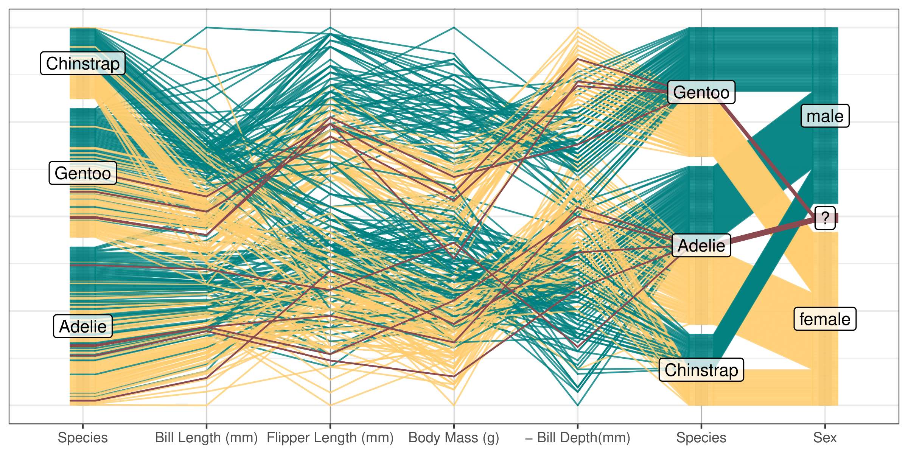
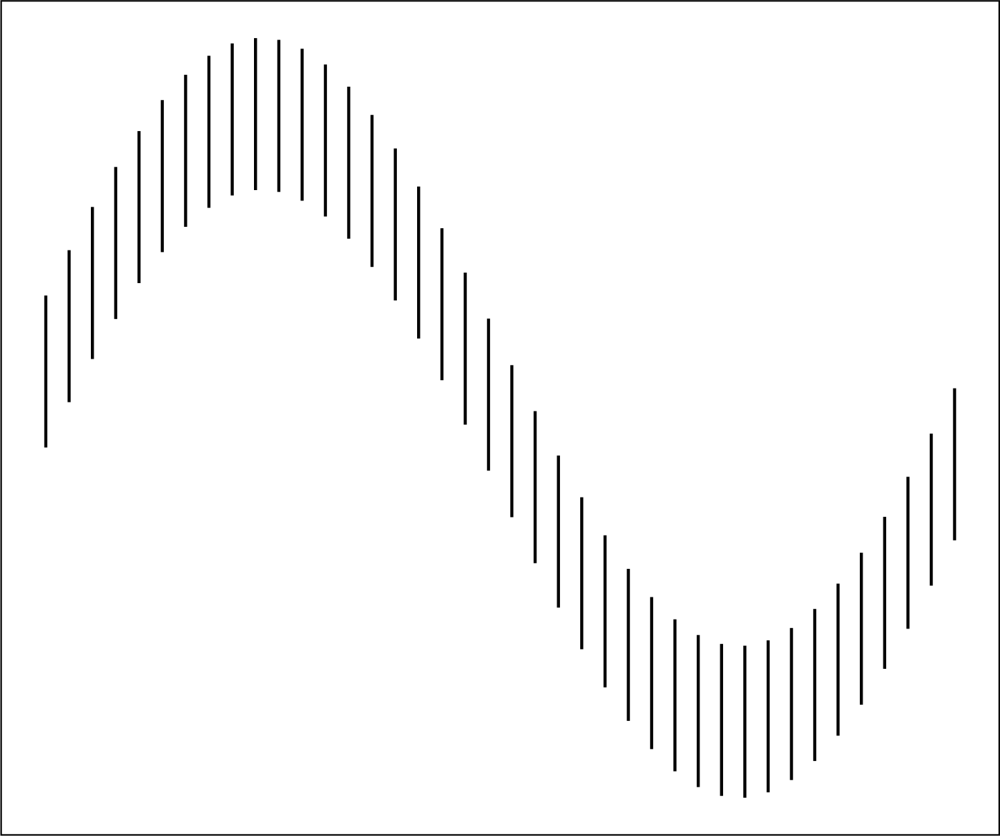
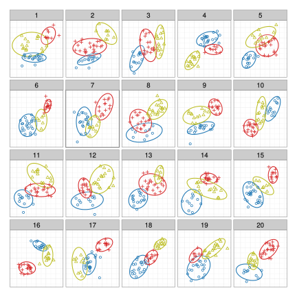
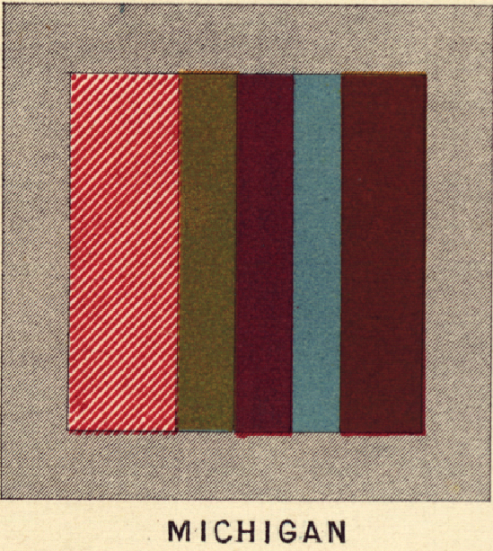
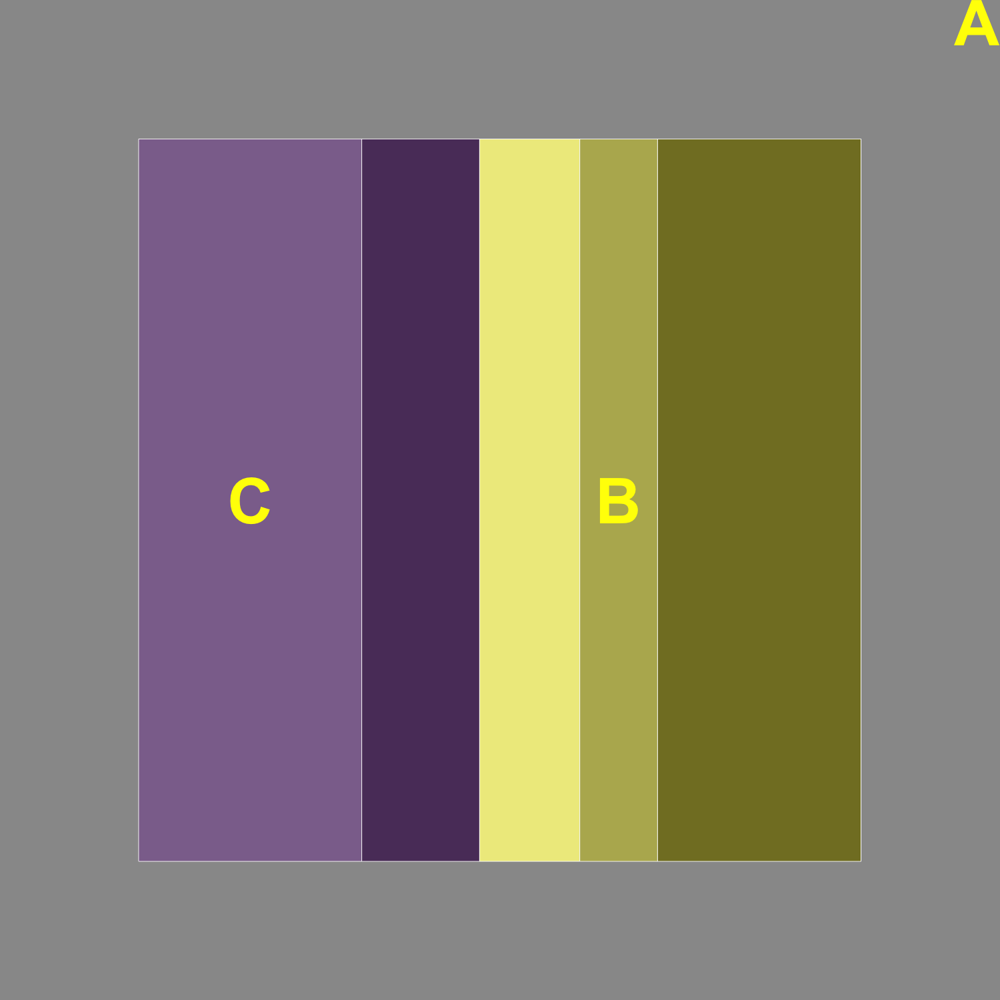
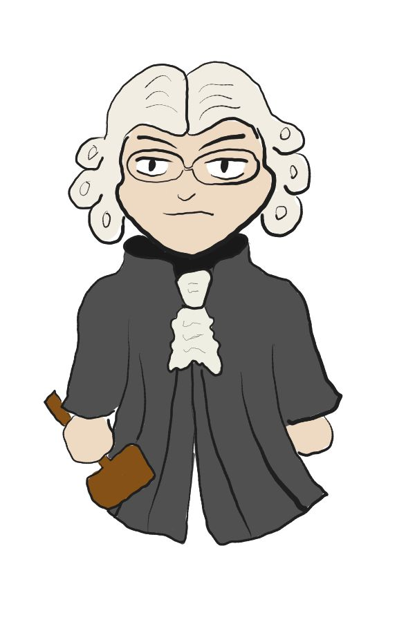
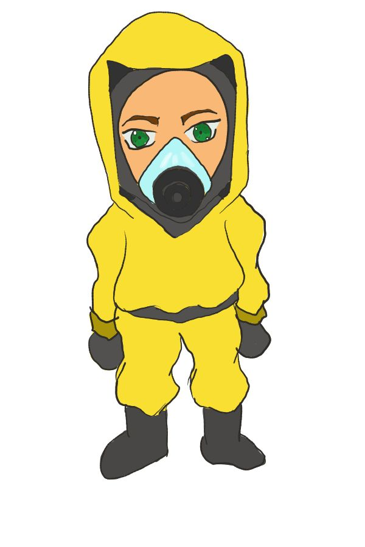
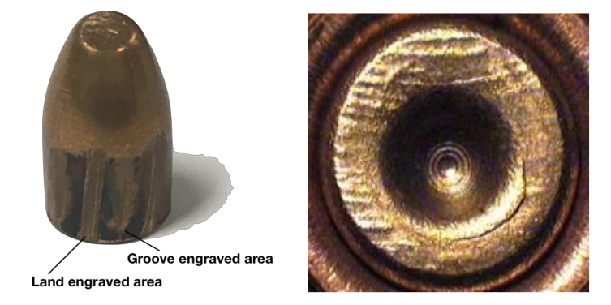
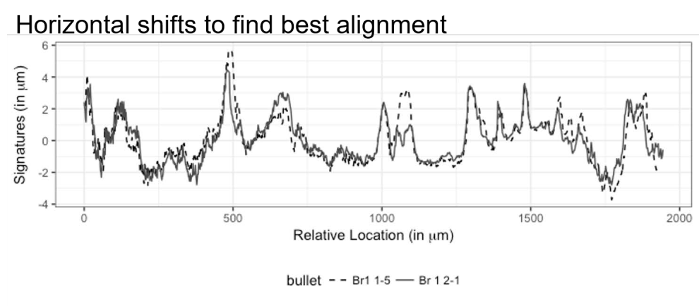

## About Me 
::: incremental

- 2005 - 2009  - BS, Applied Math & Psychology, Texas A&M

- 2009 - Started PhD in Bioinformatics at Iowa State
- 2010 - Switched to Statistics 
- 2011 - MS, Statistics
- 2015 - PhD, Statistics

- 2015-2018, Statistical Analyst, Nebraska Public Power District

- 2018-2019, Center for Statistics and Applications in Forensic Evidence (CSAFE), Iowa State

- 2020-2026, University of Nebraska Lincoln ☠️

:::

# Research

## Statistical Graphics
### Graphics Software

{fig-alt="A parallel coordinate plot of male and female penguin data, with penguins that have missing sex data highlighted in red."}

## Statistical Graphics
### Perception of Graphics

{fig-width="50%"}

## Statistical Graphics
### Visual Inference

::: {.fragment}
- How to measure graphics effectively
    - NSF CAREER award last year
:::

::: {.tiny}
VanderPlas, Susan, and Heike Hofmann. 2017. “Clusters Beat Trend⁉ Testing Feature Hierarchy in Statistical Graphics.” Journal of Computational and Graphical Statistics 26(2):231–42. doi:10.1080/10618600.2016.1209116.
:::

## Reproducibility

::: {layout-ncol=2}

:::

::: {.tiny}
VanderPlas, Susan, Goluch C. Ryan, and Heike Hofmann. 2019. “Framed! Reproducing and Revisiting 150-Year-Old Charts.” Journal of Computational and Graphical Statistics 28(3):620–34. doi:10.1080/10618600.2018.1562937.
:::

## Forensics {.r-fit-text}

- Forensic Pattern Evidence
  - Algorithms for Matching
  - Error Rates
  - Perception of Court Testimony -- "Experimental Design is Important"

::: {layout="[[1, 1, 3],[1]]"}

:::