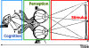
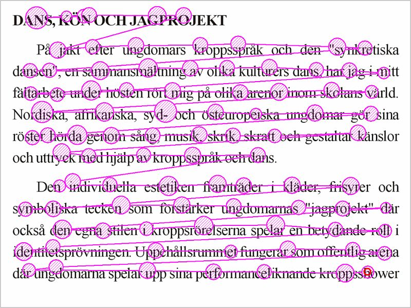
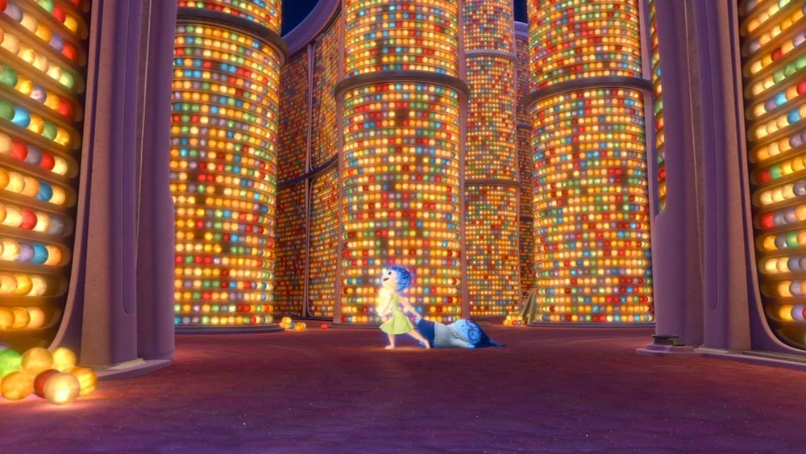
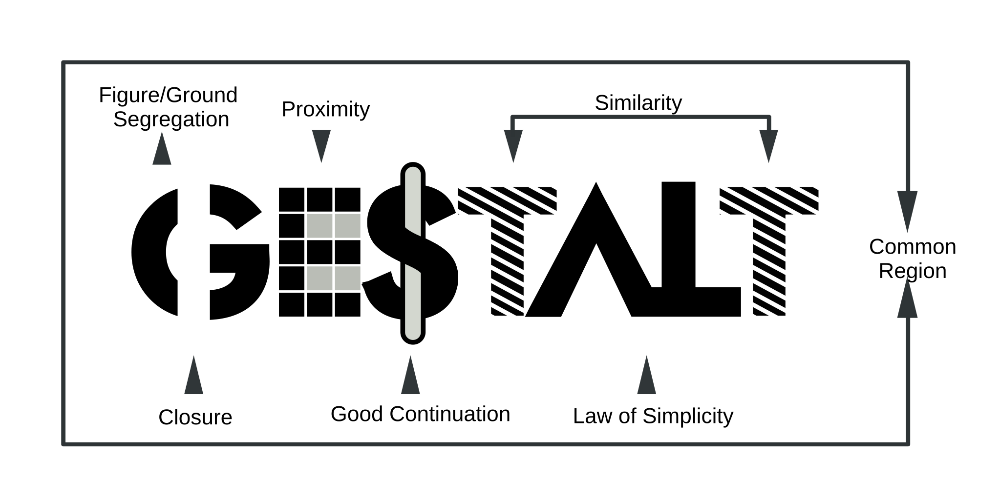
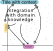
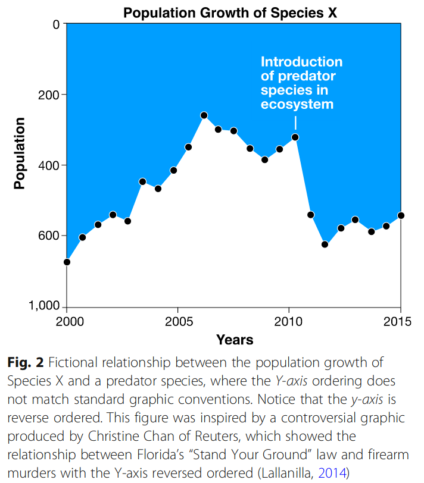
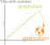
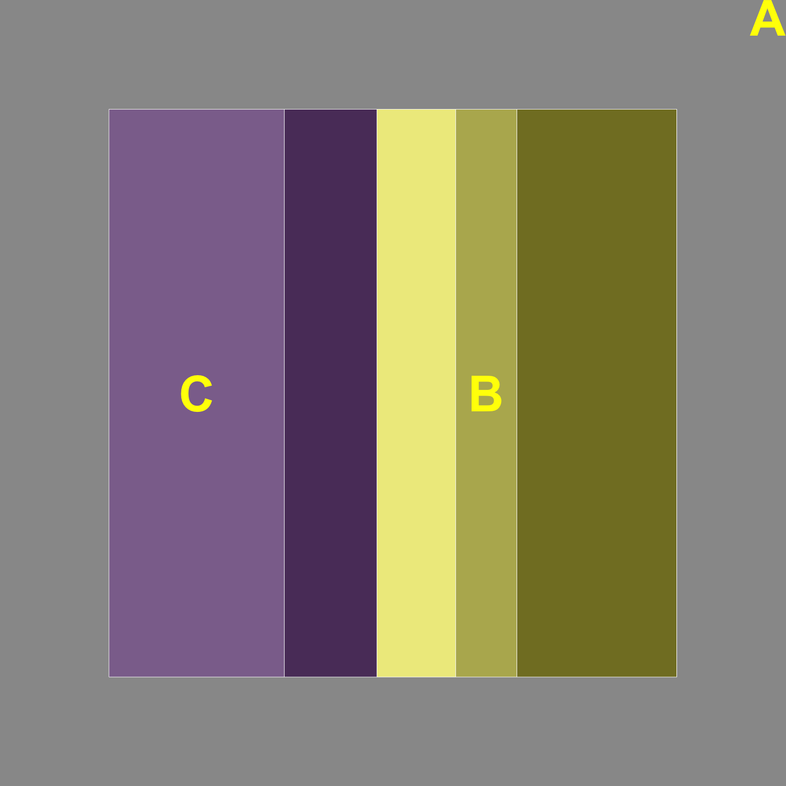
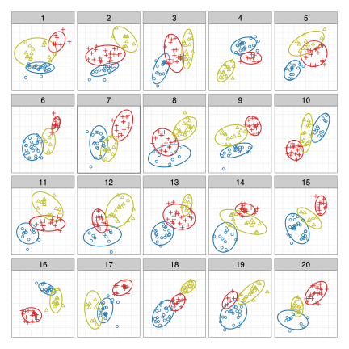
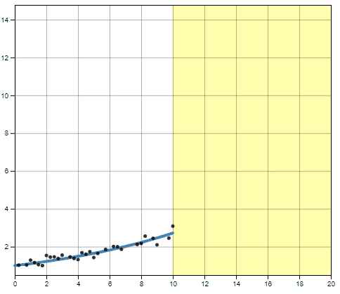

```{r setup}
#| include: false
options(htmltools.dir.version = FALSE)

knitr::opts_chunk$set(
  dpi = 300, 
  echo = F, message = F, warning = F, 
  cache = T)

knitr::opts_chunk$set(
  dev.args = list(bg = "transparent")
)

library(tidyverse)
library(gridExtra)
```

# A Quick Cognition Primer

{width="100%" fig-alt="A sketch from Descartes showing a stimulus, eyes, optic nerve, and higher level brain regions artistically. External information is contained in a box labeled 'Stimulus' on the right side of the image. The eyes and optic nerves are contained in a box labeled 'Perception' in the middle. Finally, the higher-level brain regions are contained in a box labeled 'Cognition'. An arrow at the bottom of the image labeled Time moves from right to left."}


## Attention

::: columns
::: {.column width="60%"}
-   Focused or Divided?
    - [Divided: multiple input streams]{.small} 
    - [Focused: single input stream]{.small} 


-   Attention shifts with gaze

-   Extra information may not be stored or remembered
:::

::: {.column width="40%"}
{fig-alt="Written text. An annotation layer on top shows how the eye fixates sequentially on each word/syllable (approximately) and then jumps to the next word in the sequence." width="100%"}
:::
:::

## Introspection

When reading a chart, what do you focus on

::: {style="text-align: center!important;"}
[**first**?]{.emph .sage-dk .fragment}

[**second**?]{.emph .green .fragment}

[**third**?]{.emph .cerulean-dk .fragment}

:::

## Introspection

```{r, echo = F, message = F}
# Generate some sort of plot
library(palmerpenguins)
data("penguins")
ggplot(penguins, aes(y = bill_length_mm, 
                     x = flipper_length_mm, 
                     shape = species, 
                     color = species)) +
  geom_point() +
  scale_color_manual(name = "Penguin Species",
                     labels = c("Adele", "Chinstrap", "Gentoo"),
                     values = c("#ff7400", "#056e76", "#c05ccb")) +
  scale_shape_discrete(name = "Penguin Species",
                     labels = c("Adele", "Chinstrap", "Gentoo")) + 
  xlab("Flipper Length (mm)") +
  ylab("Bill Length (mm)") +
  ggtitle("Penguin Morphology") +
  theme_bw() +
  theme(legend.position.inside = c(0.99, .01), legend.position = "inside",
        legend.justification = c(.99, .01))

```

## Introspection

When reading a chart, what do you focus on

::: {style="text-align: center!important;"}
[**first**?]{.emph .sage-dk}

[**second**?]{.emph .green}

[**third**?]{.emph .cerulean-dk}

:::

Most features require [**attention**]{.emph .blue}

[We can observe these features with [**introspection**]{.emph .blue}]{.fragment style="margin-left:auto!important;"}

[[**Preattentive**]{.emph .sage-dk} features must be examined in other ways]{.fragment}


## Long Term Memory

{width="100%"}

## Long Term Memory

-   unlimited storage capacity (theoretically)
-   maintained for long periods
-   two types:
    -   declarative/explicit - consciously accessed
    -   non-declarative/implicit - procedural memories 

## Working Memory

]{.small}](Working-Memory-Sketch.png){width="60%" fig-alt="A diagram showing input, which leads to sensory memory. One arrow points down, leading to forgotten; another labeled attention points to the Central executive. From the central executive, there is a bidirectional arrow pointing to the visuospatial sketchpad. Another bidirectional arrow points to a box containing the phonological loop, articulatory control, and is labeled phonological store. A third bidirectional arrow points to a box labeled LTM (long term memory), and an arrow points down from that box to Forgotten."}

-   Proposed by Baddeley and Hitch (1974)
-   Limited capacity
-   Components are thought to be mostly independent


# Application to Charts

## Perception

::: columns
::: {.column width="60%"}
<br/>

-   Sensory input
-   Recognition of type of chart
-   Takes place very quickly
:::

::: {.column width="40%"}
{fig-alt="A scatterplot with points, an x-axis label, a y-axis label, and a title that says 'Title with context'. The word perception is added on top of the scatterplot." width="100%"}
:::
:::

## Gestalt Grouping

::: columns
::: {.column width="60%"}
-   Gestalt heuristics used to group points into clusters/trends


:::

::: {.column width="40%"}
{fig-alt="A scatterplot with points, an x-axis label, a y-axis label, and a title that says 'Title with context'. There is a main set of points surrounded by a gray region that contains the points, indicating that these points are part of a group. There is a second group of 3 points surrounded by an orange dot that appear to be completely separate from the main group." width="100%"}
:::
:::

## Integration with Domain Knowledge

::: columns
::: {.column width="60%"}
<br/>

-   Begin to assign meaning

- Data + Axis titles + Chart title

-   Retrieve info from long term memory $\rightarrow$ working memory
:::

::: {.column width="40%"}
{fig-alt="A scatterplot with points, an x-axis label, a y-axis label, and a title that says 'Title with context'. The titles are highlighted and arrows are drawn between them. A text label of 'integration with domain knowledge' is shown between the arrows and titles overtop the data." width="100%"}
:::
:::

## Integration with Domain Knowledge

::: columns
::: {.column width="60%"}
Domain knowledge includes:

-   Typical chart structure     
[(e.g. y-axis increases from bottom to top)]{.small}

-   Chart conventions    
[use of filled vs. empty space]{.small}

-   Knowledge of relationships, events, etc.
:::

::: {.column width="40%"}
{fig-alt="An area chart showing the population growth of species X. The y-axis shows population, from 1000 at the bottom to 0 at the top. The x-axis shows years, from 2000 to 2015. The top part of the chart is shaded, showing the population decreasing up to about 2010, and then increasing, however, because basic chart construction conventions (axis order, shading) are violated, it appears that the population was increasing until 2010 and then decreased after predator species introduction. The caption explains that this plot shows a fictional relationship between species X and a predator species, where the y-axis ordering does not match standard graphic conventions. The figure was inspired by a controversial graphic produced by Christine Chan of Reuters, showing the relationship between Florida's Stand your Ground law and firearm murders with the y-axis reversed."}

[Figure from Padilla et al. *Cognitive Research: Principles and Implications* (2018) 3:29]{.tiny}
:::
:::

## Storytelling

::: columns
::: {.column width="60%"}
<br/>

-   Relationships $\rightarrow$ meaning

-   Fit visual statistics

-   Test features against a working hypothesis
:::

::: {.column width="40%"}
{fig-alt="A scatterplot showing a positive linear association between X and Y. The points are surrounded by a bounding region and a dotted regression line is drawn through the center of the region, with solid lines at the edges of the region, indicating a rough regression fit. A group of 3 points at the bottom right of the plot is colored blue and is labeled 'outlier assessment'." width="100%"}
:::
:::

## Inference

::: columns
::: {.column width="60%"}
-   Numerical estimation      
[(with uncertainty)]{.small}

-   Visual search, followed by estimation, calculation, and inference.
:::

::: {.column width="40%"}
{fig-alt="A scatterplot showing a positive linear association between X and Y. A dotted line indicates a location on the x-axis, 'x'. A red band around the line is labeled visual search, and an arrow points to the dotted line, which is labeled estimation. A yellow line points to the corresponding points around the dotted line, labeled 'calculation', and a purple line labeled 'inference' points to a region on the y-axis that has a corresponding confidence interval." width="100%"}
:::
:::

## Prediction and Application

::: columns
::: {.column width="60%"}
<br/>

-   Moving beyond the data to [**interpret**]{.emph .blue} and apply meaning

-   Draw conclusions

-   Make predictions for the future
:::

::: {.column width="40%"}
{fig-alt="A scatterplot showing a positive linear association between X and Y. A regression line shows the approximate mean of the points shown, with a dotted extension of the line which is labeled prediction. An orange arrow points from the prediction segment to an image of the globe, which is labeled application." width="100%"}
:::
:::

# Testing Graphical Perception

## Testing Accuracy

::: columns
::: {.column width="40%"}

{fig-alt="A framed spine plot, showing a grey frame that extends about 14% of the overall plot width on each side. The frame is labeled 'A'. Inside the frame, there are two purple rectangles, one about 22% of the overall plot width, labeled 'C', another about 12% of the overall plot width. There are also three yellow rectangles, one 10% of the plot width, one about 8% of the plot width, labeled 'B', and the final rectangle makes up about 20% of the total plot width."}

:::
::: {.column width="60%"}

- What proportion of the plot is 
    - A? [**48**%]{.emph .cerulean-dk .fragment fragment-index=1}
    - B? [**&nbsp;5.5**%]{.emph .cerulean-dk .fragment fragment-index=1}
    - C? [**16**%]{.emph .cerulean-dk .fragment fragment-index=1}


- The most accurate chart     
(by this measure) is a [...
**table**???]{.fragment .emph .sage-dk}

:::
:::
 
::: {.tiny}
From [VanderPlas, Susan, Goluch C. Ryan, and Heike Hofmann. 2019. “Framed! Reproducing and Revisiting 150-Year-Old Charts.” Journal of Computational and Graphical Statistics 28(3):620–34.](https://doi.org/10.1080/10618600.2018.1562937)
:::

## Visual Hypothesis Testing

::: columns
::: {.column width="50%"}

- Which plot(s) are not like the others?

- Inference: [which feature(s) are relevant?]{.small}

- Hypothesis testing:    
[1/20 = 0.05]{.small}
:::
::: {.column width="50%"}
{fig-alt="An array of 20 plots showing points with ellipses. The points and ellpses are colored red, yellow, or blue, with the points also changing shapes along with color." width="100%"}
:::
:::
 
::: tiny
From [VanderPlas, Susan, and Heike Hofmann. 2017. “Clusters Beat Trend⁉ Testing Feature Hierarchy in Statistical Graphics.” Journal of Computational and Graphical Statistics 26(2):231–42.](https://doi.org/10.1080/10618600.2016.1209116)
:::

## Direct Annotation


::: columns
::: {.column width="50%"}

{fig-alt="An exponential curve with data, animated to show the user annotating the chart by extending the curve."}
:::
::: {.column width="50%"}

- Removes numerical calculation issues
- Less intimidating?
- Requires motor control     
[(or patience)]{.small}

:::
:::
 

::: tiny
From [Robinson, Emily A., Reka Howard, and Susan VanderPlas. 2023. “‘You Draw It’: Implementation of Visually Fitted Trends with R2d3.” Journal of Data Science 21(2):281–94.](https://doi.org/10.6339/22-JDS1083) and    
[Robinson, Emily A., Reka Howard, and Susan VanderPlas. 2022. “Eye Fitting Straight Lines in the Modern Era.” Journal of Computational and Graphical Statistics 0(0):1–8.](https://doi.org/10.1080/10618600.2022.2140668)
:::

## Can We Test Graphics Better?

